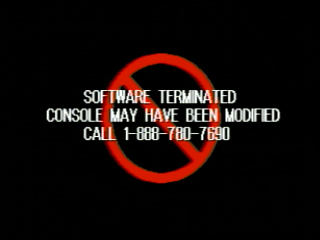

# Anti-Piracy Bypass System

## Background Info

Starting in late 1998, some specific PSX games began implementing additional copy protection designed to prevent playing backup CD-R copies of a game. Different types of additional copy protection have been found in PSX games over the years.

## APv1

The very first kind of 'standardized' additional copy protection that appeared in later PSX games. The _APv1 style protection can only prevent a backup CD-R of a game from working on a console that has a 'non-stealth mod-chip' installed_. APv1 style protection **can not detect games booted with Tonyhax International** on a stock console without a _non-stealth_ mod-chip. This means that all games with this protection work already with Tonyhax International.

## APv2

Unlike APv1, APv2 does trigger when games are booted with Tonyhax International on a stock console **unless a game disc specific [APv2 Bypass](#apv2-bypasses) has been implemented for it in the Tonyhax International loader**. The good news is at this point almost all if not every single game with this protection now has a working bypass implemented.

There is one exception though. The very early SCPH-3000 Japanese consoles, and all SCPH-1000 Japanese consoles are immune to APv2 as long as they are stock and not containing a 'non-stealth' mod-chip. These consoles will work with every game without a bypass even being needed. In fact, Tonyhax International does not even apply the APv2 bypasses for these consoles when they are detected.

## What Happens When Additional Anti-Piracy Protection Is Triggered

When triggered, the APv1 and APv2 style copy protections will trigger an 'anti-piracy screen of death'. If you encounter an APv2 game that triggers this screen, then the specific game disc is not yet supported (this is a work in progress). In such a case please open an [Anti-Piracy issue](https://github.com/alex-free/tonyhax/issues/new?assignees=&labels=antipiracy&template=antipiracy-issue.md&title=) on the [Tonyhax International Github](https://github.com/alex-free/tonyhax) to let me know about this specific game which contains APv2 protection. I would eventually like every game that can trigger the anti-piracy copy protection routine when booted via Tonyhax International on a stock console to have a  bypass implemented for 100% compatibility.

## EDC

In addition to APv1 or APv2 protection, some later games may also contain a protection measure known as the EDC check. For the affected games, this protection is triggered when you burn the EDC protected PSX CD image with standard CD burning software, which in most cases will changes the EDC data when burning an EDC protected PSX CD image.

The EDC check can be however be defeated by simply forcing the EDC data to not be changed when burning such a protected PSX CD image. Not every CD burning software has an option which can do this, please see the [CD Burning](#cd-burning-for-edc) section for a more in depth capability comparison of common burning software.

Real 'imported region' PSX game discs with EDC protection will work just fine when booted via Tonyhax International.

## LibCrypt

Some PAL PSX games are using a different copy protection scheme known as LibCrypt protection. Similar to EDC protection, LibCrypt protection is triggered when you burn a LibCrypt protected PSX CD image with standard CD burning software, which in most cases changes the SubChannel data when burning such a protected PSX CD image.

LibCrypt protection can be bypassed by burning a backup CD-R of a LibCrypt game using [CloneCD](#clone-cd) in a very [specific](https://github.com/Kippykip/SBITools) way.

Real PAL LibCrypt discs booted via Tonyhax International on USA or Japanese consoles ('imports') will not trip the detection.

## CD Burning For EDC

### [CDRDAO-PLED](https://alex-free.github.io/cdrdao)

* Is Open Source?: Yes. Pre-built Linux x86_64 binaries are also [available](https://alex-free.github.io/cdrdao##downloads).
* Burns Standard PSX Backup CD-Rs?: Yes. For .bin/.cue CD images, the `--swap` argument is required.
* Burns PSX Backup CD-Rs With Additional EDC Protection Correctly?: Yes, for .bin/.cue CD images, the `--swap` argument is required. You also must use the `generic-mmc-raw` driver.
* Burns PSX Backup CD-Rs With LibCrypt Protection Correctly?: CDRDAO can rip an authentic PAL PSX game disc containing LibCrypt protection correctly into a .toc/.bin CD image file. This file can be burned back by using the `generic-mmc-raw` driver. The much more common .bin/.cue/.sub CD image LibCrypt rips do not work directly however.

### [CloneCD](https://www.redfox.bz/en/clonecd.html)

* Is Open Source?: No, it is Windows only FreeWare with a free 'demo' version as well as a full paid version. The 'demo' version can be used however for PSX Backup CD-R burning without limitation.
* Burns Standard PSX Backup CD-Rs?: Yes, no special options required.
* Burns PSX Backup CD-Rs With Additional EDC Protection Correctly?: Yes, if you use [RAW](https://hydrogenaud.io/index.php?PHPSESSID=3voij6gqs993vdbd15mlmc2k7h&topic=42415.msg371328##msg371328) mode.
* Burns PSX Backup CD-Rs With LibCrypt Protection Correctly?: [Yes](https://github.com/Kippykip/SBITools), (with the proper BIN/CUE/SUB files).

### [ImgBurn](https://www.imgburn.com/)

* Is Open Source?: No, it is Windows only FreeWare.
* Burns Standard PSX Backup CD-Rs?: Yes.
* Burns PSX Backup CD-Rs With Additional EDC Protection Correctly?: No.
* Burns PSX Backup CD-Rs With LibCrypt Protection Correctly?: No.

## Games With EDC Protection

This list is a work in progress, and new games will be added as they are discovered to have this kind of protection. If you know of a game with EDC protection that isn't listed below, please let me know in a [generic issue](https://github.com/alex-free/tonyhax/issues/new?assignees=&labels=bug&template=generic-issue.md&title=) on the [Tonyhax International Github](https://github.com/alex-free/tonyhax) so that I can add it to the list in a future Tonyhax International update.

* BeatMania Best Hits Japan ([Rev 0](http://redump.org/disc/36175/), [Rev 1](http://redump.org/disc/44332/)).
* Dance Dance Revolution [Japan](http://redump.org/disc/1562/), [USA](http://redump.org/disc/16075/).
* Dance Dance Revolution: Best Hits [Japan](http://redump.org/disc/30601/).
* Dance Dance Revolution 2nd Remix [Japan](http://redump.org/disc/9477/).
* Dance Dance Revolution 2nd Remix: Append Club Version Vol. 1 [Japan](http://redump.org/disc/23382/).
* Dance Dance Revolution 2nd Remix: Append Club Version Vol. 2 [Japan](http://redump.org/disc/33339/).
* Dance Dance Revolution 3rd Mix [Japan](http://redump.org/disc/9536/)
* Dance Dance Revolution 4th Mix [Japan](http://redump.org/disc/34157/)

## APv2 Bypasses

This is the complete list of games with bypasses anti-piracy measures that are supported by Tonyhax International. They will all boot and play correctly on stock consoles:

### Animetic Story Game 1: Card Captor Sakura

- Versions Tested: Japan ([Disc 1](http://redump.org/disc/12000/), [Disc 2](http://redump.org/disc/11999/)).
- Versions With Anti-Piracy Screen: Japan.
- When Is The Anti-Piracy Screen Check: Immeditely.
- Versions With Anti-Piracy Bypass Support: Japan.

### Alundra 2

- Versions Tested: [Japan](http://redump.org/disc/15641/), [Japan Demo](http://redump.org/disc/6752/), [USA](http://redump.org/disc/2996/), [Europe](http://redump.org/disc/1089/), [German](http://redump.org/disc/11603/), [French](http://redump.org/disc/13396/).
- Versions With Anti-Piracy Screen: Japan.
- When Is The Anti-Piracy Screen Check: When first booting the game during the 'now loading' screen.
- Versions With Anti-Piracy Bypass Support: Japan.

### Arc The Lad III

- Versions Tested: Japan Rev 0 ([Disc 1](http://redump.org/disc/5897/), [Disc 2](http://redump.org/disc/5898/)), Japan Rev 1 ([Disc 1](http://redump.org/disc/34793/), [Disc 2](http://redump.org/disc/34794/)), USA ([Disc 1](http://redump.org/disc/674/), [Disc 2](http://redump.org/disc/675/)).
- Versions With Anti-Piracy Screen: Japan Rev 0, Japan Rev 1.
- When Is The Anti-Piracy Screen Check: Immediately.
- Versions With Anti-Piracy Bypass Support: Japan Rev 0, Japan Rev 1.

### Beatmania featuring Dreams Come True

- Versions Tested: [Japan](http://redump.org/disc/36188/).
- Versions With Anti-Piracy Screen: Japan.
- When Is The Anti-Piracy Screen Check: Immediately.
- Versions With Anti-Piracy Bypass Support: Japan.

### Beatmania Best Hits

- Versions Tested: [Japan Rev 0](http://redump.org/disc/36175/), [Japan Rev 1](http://redump.org/disc/44332/).
- Versions With Anti-Piracy Screen: Japan Rev 0, Japan Rev 1.
- When Is The Anti-Piracy Screen Check: Immediately.
- Versions With Anti-Piracy Bypass Support: Japan Rev 0, Japan Rev 1.

### Beat Mania: The Sound of Tokyo

- Versions Tested: [Japan](http://redump.org/disc/36163/).
- Versions With Anti-Piracy Screen: Japan.
- When Is The Anti-Piracy Screen Check: Immediately.
- Versions With Anti-Piracy Bypass Support: Japan.

### Beat Mania 6thMix + Core Remix

- Versions Tested: [Japan](http://redump.org/disc/16285/).
- Versions With Anti-Piracy Screen: Japan.
- When Is The Anti-Piracy Screen Check: Immediately.
- Versions With Anti-Piracy Bypass Support: Japan.

### Boku no Natsuyasumi: Summer Holiday 20th Century

- Versions Tested: [Japan](http://redump.org/disc/4890/).
- Versions With Anti-Piracy Screen: Japan.
- When Is The Anti-Piracy Screen Check: Immediately.
- Versions With Anti-Piracy Bypass Support: Japan.

### Breath of Fire IV

- Versions Tested: [Japan](http://redump.org/disc/1554/), [E3 2000/Beta USA](http://redump.org/disc/59620/), [USA](http://redump.org/disc/1222/), [Europe](http://redump.org/disc/549/).
- Versions With Anti-Piracy Screen: Japan, E3 2000/Beta USA.
- When Is The Anti-Piracy Screen Check: Immediately.
- Versions With Anti-Piracy Bypass Support: Japan, E3 2000/Beta USA.

### Capcom vs. SNK: Millennium Fight 2000 Pro
- Versions Tested: [Japan](http://redump.org/disc/37359/
), [Japan Demo](http://redump.org/disc/62464/), [Europe](http://redump.org/disc/3904/).
- Versions With Anti-Piracy Screen: Japan.
- When Is The Anti-Piracy Screen Check: Immediately.
- Versions With Anti-Piracy Bypass Support: Japan.

### Chase The Express

- Versions Tested: Japan ([Disc 1](http://redump.org/disc/5637/), [Disc 2](http://redump.org/disc/5638/)), [Japan Demo 1](http://redump.org/disc/6551/), [Japan Demo 2](http://redump.org/disc/19589/), Europe ([Disc 1](http://redump.org/disc/27257/), [Disc 2](http://redump.org/disc/27258/)), France ([Disc 1](http://redump.org/disc/28137/), [Disc 2](http://redump.org/disc/28138/)), Germany ([Disc 1](http://redump.org/disc/7507/), [Disc 2](http://redump.org/disc/7508/)), Italy ([Disc 1](http://redump.org/disc/28358/), [Disc 2](http://redump.org/disc/28359/)).
- Versions With Anti-Piracy Screen: Japan, Japan Demo 1, Japan Demo 2.
- When Is The Anti-Piracy Screen Check: Immediately.
- Versions With Anti-Piracy Bypass Support: Japan, Japan Demo 1, Japan Demo 2.

### Crash Bash

- Versions Tested: [Japan](http://redump.org/disc/3819/), [Japan Demo](http://redump.org/disc/53589/), [USA](http://redump.org/disc/512/), [USA Demo](http://redump.org/disc/49446/), [Europe](http://redump.org/disc/5483/).
- Versions With Anti-Piracy Screen: Japan, USA.
- When Is The Anti-Piracy Screen Check: 'Sony Computer Entertainment Presents' screen.
- Versions With Anti-Piracy Bypass Support: Japan, USA.

### Crash Bandicoot Racing

- Versions Tested: [Japan](http://redump.org/disc/3694/), [Japan Demo](http://redump.org/disc/53590/).
- Versions With Anti-Piracy Screen: Japan, Japan Demo.
- When Is The Anti-Piracy Screen Check: When first booting the game when the Naughty Dog box is first visible.
- Versions With Anti-Piracy Bypass Support: Japan, Japan Demo.

### Cool Boarders 2001

- Versions Tested: [USA](http://redump.org/disc/513/), [USA Demo](http://redump.org/disc/42467/).
- Versions With Anti-Piracy Screen: USA, USA Demo.
- When Is The Anti-Piracy Screen Check: During the first loading screen.
- Versions With Anti-Piracy Bypass Support: USA, USA Demo.

### Dance Dance Revolution: Best Hits

- Versions Tested: [Japan](http://redump.org/disc/30601/).
- Versions With Anti-Piracy Screen: Japan.
- When Is The Anti-Piracy Screen Check: Immeditely.
- Versions With Anti-Piracy Bypass Support: Japan. **IMPORTANT: There is an [EDC check](#bypassing-additional-edc-checks-found-in-some-games) in addition to the standardized anti-piracy copy protection routine.**

### Dance Dance Revolution: Disney's Rave

- Versions Tested: [Japan](http://redump.org/disc/37012/).
- Versions With Anti-Piracy Screen: Japan.
- When Is The Anti-Piracy Screen Check: Immeditely.
- Versions With Anti-Piracy Bypass Support: Japan.

### Dance Dance Revolution: Extra Mix

- Versions Tested: [Japan](http://redump.org/disc/44438/).
- Versions With Anti-Piracy Screen: Japan.
- When Is The Anti-Piracy Screen Check: Immeditely.
- Versions With Anti-Piracy Bypass Support: Japan.

### Dance Dance Revolution 2nd Remix

- Versions Tested: [Japan](http://redump.org/disc/9477/).
- Versions With Anti-Piracy Screen: Japan.
- When Is The Anti-Piracy Screen Check: Immeditely.
- Versions With Anti-Piracy Bypass Support: Japan.
- **IMPORTANT: There is an [EDC check](#bypassing-additional-edc-checks-found-in-some-games) in addition to the standardized anti-piracy copy protection routine.**

### Dance Dance Revolution 2nd Remix: Append Club Version Vol. 1

- Versions Tested: [Japan](http://redump.org/disc/23382/).
- Versions With Anti-Piracy Screen: Japan.
- When Is The Anti-Piracy Screen Check: When you use the 'disc change' feature found in Dance Dance Revolution 2nd Remix to boot the disc.
- Versions With Anti-Piracy Bypass Support: Japan. 
**IMPORTANT: There is an [EDC check](#bypassing-additional-edc-checks-found-in-some-games) in addition to the standardized anti-piracy copy protection routine.**
- This game works as intended/completely normal on USA and European consoles. On Japanese PS1 consoles, you must do a **perfect** [mid-game hot-swap trick](#playing-games-that-span-multiple-discs-on-japanese-ps1-consoles) in the 'disc change' feature found in Dance Dance Revolution 2nd Remix to get the game to boot AND for it to have working CD audio. You can not play this game currently on a Japanese PS2 due to the lack of a [mid-game hot-swap trick](#playing-games-that-span-multiple-discs-on-japanese-ps2-consoles) method for PS2s.

### Dance Dance Revolution 2nd Remix: Append Club Version Vol. 2

- Versions Tested: [Japan](http://redump.org/disc/33339/).
- Versions With Anti-Piracy Screen: Japan.
- When Is The Anti-Piracy Screen Check: When you use the 'disc change' feature found in Dance Dance Revolution 2nd Remix to boot the disc.
- Versions With Anti-Piracy Bypass Support: Japan.
**IMPORTANT: There is an [EDC check](#bypassing-additional-edc-checks-found-in-some-games) in addition to the standardized anti-piracy copy protection routine.**
- This game works as intended/completely normal on USA and European consoles. On Japanese PS1 consoles, you must do a **perfect** [mid-game hot-swap trick](#playing-games-that-span-multiple-discs-on-japanese-ps1-consoles) in the 'disc change' feature found in Dance Dance Revolution 2nd Remix to get the game to boot AND for it to have working CD audio. You can not play this game currently on a Japanese PS2 due to the lack of a [mid-game hot-swap trick](#playing-games-that-span-multiple-discs-on-japanese-ps2-consoles) method for PS2s.

### Dancing Stage Featuring Dreams Come True

- Versions Tested: [Japan](http://redump.org/disc/17882/).
- Versions With Anti-Piracy Screen: Japan.
- When Is The Anti-Piracy Screen Check: On the first text screen after boot, until right before the first FMV.
- Versions With Anti-Piracy Bypass Support: Japan.

### Dancing Stage Featuring True Kiss Destination

- Versions Tested: [Japan](http://redump.org/disc/15853/).
- Versions With Anti-Piracy Screen: Japan.
- When Is The Anti-Piracy Screen Check: On the first text screen after boot, until right before the first FMV.
- Versions With Anti-Piracy Bypass Support: Japan.

### Dino Crisis

- Versions Tested: [Japan](http://redump.org/disc/1598/), [USA Rev 0](http://redump.org/disc/459/), [USA Rev 1](http://redump.org/disc/473/), [USA Demo](http://redump.org/disc/2942/), [Europe](http://redump.org/disc/710/), [Italy](http://redump.org/disc/28171/), [Germany](http://redump.org/disc/7586/), [France](http://redump.org/disc/24278/), [Spain](http://redump.org/disc/27940/).
- Versions With Anti-Piracy Screen: Japan, USA Rev 0, USA Rev 1.
- When Is The Anti-Piracy Screen Check: On the disclaimer screen after the game boots.
- Versions With Anti-Piracy Bypass Support: Japan, USA Rev 0, USA Rev 1.

### Dino Crisis 2

- Versions Tested: [Japan](http://redump.org/disc/1600/), [Japan Demo](http://redump.org/disc/4407/), [USA](http://redump.org/disc/460/), [USA Demo](http://redump.org/disc/49242/), [Europe](http://redump.org/disc/1071/), [Italy](http://redump.org/disc/45993/), [Germany](http://redump.org/disc/10641/), [France](http://redump.org/disc/29514/), [Spain](http://redump.org/disc/27941/).
- Versions With Anti-Piracy Screen: Japan, Japan Demo.
- When Is The Anti-Piracy Screen Check: On the disclaimer screen after the game boots.
- Versions With Anti-Piracy Bypass Support: Japan, Japan Demo.

### Disney's The Emperor's New Grove

- Versions With Anti-Piracy Screen: [USA](http://redump.org/disc/14583/), [Europe](http://redump.org/disc/7565/).
- When Is The Anti-Piracy Screen Check: Start a new game, after the first FMV on the first loading screen is when the check completes.
- Versions With Anti-Piracy Bypass Support: USA, Europe.

### Exciting Bass 2

- Versions Tested: [Japan](http://redump.org/disc/63487/).
- Versions With Anti-Piracy Screen: Japan.
- When Is The Anti-Piracy Screen Check: Immediately.
- Versions With Anti-Piracy Bypass Support: Japan.

### Exciting Bass 3

- Versions Tested: [Japan](http://redump.org/disc/59734/).
- Versions With Anti-Piracy Screen: Japan.
- When Is The Anti-Piracy Screen Check: Immediately.
- Versions With Anti-Piracy Bypass Support: Japan.

### Gekitotsu Toma L'Arc - L'Arc en Ciel vs Tomarunner

- Versions: [Japan](http://redump.org/disc/20715/)
- Versions With Anti-Piracy Screen: Japan.
- When Is The Anti-Piracy Screen Check: Immediately.
- Versions With Anti-Piracy Bypass Support: Japan.

## Glint Glitters

- Versions Tested: [Japan](http://redump.org/disc/15969/).
- Versions With Anti-Piracy Screen: Japan.
- When Is The Anti-Piracy Screen Check: Immediately.
- Versions With Anti-Piracy Bypass Support: Japan.

### Goo! Goo! Soundry

- Versions Tested: [Japan](http://redump.org/disc/16027/).
- Versions With Anti-Piracy Screen: Japan.
- When Is The Anti-Piracy Screen Check: On the first 'now loading' screen at boot.
- Versions With Anti-Piracy Bypass Support: Japan.

### Grind Session

- Versions Tested: [USA](http://redump.org/disc/854/), [USA Demo](http://redump.org/disc/42794/), [Europe](http://redump.org/disc/3688/), [Scandinavia](http://redump.org/disc/53879/).
- Versions With Anti-Piracy Screen: USA.
- When Is The Anti-Piracy Screen Check: After going through the main menu and starting training/single player/a level.
- Versions With Anti-Piracy Bypass Support: USA.

### Guitar Freaks

- Versions Tested: [Japan](http://redump.org/disc/2277/).
- Versions With Anti-Piracy Screen: Japan.
- When Is The Anti-Piracy Screen Check: At the loading screen with the spinning guitars.
- Versions With Anti-Piracy Bypass Support: Japan.

### Harlem Beat: You're The One

- Versions Tested: [Japan](http://redump.org/disc/36294/).
- Versions With Anti-Piracy Screen: Japan.
- When Is The Anti-Piracy Screen Check: At the first loading screen after boot.
- Versions With Anti-Piracy Bypass Support: Japan.

### Hyper Value 2800: Hanafuda

- Versions Tested: [Japan](http://redump.org/disc/15791/).
- Versions With Anti-Piracy Screen: Japan.
- When Is The Anti-Piracy Screen Check: Immediately after boot.
- Versions With Anti-Piracy Bypass Support: Japan.

### Hyper Value 2800: Mahjong

- Versions Tested: [Japan](http://redump.org/disc/15793/).
- Versions With Anti-Piracy Screen: Japan.
- When Is The Anti-Piracy Screen Check: Immediately after boot.
- Versions With Anti-Piracy Bypass Support: Japan.

### i-mode mo Issho: Doko Demo Issho Tsuika Disc

- Versions Tested: [Japan](http://redump.org/disc/15793/).
- Versions With Anti-Piracy Screen: Japan.
- When Is The Anti-Piracy Screen Check: Immediately after boot.
- Versions With Anti-Piracy Bypass Support: Japan.

### Jikkyou Powerful Pro Yakyuu '99: Ketteiban

- Versions Tested: [Japan](http://redump.org/disc/11091/).
- Versions With Anti-Piracy Screen: Japan.
- When Is The Anti-Piracy Screen Check: Immediately.
- Versions With Anti-Piracy Bypass Support: Japan.

### Jikkyou Powerful Pro Yakyuu '99: Kaimakuban

- Versions Tested: [Japan](http://redump.org/disc/1686/).
- Versions With Anti-Piracy Screen: Japan.
- When Is The Anti-Piracy Screen Check: Immediately.
- Versions With Anti-Piracy Bypass Support: Japan.

### JoJo's Bizarre Adventure

- Versions Tested: [Japan](http://redump.org/disc/2871/), [USA](http://redump.org/disc/386/), [Europe](http://redump.org/disc/9983/).
- Versions With Anti-Piracy Screen: Japan.
- When Is The Anti-Piracy Screen Check: First loading screen after boot.
- Versions With Anti-Piracy Bypass Support: Japan.

### Koko Hore! Pukka

- Versions Tested: [Japan](http://redump.org/disc/4812/).
- Versions With Anti-Piracy Screen: Japan.
- When Is The Anti-Piracy Screen Check: Immeditely.
- Versions With Anti-Piracy Bypass Support: Japan.

### Koneko mo Issho

- Versions Tested: [Japan](http://redump.org/disc/6329/).
- Versions With Anti-Piracy Screen: Japan.
- When Is The Anti-Piracy Screen Check: Immeditely.
- Versions With Anti-Piracy Bypass Support: Japan.

### Legend Of Dragoon

- Versions Tested: Japan ([Disc 1](http://redump.org/disc/22753/), [Disc 2](http://redump.org/disc/22754/), [Disc 3](http://redump.org/disc/22755/), [Disc 4](http://redump.org/disc/22756/)), USA ([Disc 1](http://redump.org/disc/153/), [Disc 2](http://redump.org/disc/154/), [Disc 3](http://redump.org/disc/155/), [Disc 4](http://redump.org/disc/156/)), Europe ([Disc 1](http://redump.org/disc/2379/), [Disc 2](http://redump.org/disc/2380/), [Disc 3](http://redump.org/disc/2381), [Disc 4](http://redump.org/disc/2382/)), France ([Disc 1](http://redump.org/disc/16750/), [Disc 2](http://redump.org/disc/16751/), [Disc 3](http://redump.org/disc/16752/), [Disc 4](http://redump.org/disc/16753/)), Germany ([Disc 1](http://redump.org/disc/15580/), [Disc 2](http://redump.org/disc/15581/), [Disc 3](http://redump.org/disc/15582/), [Disc 4](http://redump.org/disc/15583/)), Italy ([Disc 1](http://redump.org/disc/30643/), [Disc 2](http://redump.org/disc/30644/), [Disc 3](http://redump.org/disc/30645/), [Disc 4](http://redump.org/disc/30646/)).
- Versions With Anti-Piracy Screen: Japan, USA, Europe, France, Germany, Italy.
- When Is The Anti-Piracy Screen Check: First loading screen after boot.
- Versions With Anti-Piracy Bypass Support: Japan, USA, Europe, France, Germany, Italy.

### Legend Of Mana

- Versions Tested: [Japan](http://redump.org/disc/1940/), [USA](http://redump.org/disc/96/).
- Versions With Anti-Piracy Screen: Japan.
- When Is The Anti-Piracy Screen Check: Immediately.
- Versions With Anti-Piracy Bypass Support: Japan, USA.

### Love Hina: Ai wa Kotoba no Naka ni

- Versions Tested: [Japan](http://redump.org/disc/7369/).
- Versions With Anti-Piracy Screen: Japan.
- When Is The Anti-Piracy Screen Check: Immediately.
- Versions With Anti-Piracy Bypass Support: Japan.

### Love Hina 2: Kotoba wa Konayuki no You ni

- Versions Tested: [Japan](http://redump.org/disc/7370/).
- Versions With Anti-Piracy Screen: Japan.
- When Is The Anti-Piracy Screen Check: Immediately.
- Versions With Anti-Piracy Bypass Support: Japan.

### Marvel vs. Capcom: Clash of Super Heroes

- Versions Tested: [Japan](http://redump.org/disc/36384/), [Japan Demo](http://redump.org/disc/60646/), [USA](http://redump.org/disc/1235/), [Europe](http://redump.org/disc/3910/).
- Versions With Anti-Piracy Screen: Japan, Japan Demo.
- When Is The Anti-Piracy Screen Check: Immediately on boot.
- Versions With Anti-Piracy Bypass Support: Japan, Japan Demo.

### MediEvil II

- Versions Tested: [USA](http://redump.org/disc/2503/), [Europe Release 1](http://redump.org/disc/593/), [Europe Release 2](http://redump.org/disc/1547/), [Europe Demo](http://redump.org/disc/45822/).
- Versions With Anti-Piracy Screen: USA.
- When Is The Anti-Piracy Screen Check: At the Whitechapel level loading screen (quite far in the game).
- Versions With Anti-Piracy Bypass Support: USA.

### MLB 2002

- Versions Tested: [USA](http://redump.org/disc/826/), [USA Demo](http://redump.org/disc/43238/).
- Versions With Anti-Piracy Screen: USA, USA Demo.
- When Is The Anti-Piracy Screen Check: First loading screen.
- Versions With Anti-Piracy Bypass Support: USA, USA Demo.

### MLB 2003

- Versions Tested: [USA](http://redump.org/disc/16660/), [USA Demo](http://redump.org/disc/50864/).
- Versions With Anti-Piracy Screen: USA, USA Demo.
- When Is The Anti-Piracy Screen Check: First loading screen.
- Versions With Anti-Piracy Bypass Support: USA, USA Demo.

### MLB 2004

- Versions Tested: [USA](http://redump.org/disc/15325/).
- Versions With Anti-Piracy Screen: USA.
- When Is The Anti-Piracy Screen Check: First loading screen.
- Versions With Anti-Piracy Bypass Support: USA.

### My Garden

- Versions Tested: [Japan](http://redump.org/disc/8300/).
- Versions With Anti-Piracy Screen: Japan.
- When Is The Anti-Piracy Screen Check: Immediately.
- Versions With Anti-Piracy Bypass Support: Japan.

## NBA Shootout 2001

- Versions Tested: [USA](http://redump.org/disc/16764/), [USA Demo](http://redump.org/disc/42465/).
- Versions With Anti-Piracy Screen: USA, USA Demo.
- When Is The Anti-Piracy Screen Check: At the end of the first loading screen.
- Versions With Anti-Piracy Bypass Support: USA, USA Demo.

## NBA Shootout 2002

- Versions Tested: [USA](http://redump.org/disc/14527/), [USA Demo](http://redump.org/disc/44305/).
- Versions With Anti-Piracy Screen: USA, USA Demo.
- When Is The Anti-Piracy Screen Check: At the end of the first loading screen.
- Versions With Anti-Piracy Bypass Support: USA, USA Demo.

## NBA Shootout 2003

- Versions Tested: [USA](http://redump.org/disc/14566/).
- Versions With Anti-Piracy Screen: USA.
- When Is The Anti-Piracy Screen Check: At the end of the first loading screen.
- Versions With Anti-Piracy Bypass Support: USA.

### NBA Shootout 2004

- Versions Tested: [USA](http://redump.org/disc/20551/).
- Versions With Anti-Piracy Screen: USA.
- When Is The Anti-Piracy Screen Check: At the end of the first loading screen.
- Versions With Anti-Piracy Bypass Support: USA.

### NCAA Final Four 2001

- Versions Tested: [USA](http://redump.org/disc/16765/)
- Versions With Anti-Piracy Screen: USA.
- When Is The Anti-Piracy Screen Check: First Loading screen.
- Versions With Anti-Piracy Bypass Support: USA.

### NCAA Game Breaker 2001

- Versions Tested: [USA](http://redump.org/disc/14374/), [USA Demo](http://redump.org/disc/43879/)
- Versions With Anti-Piracy Screen: USA, USA Demo.
- When Is The Anti-Piracy Screen Check: Second Loading screen.
- Versions With Anti-Piracy Bypass Support: USA.

### NFL GameDay 2001

- Versions Tested: [USA](http://redump.org/disc/21065/), [USA Demo](http://redump.org/disc/50868/).
- Versions With Anti-Piracy Screen: USA, USA Demo.
- When Is The Anti-Piracy Screen Check: First Loading screen.
- Versions With Anti-Piracy Bypass Support: USA.

### NFL GameDay 2002

- Versions Tested: [USA](http://redump.org/disc/2725/)
- Versions With Anti-Piracy Screen: USA.
- When Is The Anti-Piracy Screen Check: Second Loading screen.
- Versions With Anti-Piracy Bypass Support: USA.

### NFL GameDay 2003

- Versions Tested: [USA](http://redump.org/disc/13364/)
- Versions With Anti-Piracy Screen: USA.
- When Is The Anti-Piracy Screen Check: Third Loading screen.
- Versions With Anti-Piracy Bypass Support: USA.

### NFL GameDay 2004

- Versions Tested: [USA](http://redump.org/disc/14523/)
- Versions With Anti-Piracy Screen: USA.
- When Is The Anti-Piracy Screen Check: Third Loading screen.
- Versions With Anti-Piracy Bypass Support: USA.

### NFL GameDay 2005

- Versions Tested: [USA](http://redump.org/disc/15995/)
- Versions With Anti-Piracy Screen: USA.
- When Is The Anti-Piracy Screen Check: Third Loading screen.
- Versions With Anti-Piracy Bypass Support: USA.

### NHL FaceOff 2001

- Versions Tested: [USA](http://redump.org/disc/12934/), [USA Demo](http://redump.org/disc/43880/)
- Versions With Anti-Piracy Screen: USA, USA Demo.
- When Is The Anti-Piracy Screen Check: When the main menu starts.
- Versions With Anti-Piracy Bypass Support: USA, USA Demo.

### Oha-Studio Dance Dance Revolution

- Versions Tested: [Japan](http://redump.org/disc/33938/).
- Versions With Anti-Piracy Screen: Japan.
- When Is The Anti-Piracy Screen Check: Immediately.
- Versions With Anti-Piracy Bypass Support: Japan.

### Ore no Ryouri

- Versions Tested: [Japan](http://redump.org/disc/39643/).
- Versions With Anti-Piracy Screen: Japan.
- When Is The Anti-Piracy Screen Check: Immediately.
- Versions With Anti-Piracy Bypass Support: Japan.

### Pocket Jiman

- Versions Tested: [Japan](http://redump.org/disc/3189/)
- Versions With Anti-Piracy Screen: Japan.
- When Is The Anti-Piracy Screen Check: Immediately.
- Versions With Anti-Piracy Bypass Support: Japan.

### PoPoLoCrois Monogatari II

- Versions Tested: Japan ([Disc 1](http://redump.org/disc/1653/), [Disc 2](http://redump.org/disc/1654/), [Disc 3](http://redump.org/disc/1651/)), [Japan Demo](http://redump.org/disc/57327/)
- Versions With Anti-Piracy Screen: Japan.
- When Is The Anti-Piracy Screen Check: Immediately.
- Versions With Anti-Piracy Bypass Support: Japan.

### Pop'n Music: Animation Melody

- Versions Tested: [Japan](http://redump.org/disc/33223/).
- Versions With Anti-Piracy Screen: Japan.
- When Is The Anti-Piracy Screen Check: Immediately.
- Versions With Anti-Piracy Bypass Support: Japan.

### Pop'n Music: Disney Tunes

- Versions Tested: [Japan](http://redump.org/disc/34263/).
- Versions With Anti-Piracy Screen: Japan.
- When Is The Anti-Piracy Screen Check: Immediately.
- Versions With Anti-Piracy Bypass Support: Japan.

### Pop'n Music 2

- Versions Tested: [Japan](http://redump.org/disc/9774/).
- Versions With Anti-Piracy Screen: Japan.
- When Is The Anti-Piracy Screen Check: Immediately.
- Versions With Anti-Piracy Bypass Support: Japan.

### Pop'n Music 5

- Versions Tested: [Japan](http://redump.org/disc/9778/).
- Versions With Anti-Piracy Screen: Japan.
- When Is The Anti-Piracy Screen Check: Immediately.
- Versions With Anti-Piracy Bypass Support: Japan.

### Pop'n Music 6

- Versions Tested: [Japan](http://redump.org/disc/9777/).
- Versions With Anti-Piracy Screen: Japan.
- When Is The Anti-Piracy Screen Check: Immediately.
- Versions With Anti-Piracy Bypass Support: Japan.

### Resident Evil 3: The Last Escape

- Versions Tested: [Japan Rev 0](http://redump.org/disc/10/), [Japan Rev 1](http://redump.org/disc/8357/), [Japan Demo](http://redump.org/disc/11674/), [USA](http://redump.org/disc/126/), [USA Demo](http://redump.org/disc/7312/),[Europe](http://redump.org/disc/496/), [Europe Demo](http://redump.org/disc/9463/), [France](http://redump.org/disc/9753/), [Germany](http://redump.org/disc/5526/), [Italy](http://redump.org/disc/16397/), [Ireland](http://redump.org/disc/28197/), [Spain](http://redump.org/disc/1387/),
- Versions With Anti-Piracy Screen: Japan Rev 0, Japan Rev 1, Japan Demo.
- When Is The Anti-Piracy Screen Check: On the disclaimer screen after the game boots, pause there.
- Versions With Anti-Piracy Bypass Support: Japan Rev 0, Japan Rev 1, Japan Demo.

### Resident Evil: Survivor

- Versions Tested: [Japan](http://redump.org/disc/8102/), [USA](http://redump.org/disc/326/), [Europe](http://redump.org/disc/801/), [France](http://redump.org/disc/5826/).
- Versions With Anti-Piracy Screen: Japan, USA, Europe, France
- When Is The Anti-Piracy Screen Check: Immediately.
- Versions With Anti-Piracy Bypass Support: Japan, USA, Europe, France.

### Robbit mon Dieu
- Versions Tested: [Japan](http://redump.org/disc/7227/).
- Versions With Anti-Piracy Screen: Japan.
- When Is The Anti-Piracy Screen Check: Immediately after boot.
- Versions With Anti-Piracy Bypass Support: Japan.

### Rockman

- Versions Tested: [Japan](http://redump.org/disc/6091/).
- Versions With Anti-Piracy Screen: Japan.
- When Is The Anti-Piracy Screen Check: Immediately.
- Versions With Anti-Piracy Bypass Support: Japan.

### Rockman 2: Dr. Wily no Nazo

- Versions Tested: [Japan](http://redump.org/disc/6092/).
- Versions With Anti-Piracy Screen: Japan.
- When Is The Anti-Piracy Screen Check: Immediately.
- Versions With Anti-Piracy Bypass Support: Japan.

### Rockman 3: Dr. Wily no Saigo!?

- Versions Tested: [Japan](http://redump.org/disc/6092/).
- Versions With Anti-Piracy Screen: Japan.
- When Is The Anti-Piracy Screen Check: Immediately.
- Versions With Anti-Piracy Bypass Support: Japan.

### Rockman 4: Aratanaru Yabou!!

- Versions Tested: [Japan](http://redump.org/disc/6094/).
- Versions With Anti-Piracy Screen: Japan.
- When Is The Anti-Piracy Screen Check: Immediately.
- Versions With Anti-Piracy Bypass Support: Japan.

### Rockman 5: Blues no Wana!?

- Versions Tested: [Japan](http://redump.org/disc/6095/).
- Versions With Anti-Piracy Screen: Japan.
- When Is The Anti-Piracy Screen Check: Immediately.
- Versions With Anti-Piracy Bypass Support: Japan.

### Rockman X5

- Versions Tested: [Japan](http://redump.org/disc/4779/)
- Versions With Anti-Piracy Screen: Japan.
- When Is The Anti-Piracy Screen Check: Immediately.
- Versions With Anti-Piracy Bypass Support: Japan.

### Rockman X6

- Versions Tested: [Japan](http://redump.org/disc/4778/)
- Versions With Anti-Piracy Screen: Japan.
- When Is The Anti-Piracy Screen Check: Immediately.
- Versions With Anti-Piracy Bypass Support: Japan.

### Rockman 6

- Versions Tested: [Japan](http://redump.org/disc/6096/).
- Versions With Anti-Piracy Screen: Japan.
- When Is The Anti-Piracy Screen Check: Immediately.
- Versions With Anti-Piracy Bypass Support: Japan.

### Spyro: Year Of The Dragon

- Versions Tested: [USA Rev 0](http://redump.org/disc/818/), [USA Rev 1](http://redump.org/disc/818/), [USA Demo](http://redump.org/disc/49449/), [Europe Rev 0](http://redump.org/disc/492/), [Europe Rev 1](http://redump.org/disc/19611/).
- Versions With Anti-Piracy Screen: USA Rev 0, USA Rev 1.
- When Is The Anti-Piracy Screen Check: Insomniac screen before start menu.
- Versions With Anti-Piracy Bypass Support: USA Rev 0, USA Rev 1.

**NOTE**: do not use the memory card GameShark feature to enable additional codes or the anti-tamper protection will trigger. There is also a ~15 second pause before the start menu appears, be patient and the game will unfreeze and work as intended! The protection is completely disabled by Tonyhax International so no issues will happen when playing.

### Street Fighter EX2 Plus

- Versions Tested: [Japan](http://redump.org/disc/12561/), [Japan Demo](http://redump.org/disc/68873/), [USA](http://redump.org/disc/1233/), [Europe](http://redump.org/disc/1006/).
- Versions With Anti-Piracy Screen: Japan, Japan Demo.
- When Is The Anti-Piracy Screen Check: Immediately.
- Versions With Anti-Piracy Bypass Support: Japan, Japan Demo, Europe, USA.

### Strider 2

- Versions Tested: [USA](http://redump.org/disc/1231/), [Europe](http://redump.org/disc/3917/).
- Versions With Anti-Piracy Screen: USA.
- When Is The Anti-Piracy Screen Check: First now Loading screen.
- Versions With Anti-Piracy Bypass Support: USA.

## Tokimeki Memorial 2

- Versions Tested: Japan Rev 0 ([Disc 1](http://redump.org/disc/10670/), [Disc 2](http://redump.org/disc/10671/), [Disc 3](http://redump.org/disc/10672/), [Disc 4](http://redump.org/disc/10673/), [Disc 5](http://redump.org/disc/10674/)), Japan Rev 1 ([Disc 1](http://redump.org/disc/24175/), [Disc 2](http://redump.org/disc/24177/), [Disc 3](http://redump.org/disc/24178/), [Disc 4](http://redump.org/disc/24179/), [Disc 5](http://redump.org/disc/24176/)), Japan Limited Box ([Disc 1](http://redump.org/disc/67613/), [Disc 2](http://redump.org/disc/67614/), [Disc 3](http://redump.org/disc/67615/), [Disc 4](http://redump.org/disc/67616/), [Disc 5](http://redump.org/disc/67617/)).
- Versions With Anti-Piracy Screen: Japan Rev 0, Japan Rev 1, Japan Limited Box.
- When Is The Anti-Piracy Screen Check: Immediately.
- Versions With Anti-Piracy Bypass Support: Japan Rev 0 ([Disc 1](http://redump.org/disc/10670/), [Disc 2](http://redump.org/disc/10671/), [Disc 3](http://redump.org/disc/10672/), [Disc 4](http://redump.org/disc/10673/), [Disc 5](http://redump.org/disc/10674/)), Japan Rev 1 ([Disc 1](http://redump.org/disc/24175/), [Disc 2](http://redump.org/disc/24177/), [Disc 3](http://redump.org/disc/24178/), [Disc 4](http://redump.org/disc/24179/), [Disc 5](http://redump.org/disc/24176/)), Japan Limited Box ([Disc 1](http://redump.org/disc/67613/), [Disc 2](http://redump.org/disc/67614/), [Disc 3](http://redump.org/disc/67615/), [Disc 4](http://redump.org/disc/67616/), [Disc 5](http://redump.org/disc/67617/)).

### Tokimeki Memorial 2 Emotional Voice System Append Disc (Disc 1) (Minadzuki - Kotobuki - Sakura)

- Versions Tested: [Japan](http://redump.org/disc/53927/).
- Versions With Anti-Piracy Screen: Japan
- When Is The Anti-Piracy Screen Check: Immediately.
- Versions With Anti-Piracy Bypass Support: Japan.

### Tokimeki Memorial 2 Emotional Voice System Append Disc (Disc 2) (Akai - Ichimonji - Yae)

- Versions Tested: [Japan](http://redump.org/disc/53945/).
- Versions With Anti-Piracy Screen: Japan
- When Is The Anti-Piracy Screen Check: Immediately.
- Versions With Anti-Piracy Bypass Support: Japan.

### Tokimeki Memorial 2 Emotional Voice System Append Disc (Disc 3) (Shirayuki - Ijuin - Nozaki)

- Versions Tested: [Japan](http://redump.org/disc/53946/).
- Versions With Anti-Piracy Screen: Japan
- When Is The Anti-Piracy Screen Check: Immediately.
- Versions With Anti-Piracy Bypass Support: Japan.

### Tomba! 2: The Evil Swine Return

- Versions Tested: [USA](http://redump.org/disc/16475/), [USA Demo](http://redump.org/disc/32246/), [Europe](http://redump.org/disc/31192/), [France](http://redump.org/disc/31192/), [Germany](http://redump.org/disc/31192/), [Italy](http://redump.org/disc/41369/), [Spain](http://redump.org/disc/1582/).
- Versions With Anti-Piracy Screen: USA.
- When Is The Anti-Piracy Screen Check: Immediately.
- Versions With Anti-Piracy Bypass Support: USA.

### Tron ni Kobun

- Versions Tested: [Japan](http://redump.org/disc/10765/).
- Versions With Anti-Piracy Screen: Japan.
- When Is The Anti-Piracy Screen Check: Before first now loading screen.
- Versions With Anti-Piracy Bypass Support: Japan.

### Vandal Harts II

- Versions Tested: [Japan](http://redump.org/disc/4854/), [USA](http://redump.org/disc/4854/), [Europe](http://redump.org/disc/4854/), [Italy](http://redump.org/disc/4854/), [Spain](http://redump.org/disc/4854/).
- Versions With Anti-Piracy Screen: Japan, USA.
- When Is The Anti-Piracy Screen Check: Immediately.
- Versions With Anti-Piracy Bypass Support: Japan (no patch required), USA.

### Wild Arms II

- Versions Tested: Japan Rev 0 ([Disc 1](http://redump.org/disc/3924/), [Disc 2](http://redump.org/disc/3925/)), Japan Rev 1 ([Disc 1](http://redump.org/disc/1902/), [Disc 2](http://redump.org/disc/1903/)), [Japan Demo](http://redump.org/disc/4799//), USA ([Disc 1](http://redump.org/disc/171/), [Disc 2](http://redump.org/disc/172/)), [USA Demo](http://redump.org/disc/42466/).
- Versions With Anti-Piracy Screen: Japan Rev 0, Japan Rev 1, Japan Demo, USA, USA Demo.
- When Is The Anti-Piracy Screen Check: Right after the media vision logo screen fades to black.
- Versions With Anti-Piracy Bypass Support: Japan Rev 0 (no patch required), Japan Rev 1 (no patch required), Japan Demo (no patch required), USA, USA Demo.

### World Soccer Jikkyou Winning Eleven 4

- Versions Tested: [Japan Rev 0](http://redump.org/disc/4934/), [Japan Rev 1](http://redump.org/disc/4934/).
- Versions With Anti-Piracy Screen: Japan Rev 0, Japan Rev 1.
- When Is The Anti-Piracy Screen Check: As soon as the Japan Olympic Committee screen appears.
- Versions With Anti-Piracy Bypass Support: Japan Rev 0, Japan Rev 1.

### XI[SAI] Jumbo

- Versions Tested: [Japan](http://redump.org/disc/8372/).
- Versions With Anti-Piracy Screen: Japan.
- When Is The Anti-Piracy Screen Check: Immediately.
- Versions With Anti-Piracy Bypass Support: Japan.

### Yu-Gi-Oh! Forbidden Memories

- Versions Tested: [Japan](http://redump.org/disc/4173/), [Japan Genteiban Edition](http://redump.org/disc/51546/), [USA](http://redump.org/disc/820/), [Europe](http://redump.org/disc/1053/), [France](http://redump.org/disc/28263/), [Germany](http://redump.org/disc/1256/), [Spain](http://redump.org/disc/30673/), [Italy](http://redump.org/disc/35297/).
- Versions With Anti-Piracy Screen: Japan, Japan Genteiban Edition, USA, Europe, France, Germany, Spain, Italy.
- When Is The Anti-Piracy Screen Check: Immediately.
- Versions With Anti-Piracy Bypass Support: Japan, Japan Genteiban Edition, USA,
