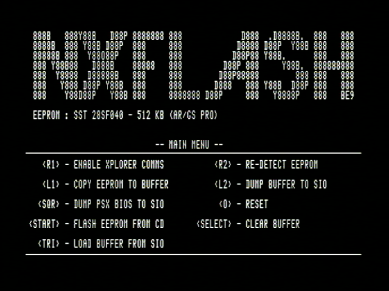
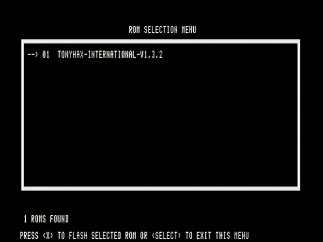
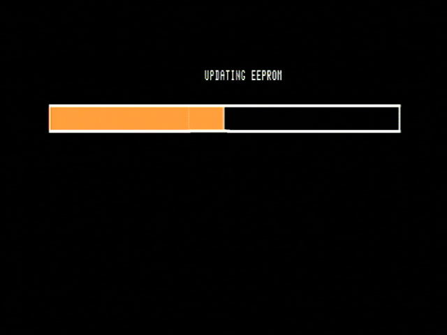

# Flashed Cheat Cart

You can overwrite the contents of a GameShark, Action Reply, or other PS1 cheat cartridge with the Tonyhax International loader. This allows you to turn on any PS1 console with such a cheat device installed to the parallel port at the back the console and will have the system instead boot into the Tonyhax International loader rather then the Sony BIOS/Shell (Sony screens/Memory Card/CD Player menu). 

A PS1 cheat cartridge flashed with the Tonyhax International ROM is essentially a plug and play 'stealth' mod-chip without any hardware modifications whatsoever being done.

## Advantages

The benefits of the ROM boot method are tremendous: 

* On a Japanese console, you may leave your lid sensor blocked before powering on the console. Put in that real NTSC-J PSX game disc, power on the console, and Tonyhax International will automatically license your drive then stop the motor to set you up for swapping in an import or backup disc.

* On USA/European consoles if you simply have any import/backup disc in the drive, close the lid, and power on the console the disc will automatically boot in seconds with no user steps involved! It's literally magic.

## You Never Need To Remove The Cheat Cart

If you want to use the original Sony BIOS features (Memory Card Manager/CD Player), you do not have to remove the flashed cheat cartridge (like other soft-mods require). There is now a 'boot stock BIOS' feature. Open the CD drive of the console **first, then power it on** with the flashed cheat cartridge plugged in. Then press `X` on a controller when you are prompted to insert a disc by Tonyhax International.

Keep in mind that you can not boot any games from the Sony BIOS which has been started by Tonyhax International ROM loader boot Sony BIOS feature at this time, not even real ones that normally work without the flashed cheat cart plugged in. This may be fixed in the future, but the whole point of this feature is to gain back the ability to use the stock memory card manager/CD player without ever needing to remove the flashed cheat cartridge itself. You can start all your games from the Tonyhax International loader by pressing reset or power-cycling your console after entering the Sony BIOS.

## YouTube Videos On This Functionality

My friend [JMaxxl](https://github.com/JMaxxL) has created a tutorial on YouTube: [HOW TO: Tonyhax International - flash to a parallel cheat device PS1](https://www.youtube.com/watch?v=sujXwGnPtqQ).

## Requirements

*   GameShark, Action Reply, or other cheat cart that you are willing to overwrite with the Tonyhax International ROM.
*   A PS1 console with a parallel port for installing the GameShark or other cheat cart (SCPH-1000-SCPH-7502).
*   A Blank high quality CD-R (if burning a ROM flasher CD) or a serial cable, PC, and software which supports flashing a PS1 cheat cartridge over serial.

## Flashing Your Cheat Cart With The ROM Flasher CD-R

Inside each Tonyhax International release in the `rom` directory are the following files:

*   tonyhax-rom-flasher.bin
*   tonyhax-rom-flasher.cue
*   tonyhax-*-international.rom

The BIN+CUE files can be burned to a CD-R. The BIN+CUE files contain the [NXFlash](https://github.com/danhans42/nxflash) PS1 executable with the `tonyhax-*-international.rom` file. 

This means when you boot the burned flasher CD-R on your PS1 console, you can connect your GameShark/cheat device and press the `R2` button (`RE-DETECT EEPROM`) to allow NXFLASH to detect the newly connected cheat cart. Next press the `start` button (`FLASH EEPROM FROM CD`), and then press X to flash your GameShark/Cheat device. Now you can simply reset or power off then power on your PS1 console and it will boot Tonyhax International from the GameShark/cheat cart immediately.

## Flashing Your Cheat Cart With The Raw ROM File + Serial Cable

There are numerous other ways to flash a cheat cartridge with a serial cable using software such as [UniROM](https://unirom.github.io/) , this method while requiring a serial cable/PC setup does allow [more cheat carts to be flashed](https://github.com/alex-free/tonyhax/issues/20).
