# FreePSXBoot Exploit

The [FreePSXBoot Exploit](https://github.com/bradl-in/freepsxboot) enables you to boot the Tonyhax International loader by selecting the Memory Card Manager option in the stock Sony BIOS while a special memory card is present in the console. This memory card once loaded with the exploit can not be used for normal game saves, and can not be formatted correctly by some software. As of v1.4.8 Tonyhax International can successfully format FreePSXBoot memory cards so that they work for normal game saves. This can be done by starting the Tonyhax International loader and pressing the TRIANGLE button when prompted.

## Requirements

*   Any PSX console. PS2 consoles _are not_ vulnerable to the FreePSXBoot exploit.

* A PS1 memory card that your not using for any other save files. The FreePSXBoot exploit takes up the entire PS1 memory card disallowing it from being used for any normal functions besides booting Tonyhax International when selecting the Memory Card Manager in the stock Sony BIOS.

* All the required hardware for either the [Modded PS2 Method](#modded-ps2-method), or the [PS3 Memory Card USB Adaptor Method](#ps3-memory-card-usb-adapter-method) of writing the FreePSXBoot file to the PSX memory card.

## Usage

You need to copy the FreePSXBoot memory card file for you console (found in the `freepsxboot` directory in each Tonyhax International release). The memory card file then must be written to a PSX memory card.

There are 2 methods that I personally use to copy a FreePSXBoot exploit file to a PS1 memory card, they are the [Modded PS2 Method](#modded-ps2-method), and the [PS3 Memory Card USB Adaptor Method](#ps3-memory-card-usb-adapter-method). There are other methods that I haven't tried though they would also work. You just need to get the correct file on the PS1 memory card.

Once you write the correct file to the PSX memory card, insert it into slot 1 or slot 2 of the console (depending on which file you wrote to it). Turn on your PSX console **with the CD drive lid open**, and then select the `Memory Card` option in the PSX BIOS. This will start the Tonyhax international loader after a brief delay. **Before starting any backup or import disc in the loader YOU MUST REMOVE THE FREEPSXBOOT MEMORY CARD to ensure successful booting of your backup or import disc. THIS APPLIES TO BOTH SLOT 1 AND SLOT 2 FREEPSXBOOT CARDS.**

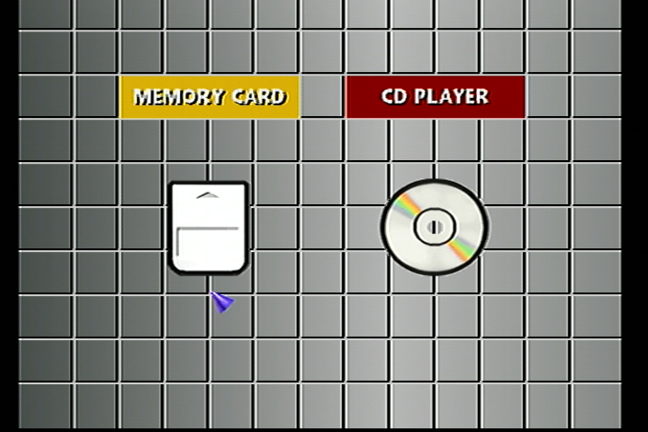

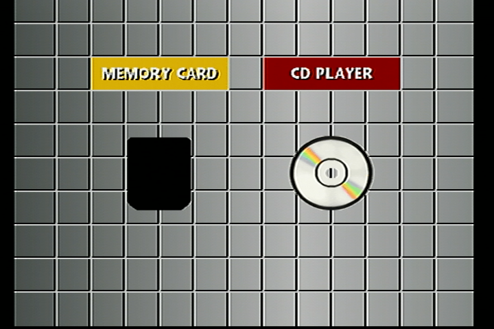

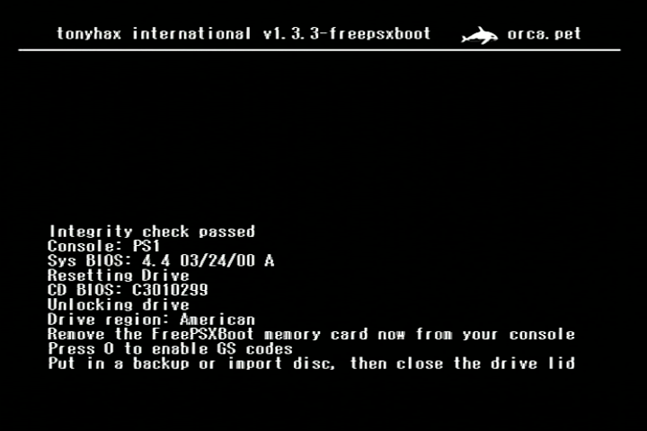

If you want to remove the FreePSXBoot exploit from your memory card, you can format it successfully using [MCTool](https://www.psx-place.com/threads/mctool-tonyhax-freepsxboot-installer.36569/) or [MemcardRex](https://github.com/ShendoXT/memcardrex). Be aware that most other programs are unable to format or read a PSX memory card with the FreePSXBoot exploit on it.

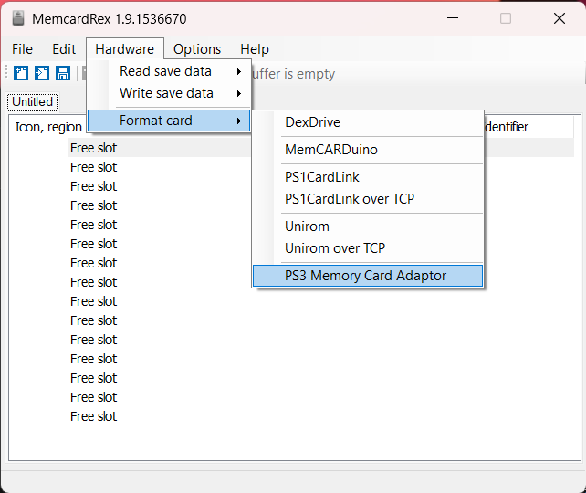

## Finding The Correct FreePSXBoot Exploit File

Console models and the BIOS versions they contain are listed below:

*   SCPH-1000 - BIOS-1.0-1994-09-22-I
*   SCPH-1001 - BIOS-2.0-1995-05-07-A, BIOS-2.1-1995-07-17-A, or BIOS-2.2-1995-12-04-A
*   SCPH-1002 - BIOS-2.0-1995-05-10-E, BIOS-2.1-1995-07-17-E, or BIOS-2.2-1995-12-04-E
*   SCPH-3000 - BIOS-1.1-1995-01-22-I or BIOS-2.1-1995-07-17-I
*   SCPH-3500 - BIOS-2.1-1995-07-17-I
*   SCPH-5000 - BIOS-2.2-1995-12-04-I
*   SCPH-5001 - BIOS-3.0-1996-11-18-A
*   SCPH-5003 - BIOS-2.2-1995-12-04-A
*   SCPH-5500 - BIOS-3.0-1996-09-09-I
*   SCPH-5501 - BIOS-3.0-1996-11-18-A
*   SCPH-5502 - BIOS-3.0-1997-01-06-E
*   SCPH-5503 - BIOS-3.0-1996-11-18-A
*   SCPH-5552 - BIOS-3.0-1997-01-06-E
*   SCPH-5903 - BIOS-2.2-1995-12-04-A
*   SCPH-7000 - BIOS-4.0-1997-08-18-I
*   SCPH-7001 - BIOS-4.1-1997-12-16-A
*   SCPH-7002 - BIOS-4.1-1997-12-16-E
*   SCPH-7003 - BIOS-3.0-1996-11-18-A
*   SCPH-7500 - BIOS-4.0-1997-08-18-I
*   SCPH-7501 - BIOS-4.1-1997-12-16-A
*   SCPH-7502 - BIOS-4.1-1997-12-16-E
*   SCPH-7503 - BIOS-4.1-1997-12-16-A
*   SCPH-9000 - BIOS-4.0-1997-08-18-I
*   SCPH-9001 - BIOS-4.1-1997-12-16-A
*   SCPH-9002 - BIOS-4.1-1997-12-16-E
*   SCPH-9003 - BIOS-4.1-1997-12-16-A
*   SCPH-9903 - BIOS-4.1-1997-12-16-A
*   SCPH-100 - BIOS-4.3-2000-03-11-I
*   SCPH-101 - BIOS-4.4-2000-03-24-A or BIOS-4.5-2000-05-25-A
*   SCPH-102 - BIOS-4.4-2000-03-24-E or BIOS-4.5-2000-05-25-E
*   SCPH-103 - BIOS-4.5-2000-05-25-A

If you have a PSX console that can have multiple different BIOS versions, you have to try each different memory card file one by one until you figure out what BIOS version you need for your PSX console.

## Modded PS2 Method

This installation method requires:

* A modded PS2 that is a SCPH-18000 or newer model. This is because the early SCPH-10000 and SCPH-150000 models are incapable of running [Memory Card Annihilator](https://www.psx-place.com/threads/memory-card-annihilator-v2-0a-a-new-version-after-more-than-11-years.36277/).

* A FAT32 formatted USB flash drive that your PS2 console can read, not that not all USB flash drives seem to work with PS2 consoles (due to iffy USB 1.1 support found in some newer USB flash drives). You may need to do a bit of trial and error testing to find a USB flash drive that works.

Copy the [correct FreePSXBoot exploit file](#finding-the-correct-freepsxboot-exploit-file) for your console to the USB flash drive.

Download [Memory Card Annihilator](https://www.psx-place.com/threads/memory-card-annihilator-v2-0a-a-new-version-after-more-than-11-years.36277/) and extract it. Copy **both** the `mca_v20a-2022-06-16/MCA/mca_v20a.elf` and the `mca_v20a-2022-06-16/MCA/lang.lng` files to the USB flash drive.

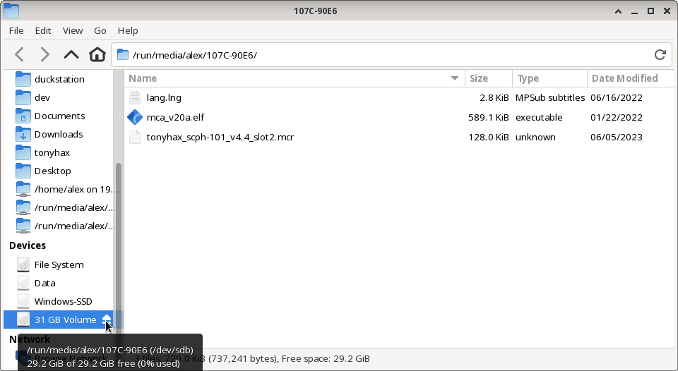

Eject the USB drive and insert it and the target PSX memory card into the PS2 console. Start the wLaunchElf program.

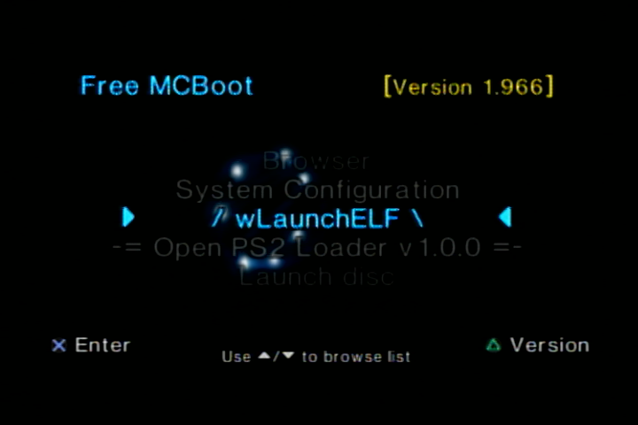

Navigate to the "mass" device and launch the Memory Card Annihilator.elf file you previously copied to the USB flash drive by pressing `O`.

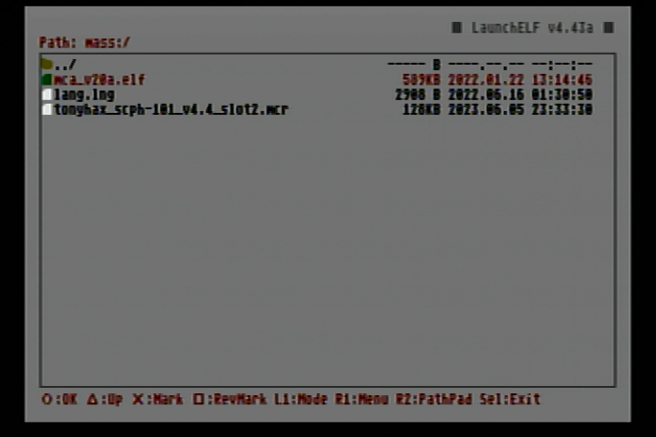

Select the PS1 memory card in the menu and then select restore. In the file picker navigate to the memory card file you copied to the USB flash drive previously. Wait for the restore to complete and press X. Remove your memory card and put it into either Slot 1 or Slot 2 of your PS1 console depending on what memory card image you use.

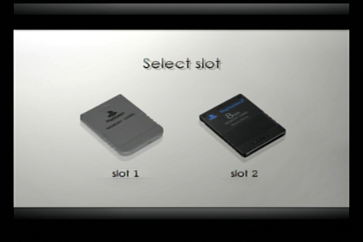

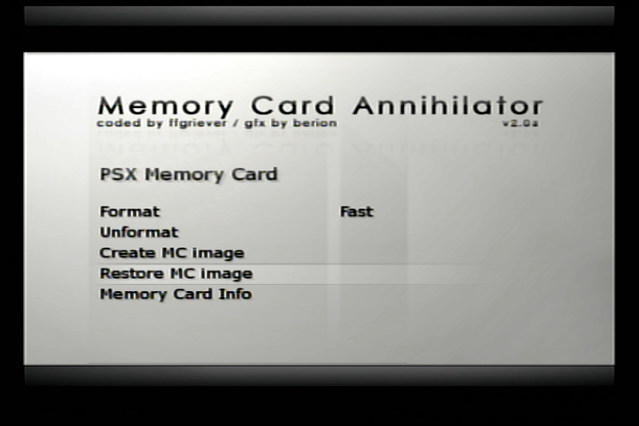

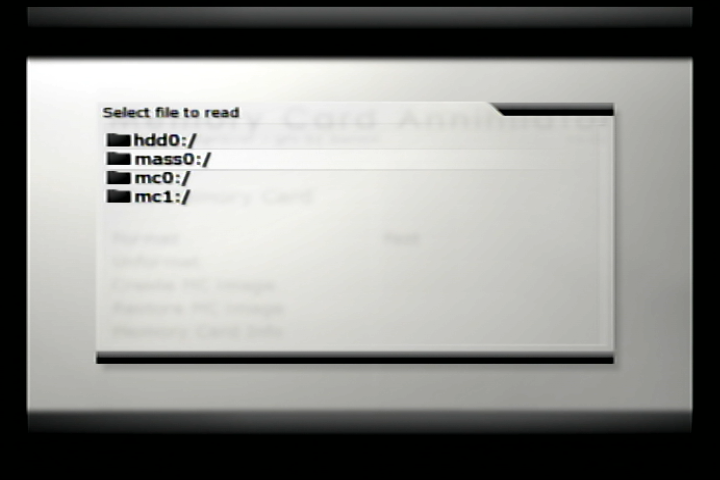

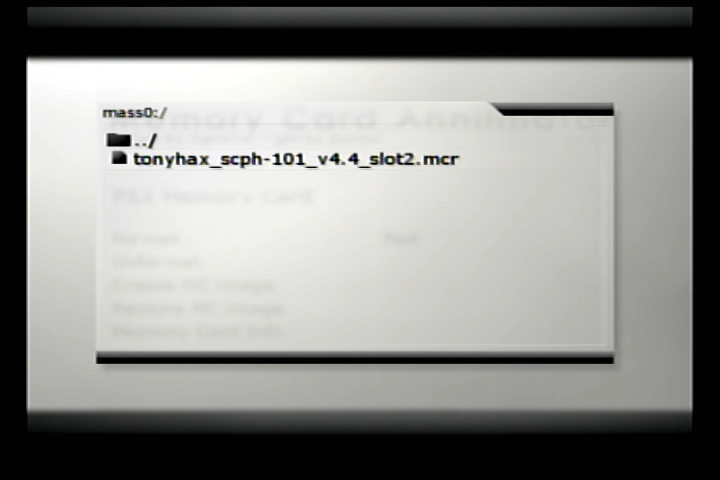

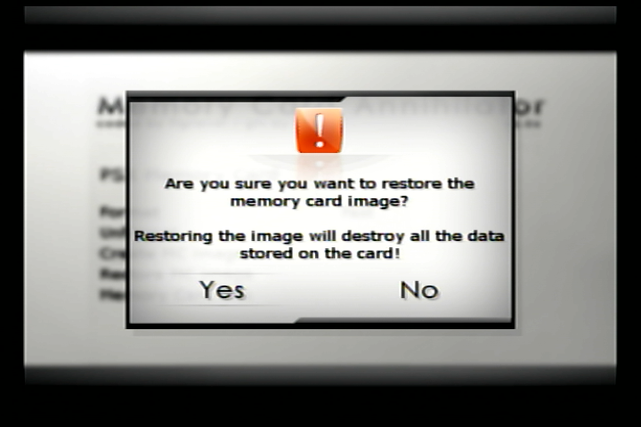

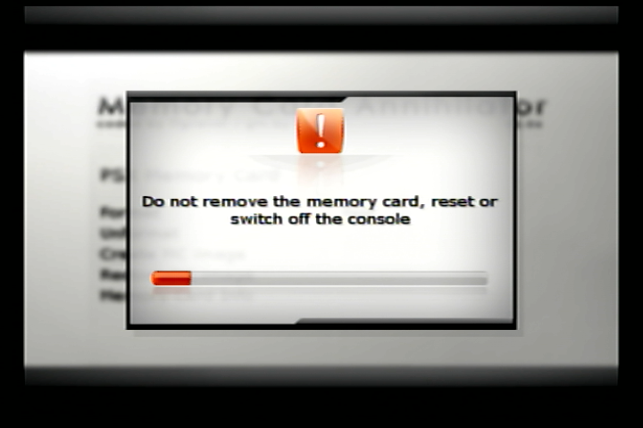

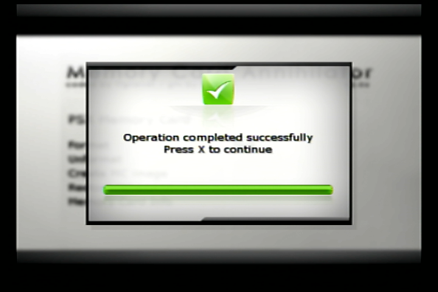

Keep in mind that after you restore the memory card it will crash Memory Card Annihilator due to the FreePSXBoot exploit being present on the memory card. You should remove the PSX memory card you just restored, turn off your PS2, and then turn it back on if you want to use your PS2 console for something else. Don't keep the restored card in your PS2 console or it will cause problems with the console booting and maybe others, you must [format that card](#usage) before you can use it in any other capacity with your PS2 console.

## PS3 Memory Card USB Adapter Method

This installation method requires:

* A Windows PC.
* A PS3 Memory Card USB Adapter.

You can use a PS3 Memory Card adapter in combination with the [MemcardRex](https://github.com/ShendoXT/memcardrex) and a Windows PC to copy the freepsxboot exploit memory card image to a PS1 memory card.

Get the latest version of [MemcardRex](https://github.com/ShendoXT/memcardrex) and follow the instructions to install the driver for the PS3 Memory card adapter. Those instructions are found in the previous link, as well as copied verbatim below:

`PS3 Memory Card Adaptor
The PS3 Memory Card Adaptor is an official Sony USB adapter that allows reading and writing PS1 Memory Cards on a PlayStation 3.
To use it on a Windows PC, a custom USB driver needs to be installed.`

`This USB driver can be easily created and installed using [Zadig](https://zadig.akeo.ie/) by following these steps:`

`Plug the PS3 Memory Card Adaptor into a free USB port and start Zadig.
Zadig should display the PS3 MCA as an "Unknown Device". Verify that the USB ID matches: 054C 02EA`

`Click the Edit checkbox and name the device "PS3 Memory Card Adaptor"
Ensure that "WinUSB" is selected from the list of Driver options and click the Install Driver button.`

`After about 30 seconds Zadig should show a message that the driver was installed successfully.`

`With the USB driver installed and the PS3 Memory Card Adaptor plugged in, you should now be able to read, write and format PS1 Memory Cards.`

With everything ready, start up memcardrex. **Before you access the memory card in MemcardRex**, you need to disable one setting enabled by default. This setting is named `Try to fix corrupted Memory Cards`. Uncheck it, click `Apply`, then click `OK`.

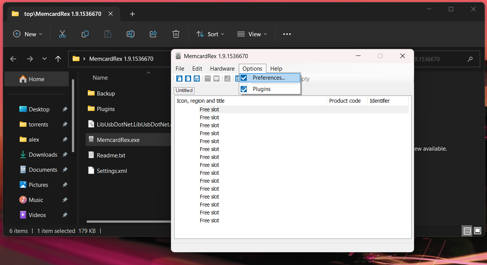

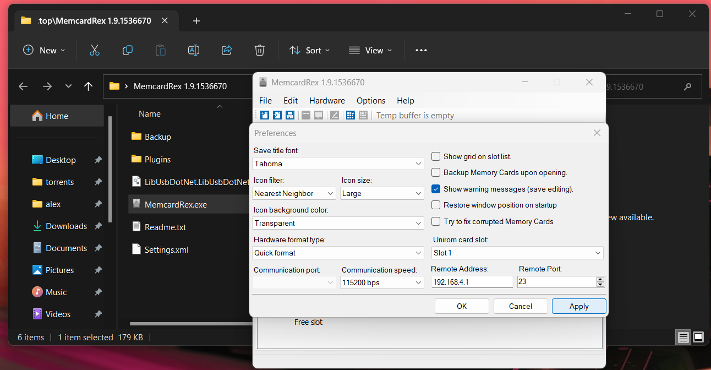

Drag and Drop the [correct FreePSXBoot exploit file](#finding-the-correct-freepsxboot-exploit-file) for your console into the MemcardRex window.

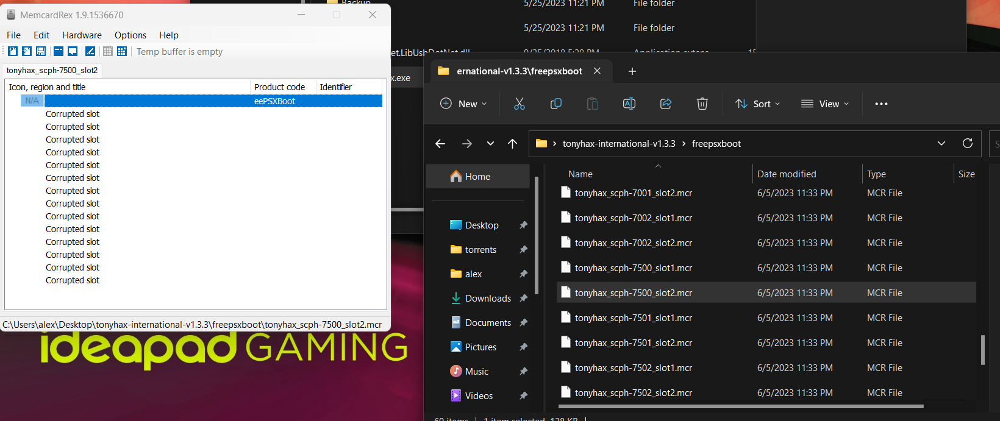

Write the FreePSXBoot file to the memory card.

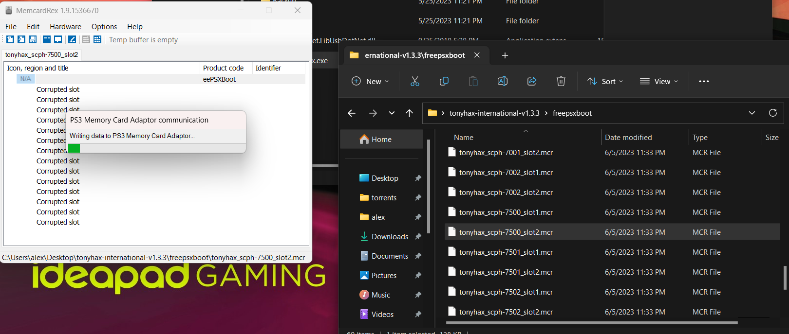