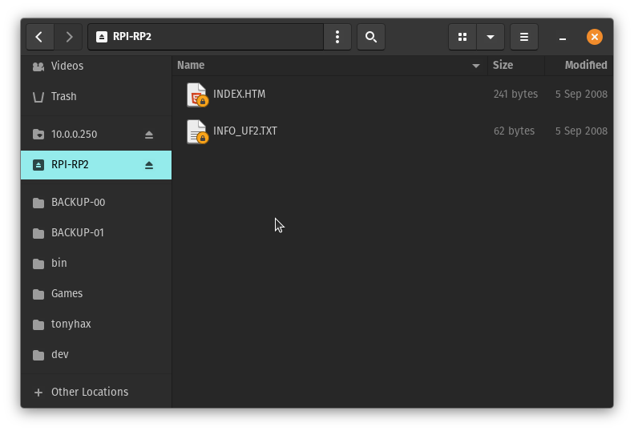
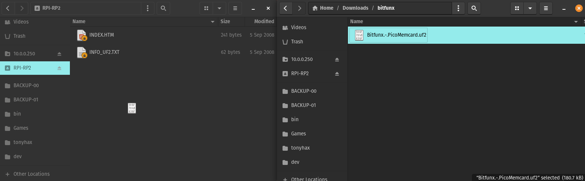
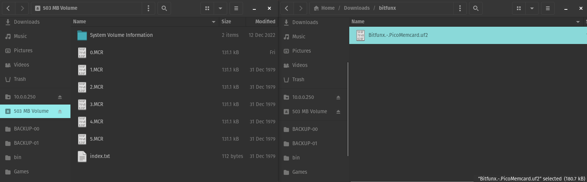

# [Tonyhax International](readme.md) -> GameID

Tonyhax International as of v1.5.3 has support for GameID. GameID is sent by Tonyhax International to tell special memory card hardware to use a memory card image specific to the game being started. Since each game gets access to 15 memory card slots, this allows for some pretty great memory card save management features. In addition, these devices allow for easy transfer of save files and memory card images over USB, in a way much cheaper and faster then the now rare Sony PS3MCA.

The following GameID compatible devices have been tested with Tonyhax international (**must be in slot 1 of the console**):

* MemcardPro.
* MemcardPro 2.
* SD2PSX.
* Bitfunx PSXMemCard (requires additional setup, see below).

## Bitfunx PSXMemCard

This thing is phenomenal. Essentially, it is a [picomemcard+](https://github.com/MrPalloncini/PicoMemcard?tab=readme-ov-file#picomemcard-vs-picomemcard) that is already assembled for you. It's about $14 on Aliexpress, and comes with a 512MB micro SD card in the box. It supports firmware updates, which is very important since it ships with a version of the original [picomemcard+](https://github.com/dangiu/PicoMemcard) firmware, which as of 10/6/2024 has not added GameID support.

[MrPalloncini](https://github.com/MrPalloncini) has [forked PicoMemcard](https://github.com/MrPalloncini/PicoMemcard) to add GameID support. MrPalloncini has opened a [pull request](https://github.com/dangiu/PicoMemcard/pull/82) to get GameID support into the official [PicoMemcard](https://github.com/dangiu/PicoMemcard). Until then, we don't have to wait. We can use MrPalloncini's version.

How to add GameID support to your Bitfunx PSXMemCard:

1) [Download](https://github.com/MrPalloncini/PicoMemcard/releases) MrPalloncini's PicoMemCard fork. As of 10/6/2024, the latest release is at [https://github.com/MrPalloncini/PicoMemcard/releases/download/1.0.5/Bitfunx.-.PicoMemcard.uf2](https://github.com/MrPalloncini/PicoMemcard/releases/download/1.0.5/Bitfunx.-.PicoMemcard.uf2).

2) Find something that will allow you to access the `BOOT` button (it's at the bottom of a small access hole next to the USB-C charging port). You can use an unbent paper clip, phone SIM removal tool, or sacrifice a clicky pen for a pen spring that can be unbent.

3) Using a USB-C cable, connect the Bitfunx PSXMemCard to the computer while the `BOOT` button is being pressed.

4) Once the Bitfunx PSXMemCard is mounted as `RPI-RP2`, drag and drop the `*.uf2` onto the `RPI-RP2` volume.

5) Wait for the Bitfunx PSXMemCard to unmount, and mount again as a standard volume  (i.e. mine appears as `503MB Volume` with the included micro SD card).

## About PSX.EXE Games

All other projects that have implemented GameID support (ODEs, soft-mods, etc.) have ignored the early Japanese launch games in regards to proper GameID implementation. This is due to said games sharing the same boot file name ('PSX.EXE'). When I implemented GameID support into Tonyhax International, I devised a first of it's kind PSX.EXE identification system which has made it possible to send the serial number listed on the CD case of these games as the GameID. Each PSX.EXE officially licensed title with saving functionality should be identified by Tonyhax International. Due to this support being added on a game by game basis, if you get `Unknown PSX.EXE ID, unique GameID unavailable.` please open an [issue](https://github.com/alex-free/tonyhax/issues/new) so support may be added.
