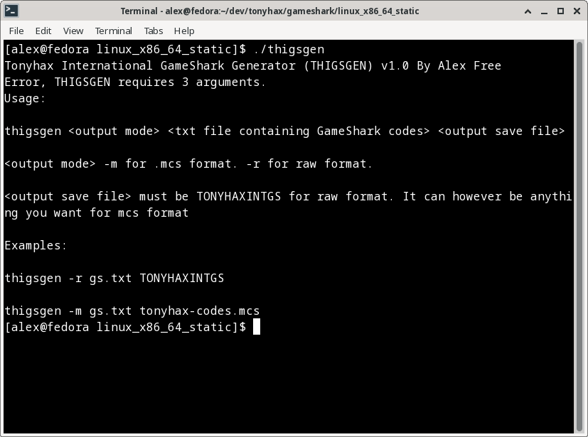
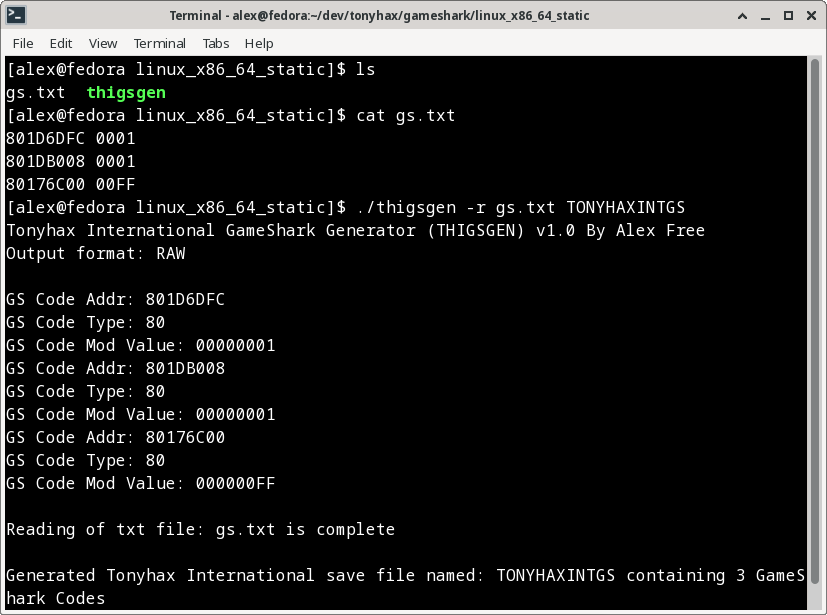
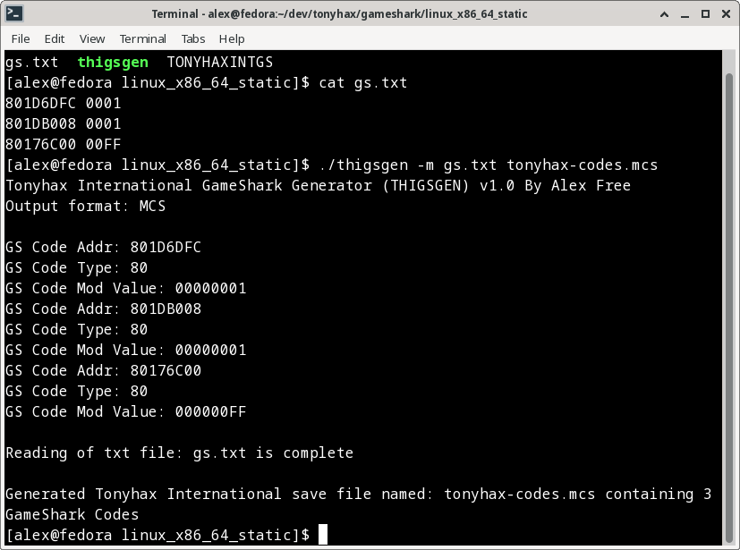

# GameShark Code Support

Tonyhax International now has the ability to apply user-supplied GameShark codes to any game before starting it. This uses my save game GameShark storage system as well as MottZilla's 'Cheat Engine', the latter of which has only previously been put to use by the APv2 bypass system.

## How It Works

1) Create a save game file using the new THIGSGEN program supplied in each Tonyhax International release, found in the `gameshark` directory.

2) Copy the `TONYHAXINTGS` file to a memory card, this takes up 1 Block of space.

3) Put the memory card in Slot 1 of your PSX console. Start Tonyhax International using any boot method.

4) When you see the text `Press O to enable GS codes` in the Tonyhax International loader, press the circle button on your controller. You will then see the text `Reading MC...`, followed by `X codes detected` (where `X` is the number of codes you wrote to the save file generated by THIGSGEN).

5) Boot your game as normal, and enjoy the GameShark codes.

## Supported Codes & Limits

Currently these code types are supported:

80 - 16-bit constant write codes. I.e., `801D6DFC 0001`
*D0/80 - 16-bit write on comparison match codes. I.e, `D0149004 959C
80149004 9E64`. 

_*Important Note On D0/80 codes:_ currently any D0 code type must match the corresponding 80 code on the next line. What this means is the code: `D0149004 959C 80149004 9E64` works because the first part `D0149004` matches the `80149004` part. An example of a code that does not match is like `D0160022 9404 80240246 0001` because the `D0160022` part does not match the `80240246` part. Such codes **do not work yet**.

It is unknown how many codes will all simultaneously work on real hardware. I tried 91 simulations codes, and while they work on emulation on real hardware the whole console locks up so definitely less then that. Keep in mind that some later games containing [anti-piracy](anti-piracy-bypass.md) functions use a few GameShark codes automatically to bypass the detection by Tonyhax International, so those games might support a total amount of simultaneous codes slightly less so then other games without such anti-piracy.

## Usage

### Tonyhax International GameShark Generator (THIGSGEN)

This is a command line program found in the `gameshark` directory of each Tonyhax International release. There are 4 different binaries available:

*   `windows_x86` - For Windows 95 OSR 2.5 and newer.
*   `windows_x86_64` - For 64bit Windows.
*   `linux_x86_static` - For 32bit Linux distros.
*   `linux_x86_64_static` - For 64bit Linux distros.

So find the correct binary to use for your computer in one of the folders above. It will be named `thigsgen.exe` (Windows) or `thigsgen` (Linux). 

Then, open `COMMAND.EXE` (Windows) or your Terminal in Linux. Drag the executable into the `COMMAND.EXE` or Terminal window.

The first argument given must be either -m (for .MCS format output) or -r (for RAW save file output). The .MCS format is useful for working with emulators and or the MemCardRex software. The RAW format is useful for working with [WLaunchELF](https://github.com/ps2homebrew/wLaunchELF) and real consoles. You most likely want the RAW format.

The second argument given is the filename of a .txt file that contains gameshark codes listed line by line. These codes are the ones which will be included in the generated save file.

The 3rd argument is the name of the save file, which must be `TONYHAXINTGS` if working with the RAW save file format. The .MCS format does not care what you provide as output file name, since it actually includes the exact filename of the RAW save file internally in it's format.

So, example usage could look like this:

`thigsgen -r gs.txt TONYHAXINTGS` - this reads all codes in the file `gs.txt` and generates a RAW save file that can be used on a real console.

`thigsgen -m gs.txt tonyhax-codes.mcs` - this reads all codes in the file `gs.txt` and generates a MCS save file that can be used in emulators and or the MemCardRex software.

The `gs.txt` file could look like this:

`801D6DFC 0001`

`801DB008 0001`

`80176C00 00FF`

The first 2 codes enable all cars. The last code enables all tracks. These codes are for the game [Ridge Racer USA](http://redump.org/disc/1869/).

**Note that each code line must be on it's own line in the txt file, without any gaps.**

## Copying The TONYHAXINGS File To A PSX Memory Card

So now you should have a TONYHAXINTGS file containing the GameShark codes you desire to use. The next step is to copy this file to your PSX memory card.

You can use a PS2 console to copy the save files to a PS1 memory card from a USB flash drive.

Requirements:

* A FAT32 formatted USB flash drive that your PS2 console can read. Please note that not all USB flash drives seem to work with PS2 consoles (due to iffy USB 1.1 support found in some newer USB flash drives). You may need to do a bit of trial and error testing to find a USB flash drive that works.

* A soft-modded (or modchipped) PS2 console that can run [WLaunchELF](https://github.com/ps2homebrew/wLaunchELF) (Models newer then the SCPH-39004 can therefore be used for copying the files to the PS1 memory card, but they can not be used to boot into Tonyhax International). You could do this with [FreeHDBoot](https://www.ps2-home.com/forum/viewtopic.php?t=5208) or [FreeMCBoot](https://www.ps2-home.com/forum/viewtopic.php?t=1248).

Installation With A PS2:

* Copy the `TONYHAXINTGS` file to the FAT32 USB flash drive using a computer.

* Eject the USB flash drive from your computer and insert it into your PS2 console. Insert a PS1 memory card into your PS2 as well. 

* Start the [WLaunchELF](https://github.com/ps2homebrew/wLaunchELF) homebrew program on your PS2 console. Navigate to the `mass` device (this is your USB flash drive) with the `DPAD` on the controller, then select it with the `circle` button. 

* Using the `DPAD` to navigate, press the `cross` button on the controller to highlight the `TONYHAXINTGS` file that you previously copied to the USB flash drive. Press the `R1` button on the controller to make the file operations menu appear in [WLaunchELF](https://github.com/ps2homebrew/wLaunchELF). Use the `DPAD` to move to the copy function and then press the `circle` button to select it.

* Press the `triangle` button to navigate out of the `mass` device. Use the `DPAD` and the circle button to navigate into either the `MC0` (if the PS1 memory card is in slot 1 of the PS2) or `MC1` (if the PS1 memory card is in slot 2 of the PS2) device. 

* Press the `R1` button to again make the file operations menu appear in [WLaunchELF](https://github.com/ps2homebrew/wLaunchELF). Use the `DPAD` to navigate to the paste option and press the `circle` button to finally paste the `TONYHAXINTGS` file. Now you can press the `triangle` button to navigate out of the PS1 memory card device, and remove the memory card from the PS2 console (if you want to use it in a different console).

## Using GameShark Codes In The Tonyhax International loader

Start the Tonyhax International loader using any boot method. When you see the text `Press O to enable GS codes` do so on your controller. Then boot the game that the codes are for as usual. Enjoy!