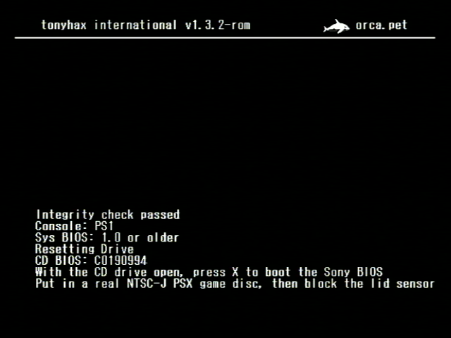
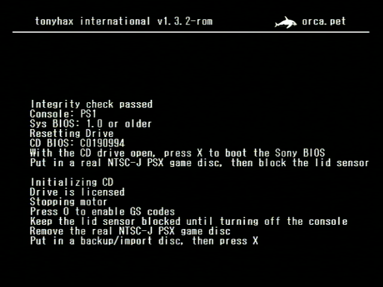
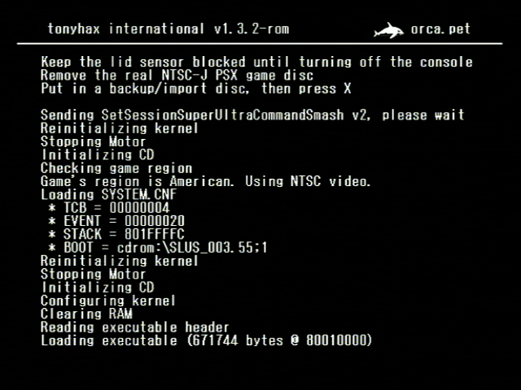
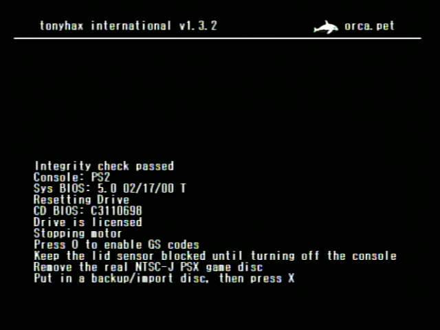
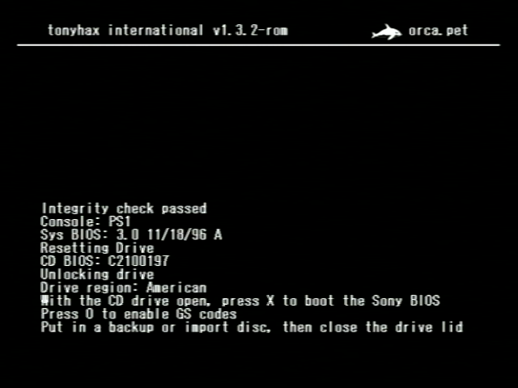
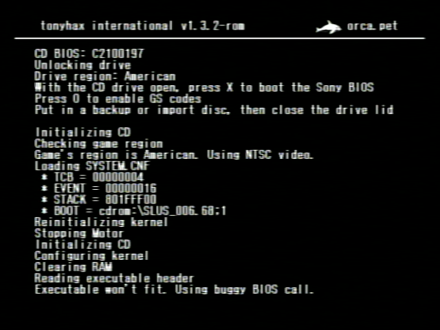

## [alex-free.github.io](https://alex-free.github.io)

## The Ultimate Backup CD-R/Import Disc Loader Soft-Mod Solution For The Original PlayStation & Early Models Of PlayStation 2

Brought to you by [Alex Free](http://www.psxdev.net/forum/memberlist.php?mode=viewprofile&u=6018), [MottZilla](http://www.psxdev.net/forum/memberlist.php?mode=viewprofile&u=867), [Patchouli (karehaani)](http://www.psxdev.net/forum/memberlist.php?mode=viewprofile&u=6714), and [SylverReZ (M4x1mumReZ)](https://gbatemp.net/members/sylverrez.610331/). Built on the work of many [others](credits.md).

Tonyhax International is a fork of the [Tonyhax](https://orca.pet/tonyhax/) "Software backup loader exploit thing for the Sony PlayStation 1" originally created by [Socram8888](https://github.com/socram8888). Tonyhax International is developed by Alex Free and MottZilla with many new features and upgrades compared to the original Tonyhax, some of which are listed below:

* Supports all PS1 Consoles (Japanese, American, European, SCPH-1000-SCPH-102) **and** Early PS2 Consoles (Japanese, American, European, SCPH-10000-SCPH-39004).

* Supports starting the Tonyhax International loader with [GameShark Codes](gameshark-code.md) and any PSX cheat device using the new GameSharkHAX boot method.

* Supports [flashing](flashed-cheat-cart.md) the Tonyhax International backup/import loader to a GameShark, Action Reply, or similar PSX cheat cartridge. Whenever the flashed cartridge is plugged into the back of a PSX console model with a cartridge port on the back when you power it on the Tonyhax International will boot instead of the shell program/BIOS (Sony screens/CD Player/Memory Card Manager). You can still however access the CD Player/Memory Card Manager by powering on the console with the CD drive open, and then pressing `X` when prompted in the Tonyhax International loader.

* Supports **more [save game exploits](save-game-exploit.md)**, enabling the use of even more PSX game discs to start the Tonyhax International loader.

* Boots more games via the [FreePSXBoot](freepsxboot-exploit.md) exploit successfully.

* Supports more [games with additional copy protection routines](anti-piracy-bypass.md), by **using a completely different anti-piracy bypass system.**

* Supports [applying user-supplied GameShark codes](gameshark-code-support.md) to any game it booted by the Tonyhax International loader. Dare I say this is the world's first open source PSX GameShark.

* Supports [TOCPerfect Patching](https://alex-free.github.io/tocperfect) a CD image directly to use the Tonyhax International loader as a way to remove some of the limitations of using the CD Player Swap Trick as a boot method.

* Enables speeding up xStation boot time and allows for applying codes to games `Full Boot`ed by xStation. This is accomplished by a [special xStation ROM version](xstation.md).

* Uses a completely different build system that is portable to many more Linux distributions. This new build system is more efficient and easier to use as well.

## Important Info

*   [The Ultimate Guide To PSX CD-Rs](https://alex-free.github.io/psx-cdr) - everything you need to know when making your own PSX backup CD-Rs.

*   [Unofficial PS1 CD Drive Service Manual](https://alex-free.github.io/unofficial-ps1-cd-drive-service-manual/) - How to refurbish your PSX CD drive to read discs better if it has issues.

## Usage

_Japanese PS1 Consoles (SCPH-1000-SCPH-100)_

*   [Japanese PS1 Console Loader Instructions](#japanese-ps1-console-loader-instructions)

*   [Playing Games That Span Multiple Discs On Japanese PS1 Consoles](#playing-games-that-span-multiple-discs-on-japanese-ps1-consoles)

_Japanese PS2 Consoles (SCPH-10000-SCPH-39000)_

*   [Japanese PS2 Console Loader Instructions](#japanese-ps2-console-loader-instructions)

*   [Using the Swap Magic Tool](#using-the-swap-magic-tool)

*   [Playing Games That Span Multiple Discs On Japanese PS2 Consoles](#playing-games-that-span-multiple-discs-on-japanese-ps2-consoles)

*   [Playing PAL Region Games On Japanese PS2 Consoles](#playing-pal-region-games-on-japanese-ps2-consoles)

_American/European PS1/PS2 Consoles (SCPH-1001-SCPH-39004)_

*   [American/European PS1/PS2 Console Loader Instructions](#americaneuropean-ps1ps2-console-loader-instructions)

*   [Playing Games That Span Multiple Discs On American/European PS1/PS2 Consoles](#playing-games-that-span-multiple-discs-on-americaneuropean-ps1ps2-consoles)

*   [Playing PAL Games On American PS2 Consoles](#playing-pal-games-on-american-ps2-consoles)

*   [Playing Japanese/American Games On PAL PS2 Consoles](#playing-japaneseamerican-games-on-pal-ps2-consoles)

## Boot Methods

*   [TOCPerfect Patching](https://alex-free.github.io/tocperfect)

*   [GameShark Code](gameshark-code.md)

*   [Flashed Cheat Cartridge - ROM/ROM Flasher CD](flashed-cheat-cart.md)

*   [FreePSXBoot Exploit Memory Card Images](freepsxboot-exploit.md)

*   [Boot CD](boot-cd.md)

*   [Save Game Exploit](save-game-exploit.md)

## More Info

* [GameShark Code Support](gameshark-code-support.md)

* [XStation ROM Version](xstation.md)

* [Playing Games With Additional Copy Protection Routines](anti-piracy-bypass.md)

* [Building From Source](build.md)

* [Credits](credits.md)

## Links

_Home Pages_

*   [Tonyhax International Homepage](https://alex-free.github.io/tonyhax-international)
*   [Tonyhax International GitHub](https://github.com/alex-free/tonyhax)

_Threads_

*   [PSX-Place Thread](https://www.psx-place.com/threads/tonyhax-international-backup-loader-for-all-japanese-usa-and-pal-ps1-consoles-early-ps2-consoles.37925/)
*   [PSX-Place Tonyhax International Resource](https://www.psx-place.com/resources/tonyhax-international.1281/)
*   [PSXDEV Thread](http://www.psxdev.net/forum/viewtopic.php?f=66&t=3967)
*   [GBATemp](https://gbatemp.net/threads/tonyhax-international-backup-loader-for-all-japanese-usa-and-pal-ps1-consoles-early-ps2-consoles-gameshark-cheat-cart-flasher.615892/##post-9922514)

_Relevant Software_

*   [TOCPerfect Patcher](https://alex-free.github.io/tocperfect) - patch the Tonyhax International loader into a disc image directly to expand the capabilities of the CD Player Swap Trick.

*   [CDRDAO-PLED](https://alex-free.github.io/cdrdao) - recommended burning software for Linux.

*   [EDCRE](https://alex-free.github.io/edcre) - EDC/EEC regenerator to allow EDC protected PSX games to be burned by CDRDAO-PLED's generic-mmc-raw driver correctly.

*   [APrip Homepage](https://alex-free.github.io/aprip) - patches some later PSX games with additional anti-piracy copy protection.

*   [PS1 DemoSwap Patcher Homepage](https://alex-free.github.io/ps1demoswap) - a similar project that uses the Tonyhax International loader.

*   [PSEXE2ROM Homepage](https://alex-free.github.io/psexe2rom) - what generates the Tonyhax International ROM file.

*   [NXFLASH](https://github.com/danhans42/nxflash) - the software which flashes cheat carts with the Tonyhax International ROM.

*   [FreePSXBoot](https://github.com/brad-lin/FreePSXBoot) - an exploit used in a Tonyhax International boot method.

*   [Tonyhax (the original) Github](https://github.com/socram8888/tonyhax) - what Tonyhax International is based on (_International is not an official version and at this point deviates quite greatly_).

*   [Tonyhax (the original) Homepage](https://orca.pet/tonyhax)

## Downloads

### Version 1.4.1 (9/15/2023)

*   [tonyhax-international-v1.4.1](https://github.com/alex-free/tonyhax/releases/download/v1.4.1i/tonyhax-international-v1.4.1.zip)

Changes:

*   Implemented a small wait period between open() and read() for memory card reading as per PSX specs to prevent any other possible rare fail to read memory card issues involving the [user supplied GameShark codes feature](gameshark-code-support.md).

*   Removed a [redundant](https://github.com/socram8888/tonyhax/issues/149) exitcritcalsection() call after the final setconf (thanks Socram8888)!

*   Added an [APv2 bypass](anti-piracy-bypass.md) for MLB 2005.

*   Cleaned up source code to be more similar to original Tonyhax.

*   Updated [MKPSXISO](https://github.com/Lameguy64/mkpsxiso) to latest commit.

[About previous versions](changelog.md).

## Usage

The Tonyhax International loader is the program that once started enables the use of backup CD-Rs or import PS1 discs. The Tonyhax International loader can be booted with a [flashed cheat cart](flashed-cheat-cart.md), a [flashed memory card](freepsxboot-exploit.md), a [save game exploit](save-game-exploit.md), a [CD-R](boot-cd.md), or even a [GameShark Code](gameshark-code.md). The Tonyhax International loader provides the ability to properly play backup CD-R and 'imported region discs' on all PS1 consoles, and all supported early PS2 consoles (Japanese, USA, and PAL models SCPH-10000-SCPH-39004).

If you are using **any Japanese console**, at least one real Japanese NTSC-J PS1 game disc is required (any officially licensed Japanese PS1 disc will do). If you are using a **Japanese PS2 console (SCPH-10000-SCPH-39000)** a Swap Magic Tool is also required. Neither of these are needed if you are using an American or European PS1/PS2 console.

### Japanese PS1 Console Loader Instructions

Start the Tonyhax International loader with a supported boot method:

*   [TOCPerfect Patching](https://alex-free.github.io/tocperfect)
*   [GameShark Code](gameshark-code.md)
*   [ROM/ROM Flasher CD](flashed-cheat-cart.md)
*   [FreePSXBoot Memory Card Images](freepsxboot-exploit.md)
*   [Boot CD](boot-cd.md)
*   [Save Game Exploit](save-game-exploit.md)

If you see the text `Put in a real NTSC-J PSX game disc, then block the lid sensor`:

*   Open the CD drive of your PS1 console.
*   Put in a real NTSC-J Japanese PS1 game disc in the CD drive, but don't close the CD drive lid.
*   The lid sensor is highlighted by the red circle and arrow in the pictures below. On the original grey fat PS1 consoles (SCPH-900X and earlier) it is located in the top right corner, it is is shaped like a circle. Ideally you press it down with a bent pen spring as shown. On the slim PSone consoles (SCPH-10X) it is in the lower right corner to the side of the edge of the CD drive. For these consoles it is best to use a piece of tape or paper to slide in and press it down as shown.

After blocking the lid sensor, your real Japanese PS1 game will spin up and then stop. Once you see the text `Put in a backup/import disc, then press X` remove either the real NTSC-J PSX game disc or Boot CD from your PS1 console's CD drive. 

Put in the backup CD-R or import PSX game disc you want to play **without unblocking the lid sensor**. Once you press X, the console will run some commands automatically, followed by the game booting with perfect CD audio playback. Note that you can not unblock the lid sensor while playing the game on **Japanese consoles**, if you do so the game will stop working.

### Playing Games That Span Multiple Discs On Japanese PS1 Consoles

There are some games which span multiple discs. And some of these games (such as Parasite Eve, Fear Effect, and Crono Cross) that span multiple discs require you to open the CD drive, remove disc 1, insert disc 2, and close the CD drive at some point in the game without providing a save game option at the disc swap. If you encounter this type of game on a Japanese PS1 console you have to do the "mid-game hot-swap trick":

*   When the game asks you to insert disc 2, unblock the lid sensor and remove the CD.
*   Put **any real authentic Japanese PSX disc** into the PS1 drive.
*   You will now be performing a _mid-game hot-swap trick_. Have the disc 2 you want to play in one hand, and whatever your using to block the lid sensor in another. Now block the lid sensor, freeing your one hand. Wait until the original real Japanese PSX disc stats spinning fast (~3 seconds) and **immediately** swap the disc with your free hand, and put in the actual disc 2 you want to play. You can now continue playing your game that spans multiple discs normally! This trick would work for games that span even more then 2 discs as well.

It is important to note however that most games that span multiple discs allow you to load a game save created on disc 1 while playing disc 2. This means you just need to save at the last point possible on disc 1, and then you can just boot disc 2 like normal and load your game save created earlier on disc 1. **Some games however do not allow this** as previously mentioned, so for those games you must use the **mid-game hot-swap trick** described above.

### Japanese PS2 Console Loader Instructions

Start the Tonyhax International loader with a supported boot method:

*   [Boot CD](boot-cd.md) (I don't know of anyway to boot this on an unmodified Japanese PS2 but it is available).
*   [Save game exploit](save-game-exploit.md)
*   [GameShark Code](gameshark-code.md)

Japanese PS2 consoles **must have the DVD drive tray front panel removed to use Tonyhax International**. For the SCPH-10000, you can follow the method below (some newer consoles may slightly differ in the way to remove the DVD drive's front panel).

### Removing The DVD Drive Tray Front Panel

Turn on the Japanese PS2 console. Eject the DVD drive tray, and **while it is open** power off the console by either pulling the plug from the wall or PSU in the back of the console, or by flicking the power switch for the PSU on the back of the console. You can not use the power button because then the DVD drive tray will close before the console turns off. Now, flip the Japanese PS2 console upside down like in the image below:

Now bring your focus to the bottom of the opened DVD drive tray. At the very top edge (highlighted in the picture above) is a tab. You want to jam a thin flat head screwdriver in between this tab and the DVD drive tray face plate as shown in the image below. Now, push with the flat head screwdriver to separate the DVD drive face plate from the rest of the DVD drive tray. **Be very gentle and only use a direct straight force towards the face plate. Do not go side to side when doing this or you risk breaking off an edge of the DVD drive tray. I am obviously not responsible for any damage you may do by doing this!** Once successful, the face plate will become removable. You are free to slide it back on at a later time, it just needs to be off for you to use the Japanese PS2 to boot backup/import PS1 games with Tonyhax International.

With the DVD drive face plate off, flip over the Japanese PS2 console right side up. You can now see a gap at the bottom of the DVD drive. This is where you place the Swap Magic Tool in when using Tonyhax International on your Japanese PS2 console.

You can now use one of the supported boot methods to start the Tonyhax International loader on the Japanese PS2 console. You will most likely be using the [Save Game Exploit](save-game-exploit.md), however you could be using some kind of intermediate boot disc to boot the [Boot CD](boot-cd.md) as well if you find one that supports Japanese PS1 consoles. Once you see the text `Put in a backup/import disc, then press X` appear, you need to use a Swap Magic Slide Tool to release the DVD drive to gain access to it without pressing the eject switch. A [video tutorial](https://www.youtube.com/watch?v=Ffv5m52zlEI) is available that shows how to use the Swap Magic Tool (in general), although the exact steps are also explained below. Once you use the Swap Magic Tool to swap in your import/backup CD-R while booted in the Tonyhax International loader, just press the cross button on your PS2 or PS1 controller to boot and play your game.

Important note: **do not eject the PS1 import or backup CD-R from the Japanese PS2 console until your done playing the game**. Unlike American and European consoles (which do not have this limitation), if you do so your game will stop working, and you will have to start Tonyhax International all over again to boot your import/backup CD-R and start playing again.

### Using the Swap Magic Tool

Slide in the Swap Magic Tool like shown in the image below by the arrow. You need to feel around with the Swap Magic Tool to get the hook to latch on internally inside the DVD drive.

Now that your Swap Magic Tool is latched on internally inside the DVD drive, move it straight to the right side. This movement will feel correct and nice when you are properly using the Swap Magic Tool, reassuring you are using it correctly. Once you get to the end of this movement the DVD drive tray will begin to move forward out of the DVD drive, "releasing" it from it's locked state.

Use your hand to pull out the DVD drive tray to gain access to the disc in it. Remove the original NTSC-J PSX game disc, and put in your import/backup CD-R.

With your import/backup CD-R in the Japanese PS2 console, use your hand to push in the DVD drive tray as far as it will go back into the DVD drive.

Now that the DVD drive tray is pushed all the way back in, the Swap Magic Tool can be used to "lock" the drive. Like before, slide in the Swap Magic Tool to the right most position like shown in the image below. Remember to feel around with the Swap Magic Tool to get the hook to latch on internally inside the DVD drive. Now that your Swap Magic Tool is once again latched on internally inside the DVD drive, move it straight to the left side. This movement will feel correct and nice when you are properly using the Swap Magic Tool, reassuring you are using it correctly. Once you get to the end of this movement (when you can't go any more to the left) the DVD drive tray will fully go back inside the DVD drive to put the DVD drive into the "locked" state. **You must ensure that the DVD drive is fully back in or Tonyhax International will lock up loading the disc**.

### Playing Games That Span Multiple Discs on Japanese PS2 Consoles

There are some games which span multiple discs. And **some of these games** (such as Parasite Eve, Fear Effect, and Crono Cross) that span multiple discs require you to open the CD drive, remove disc 1, insert disc 2, and close the CD drive at some point in the game. **Unfortunately only for Japanese PS2 consoles, you can not do this with Tonyhax International.** If you get to a point in a game that requires ejecting the drive and putting in a new game, you have to play this part of the game on a different console (Any PS1 or American/European PS2 works). It is important to note however that most games that span multiple discs allow you to load a game save created on disc 1 while playing disc 2. This means you just need to save at the last point possible on disc 1, and then you can just boot disc 2 with Tonyhax International like normal and load your game save created earlier on disc 1, bypassing this limitation for certain games that allow saving right at disc swap mid-game.

### Playing PAL Region Games On Japanese PS2 Consoles

The early PS2 models that Tonyhax International supports have the PS1 mode which runs PS1 software hard-coded to NTSC video mode. This can cause a problem with Tonyhax International if you want to play a European/PAL PS1 backup CD-R or import disc on a Japanese PS2 in PAL video mode. Since PS1 software can not change the video mode correctly from PS1 mode running on a PS2, you have to resort to the **PS2 homebrew software known as [PSVModeNeg](https://www.psx-place.com/threads/ps1vmodeneg-by-sp193.25050/)**. This software allows you to explicitly change the video mode to PAL. An older version of PSVModeNeg is required if you want to use it's effects with Tonyhax International, specifically [v1.0.1](https://alex-free.github.io/tonyhax-international/PS1VModeNeg-1.0.1.zip). This version simply inverses the current video mode of the console, rather then reading the PS1 game disc to figure out what video mode the disc itself expects. Here are the steps below to change your Japanese PS2 console to PAL video mode for Tonyhax International:

*   Download [PSVModeNeg v1.0.1](https://alex-free.github.io/tonyhax-international/PS1VModeNeg-1.0.1.zip) and extract the file `PS1VModeNeg.elf`.
*   Copy the file `PS1VModeNeg.elf` to a FAT32 formatted USB flash drive that works with your soft-modded PS2. You can soft-mod your PS2 with [FreeHDBoot](https://www.ps2-home.com/forum/viewtopic.php?t=5208), [FreeDVDBoot](https://github.com/CTurt/FreeDVDBoot) or [FreeMCBoot](https://www.ps2-home.com/forum/viewtopic.php?t=1248) to be able to use PS1VModeNEG on your PS2 console.
*   Using wLaunchELF load the `PS1VModeNeg.elf` file from the `mass` device (your flash drive).
*   Put in the real Japanese PS1 game disc that you are using with a [save game exploit.](save-game-exploit.md) when in PS1VModeNeg. The video mode will be forced to PAL now in the PS1 mode of your Japanese PS2.
*   Playing through your Japanese PS1 game disc may look or act weird in PAL video mode, ignore this. Just get to the exploit method and start Tonyhax International. Put in a PAL region import disc or PAL region backup CD-R and the PAL PS1 game will boot in PAL video mode.

## American/European PS1/PS2 Console Loader Instructions

Start the Tonyhax International loader with a supported boot method.

Available boot methods for American and European PS2 consoles:

*   [Boot CD](boot-cd.md).
*   [Save game exploit](save-game-exploit.md)
*   [GameShark Code](gameshark-code.md)

Available boot methods for American and European PS1 consoles:

*   [TOCPerfect Patching](https://alex-free.github.io/tocperfect)
*   [GameShark Code](gameshark-code.md)
*   [ROM Flasher CD](flashed-cheat-cart.md)
*   [FreePSXBoot Memory Card Images](#freepsxboot-memory-card-images)
*   [Boot CD](boot-cd.md)
*   [Save Game Exploit](save-game-exploit.md)

Once you see the text `Put in a backup/import disc` appear, eject the DVD drive (PS2) or open the CD drive (PS1).

*   If you are booting the Tonyhax International [Boot CD](boot-cd.md), you'll want to remove the spring or whatever you have blocking down the lid sensor to "open" the CD drive and stop the disc from spinning, allowing you to remove the Boot CD from the console's CD drive (PS1) or DVD drive (PS2).
*   If you are booting Tonyhax International via a [Save Game Exploit](save-game-exploit.md), after ejecting the DVD drive (PS2) or opening the CD drive (PS1) the real PS1 game disc you used with a save game exploit will stop spinning, allowing you to remove it from the console's CD drive (PS1) or DVD drive (PS2).

All other boot methods don't have a disc usually in the drive already, so there is no disc to remove. With no disc currently in your console, you can now put in the backup CD-R or import PSX game disc you want to play. Close the CD drive (PS1) or DVD drive (PS2). The console will detect that the drive has been closed and will spin up your disc. The console will then send some commands and boot the disc.

## Playing Games That Span Multiple Discs On American/European PS1/PS2 Consoles

All American and European consoles do not have the same limitations as the Japanese consoles and can play games that span multiple discs like normal.

## Playing PAL Games On American PS2 Consoles

The early PS2 models that Tonyhax International supports have the PS1 mode which runs PS1 software hard-coded to NTSC video mode. This can cause a problem with Tonyhax International if you want to play a European/PAL PS1 backup CD-R or import disc on a American PS2 in PAL video mode. Since PS1 software can not change the video mode correctly from PS1 mode running on a PS2, you have to resort to the **PS2 homebrew software known as [PSVModeNeg](https://www.psx-place.com/threads/ps1vmodeneg-by-sp193.25050/)**. This software allows you to explicitly change the video mode to PAL. An older version of PSVModeNeg is required if you want to use it's effects with Tonyhax International, specifically [v1.0.1](https://alex-free.github.io/tonyhax-international/PS1VModeNeg-1.0.1.zip). This version simply inverses the current video mode of the console, rather then reading the PS1 game disc to figure out what video mode the disc itself expects. Here are the steps below to change your American PS2 console to PAL video mode for Tonyhax International:

*   Download [PSVModeNeg v1.0.1](https://alex-free.github.io/tonyhax-international/PS1VModeNeg-1.0.1.zip) and extract the file `PS1VModeNeg.elf`.
*   Copy the file `PS1VModeNeg.elf` to a FAT32 formatted USB flash drive that works with your soft-modded PS2. You can soft-mod your PS2 with [FreeHDBoot](https://www.ps2-home.com/forum/viewtopic.php?t=5208), [FreeDVDBoot](https://github.com/CTurt/FreeDVDBoot) or [FreeMCBoot](https://www.ps2-home.com/forum/viewtopic.php?t=1248) to be able to use PS1VModeNEG on your PS2 console.
*   Using wLaunchELF load the `PS1VModeNeg.elf` file from the `mass` device (your flash drive).
*   Using wLaunchELF load the `PS1VModeNeg.elf` file from the `mass` device (your flash drive).
*   Put in the real American PS1 game disc that you are using with a [save game exploit.](save-game-exploit.md) when in PS1VModeNeg. The video mode will be forced to PAL now in the PS1 mode of your American PS2.
*   Playing through your American PS1 game disc may look or act weird in PAL video mode, ignore this. Just get to the exploit method and start Tonyhax International. Put in a PAL region import disc or PAL region backup CD-R and the PAL PS1 game will boot in PAL video mode.

## Playing Japanese/American Games On PAL PS2 Consoles

The early PS2 models that Tonyhax International supports have the PS1 mode which runs PS1 software hard-coded to NTSC video mode. This can cause a problem with Tonyhax International if you want to play a Japanese/American PS1 backup CD-R or import discs on a PAL PS2 in NTSC video mode. Since PS1 software can not change the video mode correctly from PS1 mode running on a PS2, you have to resort to the **PS2 homebrew software known as [PSVModeNeg](https://www.psx-place.com/threads/ps1vmodeneg-by-sp193.25050/)**. This software allows you to explicitly change the video mode to PAL. An older version of PSVModeNeg is required if you want to use it's effects with Tonyhax International, specifically [v1.0.1](https://alex-free.github.io/tonyhax-international/PS1VModeNeg-1.0.1.zip). This version simply inverses the current video mode of the console, rather then reading the PS1 game disc to figure out what video mode the disc itself expects. Here are the steps below to change your PAL PS2 console to NTSC video mode for Tonyhax International:

*   Download [PSVModeNeg v1.0.1](https://alex-free.github.io/tonyhax-international/PS1VModeNeg-1.0.1.zip) and extract the file `PS1VModeNeg.elf`.
*   Copy the file `PS1VModeNeg.elf` to a FAT32 formatted USB flash drive that works with your soft-modded PS2. You can soft-mod your PS2 with [FreeHDBoot](https://www.ps2-home.com/forum/viewtopic.php?t=5208), [FreeDVDBoot](https://github.com/CTurt/FreeDVDBoot) or [FreeMCBoot](https://www.ps2-home.com/forum/viewtopic.php?t=1248) to be able to use PS1VModeNEG on your PS2 console.
*   Using wLaunchELF load the `PS1VModeNeg.elf` file from the `mass` device (your flash drive).
*   Put in the real PAL PS1 game disc that you are using with a [save game exploit.](save-game-exploit.md) when in PS1VModeNeg. The video mode will be forced to NTSC now in the PS1 mode of your PAL PS2.
*   Playing through your PAL PS1 game disc may look or act weird in NTSC video mode, ignore this. Just get to the exploit method and start Tonyhax International. Put in a NTSC disc and the NTSC PS1 import or backup disc will boot in NTSC video mode.