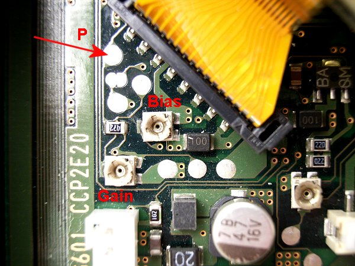
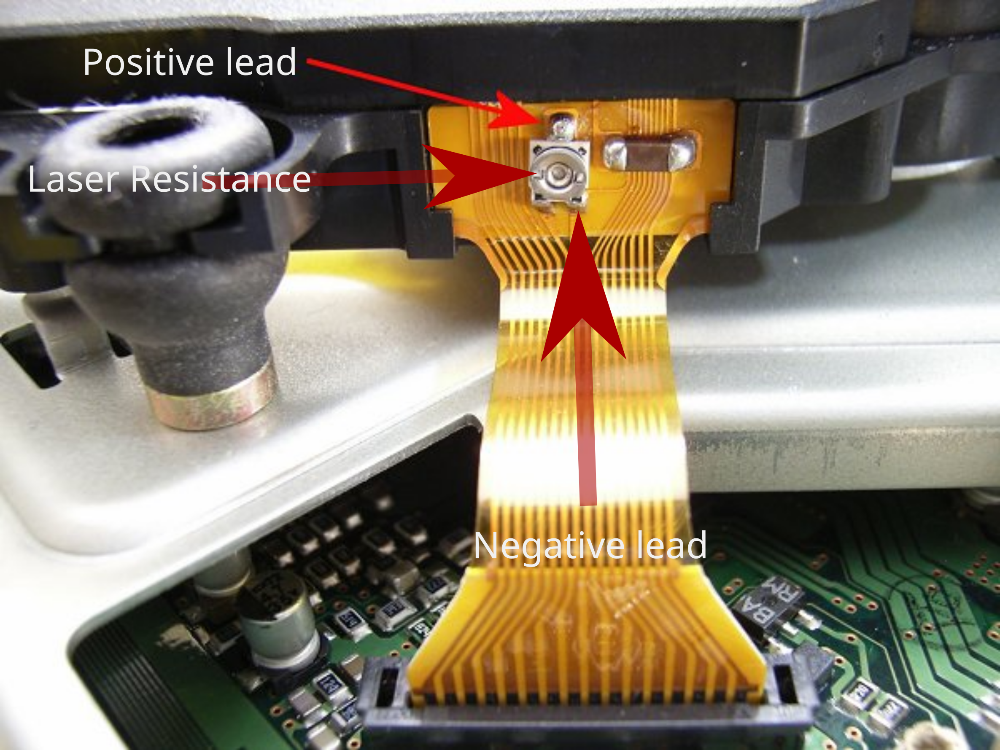

tonyhax international 

[alex-free.github.io](https://alex-free.github.io)
==================================================

Tonyhax International: Backup Loader/Region Bypass/Exploit For All PS1 Consoles (Japanese, American, European) And Early PS2 Consoles (Japanese, American, European, SCPH-10000-SCPH-39000)
===========================================================================================================================================================================================

Brought to you by [MottZilla](http://www.psxdev.net/forum/memberlist.php?mode=viewprofile&u=867), [Alex Free](http://www.psxdev.net/forum/memberlist.php?mode=viewprofile&u=6018), and [Patchouli (karehaani)](http://www.psxdev.net/forum/memberlist.php?mode=viewprofile&u=6714). Built on the work of many [others](#credits).

Tonyhax International is a fork of the [Tonyhax](https://orca.pet/tonyhax/) "Software backup loader exploit thing for the Sony PlayStation 1" originally created by [Socram8888](https://github.com/socram8888). Tonyhax International is developed by Alex Free and MottZilla with many new features and upgrades compared to the original Tonyhax, as described below:

Tonyhax International

Tonyhax

Supports all [Japanese](#usage)/American/European PS1 consoles, as well as Japanese/American/European PS2 consoles with model number SCPH-10000 to SCPH-39000.

Supports all American/European PS1 consoles, as well as American/European PS2 consoles with with model number SCPH-30001-SCPH-39000.

Can be flashed to a GameShark or other cheat device (via a [flasher CD](#rom) or serial cable) that starts the Tonyhax International loader automatically when the PS1 console (SCPH-750X models and older) is powered on.

No GameShark/cheat device support.

Supports [TOCPerfect](#tocperfect) patching for [PS1 DemoSwap Patcher](https://alex-free.github.io/ps1demoswap) which automatically corrects the TOC data and unlocks the drive if possible when booting the patched backup CD-R via a [swap trick](#audiomenuswaptrick) or other methods.

No TOCPerfect patching support.

Can be compiled on [any operating system](#building) that supports [Crosstool-NG](https://crosstool-ng.github.io/) using a script that builds a local tool chain within the source directory that does not install anything into your system.

Only supports being compiled on Debian 10/Windows Subsystem for Linux.

Loader displays the CDROM Controller BIOS firmware version on PS1 consoles.

Loader does not display the CDROM Controller BIOS firmware version on any console.

Tonyhax International also provides more [save game exploits](#savegame) then the original Tonyhax.

Table of Contents
-----------------

*   [Downloads](#downloads)
*   [Usage](#usage)

_Japanese PS1 Consoles_

*   [Japanese PS1 Console Loader Instructions](#jps1)
*   [Playing Games That Contain Anti-Piracy Features On Japanese PS1 Consoles](#apjps1)
*   [Playing Games That Span Multiple Discs On Japanese PS1 Consoles](#mdjps1)

_Japanese PS2 Consoles_

*   [Japanese PS2 Console Loader Instructions](#jps2)
*   [Using the Swap Magic Tool](#swapmagictool)
*   [Playing Games That Contain Anti-Piracy Features On Japanese PS2 Consoles](#apjps2)
*   [Playing Games That Span Multiple Discs On Japanese PS2 Consoles](#mdjps2)

_American/European PS1/PS2 Consoles_

*   [American/European PS1/PS2 Console Loader Instructions](#uu)
*   [Playing Games That Contain Anti-Piracy Features On American/European PS1/PS2 Consoles](#apu)
*   [Playing Games That Span Multiple Discs On American/European PS1/PS2 Consoles](#apu)

_Boot Methods_

*   [ROM/ROM Flasher CD](#rom)
*   [FreePSXBoot Exploit Memory Card Images](#freepsxboot)
*   [Boot CD](#bootcd)
*   [Save Game Exploit](#savegame)
*   [TOCPerfect Patching](#tocperfect)
*   [Audio Menu Swap Trick](#audiomenuswaptrick)

_Burning CD-R Backups_

*   [CD-R Media For PS1 Backups](#cdr)
*   [Burning Programs For PS1 Backups](#burning)
*   [Cleaning Discs](#clean)
*   [Vertical Console Boot Fix](#vertical)

_Replacing CD Drives In PS1 Consoles_

*   [PS1 CD Drive Compatibility](#cddrivecompat)
*   [Laser Assembly Top Case Swap](#ltcswap)
*   [Manual bias/gain Adjustments (Early Consoles Only)](#biasngain)
*   [Manual Laser Resistance Adjustments](#laserresistance)

_More Info_

*   [Building From Source](#building)
*   [Credits](#credits)

Links
-----

*   [Tonyhax International Homepage](https://alex-free.github.io/tonyhax-international)
*   [Tonyhax International GitHub](https://github.com/alex-free/tonyhax)
*   [PS1 DemoSwap Patcher Homepage](https://alex-free.github.io/ps1demoswap)
*   [PSEXE2ROM Homepage](https://alex-free.github.io/psexe2rom)

Downloads
---------

### Version 1.0.8 (8/26/2022)

*   [tonyhax-v1.0.8-international](https://github.com/alex-free/tonyhax/releases/download/v1.0.8i/tonyhax-v1.0.8-international.zip)
*   [source code](https://github.com/alex-free/tonyhax/archive/refs/tags/v1.0.8i.zip)

Changes:

*   Fixed the anti anti-piracy functionallity regression for American/European consoles. You can now play backup or import PS1 games that have anti-piracy features (i.e. Dino Crisis or Spyro: Year Of The Dragon) without issue on all American console and European consoles.
*   Removed the PAL licensed ROM flasher CD image, as it is not actually not needed. Any console that supports cheat carts (SCPH-1000 up to SCPH-750X models) will boot a CD-R burned via the current `tonyhax-rom-flasher.bin+tonyhax-rom-flasher.cue` files just fine.
*   Updated documentation on burning PS1 backups. Added info on games containing anti-piracy and or libcrypt protection. Also added info on replacing and modifying PS1 CD drives and changing bias/gain/laser resistance values.
*   Cleaned up build proccess and source tree.

### Version 1.0.7 (8/7/2022)

*   [tonyhax-v1.0.7-international](https://github.com/alex-free/tonyhax/releases/download/v1.0.7i/tonyhax-v1.0.7-international.zip)
*   [source code](https://github.com/alex-free/tonyhax/archive/refs/tags/v1.0.7i.zip)

Changes:

*   The Tonyhax International loader memory card save file **is now named `HAX` instead of `BESLEM-99999TONYHAX` to allow for more exploitable games**. You will need to update both the save game exploit file for your game as well as the Tonyhax International loader file to use v1.0.7 if you are using a previou version of the save game exploit file for your game that is already on a memory card.
*   Removed the SetSessionSuperUltraCommandSmash and replaced it with [MottZilla](http://www.psxdev.net/forum/memberlist.php?mode=viewprofile&u=867)'s new method of re-reading TOC data for VC0 A, VC0 B, and VC1 A CDROM Controller BIOS firmwares. **This change reduces the time it takes to re-read the TOC data on the backup CD-R or import PS1 disc from 2-10 minutes on the SCPH-1000, SCPH-3000, and some SCPH-3500 japanese consoles to around 30 seconds with 100% reliability!**
*   Added [save game exploit](#savegame) support for Tekken 3 Japan/USA/PAL thanks to Patchouli ([karehaani](http://www.psxdev.net/forum/memberlist.php?mode=viewprofile&u=671)) and [krystalgamer](https://github.com/socram8888/tonyhax/pull/20).
*   Added [save game exploit](#savegame) support for Tekken 2 Japan (rev 1 only), USA (rev 0 only), and PAL thanks to Patchouli ([karehaani](http://www.psxdev.net/forum/memberlist.php?mode=viewprofile&u=671)) and [krystalgamer](https://github.com/socram8888/tonyhax/pull/20).
*   Added [save game exploit](#savegame) support for Downhill Snow Japan thanks to Patchouli ([karehaani](http://www.psxdev.net/forum/memberlist.php?mode=viewprofile&u=671)).

### Version 1.0.6 (8/3/2022)

*   [tonyhax-v1.0.6-international](https://github.com/alex-free/tonyhax/releases/download/v1.0.6i/tonyhax-v1.0.6-international.zip)
*   [source code](https://github.com/alex-free/tonyhax/archive/refs/tags/v1.0.6i.zip)

Changes:

*   Added [save game exploit](#savegame) support for Castlevania Chronicle NTSC-J (only the first release, rev 1 is not working right now) (Alex Free) and 1500 Lite Series Castrol Honda Super Bike Racing NTSC-J (Alex Free).
*   Added [save game exploit](#savegame) support for Tony Hawk Pro Skater 2 NTSC-J (MottZilla) and 1500 Lite Series Castrol Honda VTR (MottZilla).

### Version 1.0.5 (7/27/2022)

*   [tonyhax-v1.0.5-international](https://github.com/alex-free/tonyhax/releases/download/v1.0.5i/tonyhax-v1.0.5-international.zip)
*   [source code](https://github.com/alex-free/tonyhax/archive/refs/tags/v1.0.5i.zip)

Changes:

*   Added [save game exploit](#savegame) support for Doki Oki (NTSC-J), Crash Bandicoot 3 (NTSC-J), and The Legend Of Heroes I&II (NTSC-J). All these save game exploits were found by [Patchouli (karehaani)](http://www.psxdev.net/forum/memberlist.php?mode=viewprofile&u=6714).

### Version 1.0.4 (7/23/2022)

*   [tonyhax-v1.0.4-international](https://github.com/alex-free/tonyhax/releases/download/v1.0.4i/tonyhax-v1.0.4-international.zip)
*   [source code](https://github.com/alex-free/tonyhax/archive/refs/tags/v1.0.4i.zip)

Usage
-----

The Tonyhax International loader is the program that is booted on any PS1 or an early PS2 that enables the use of backup CD-Rs or import PS1 discs. The Tonyhax International loader can be booted on your PS1 with a [GameShark/cheat cart](#rom), [flashed memory card](#freepsxboot), [save game exploit](#savegame), or [CD-R](#bootcd). It provides the ability to properly play backup and import discs on all PS1 consoles, and early PS2 consoles (Japanese, USA, and PAL models SCPH-10000 to SCPH-39000).

If you are using **any Japanese console**, at least one real Japanese NTSC-J PS1 game disc is required (any officially licensed Japanese PS1 disc will do). If you are using a **Japanese PS2 console (SCPH-10000 to SCPH-39000)** a Swap Magic Tool is also required. Neither of these are needed if you are using an American or European PS1/PS2 console.

Japanese PS1 Console Loader Instructions
----------------------------------------

Boot into the Tonyhax International loader using one of the boot methods below:

*   [ROM/ROM Flasher CD](#rom)
*   [FreePSXBoot Memory Card Images](#freepsxboot)
*   [Boot CD](#bootcd)
*   [Save Game Exploit](#savegame)
*   [TOCPerfect Patching](#tocperfect)
*   [Audio Menu Swap Trick](#audiomenuswaptrick)

If you see the text `Put in a real NTSC-J PSX game disc, then block the lid sensor`:

*   Open the CD drive of your PS1 console.
*   Put in a real NTSC-J Japanese PS1 game disc in the CD drive, but don't close the CD drive lid.
*   The lid sensor is highlighted by the red circle and arrow in the pictures below. On the original grey fat PS1 consoles (SCPH-900X and earlier) it is located in the top right corner, it is is shaped like a circle. Ideally you press it down with a bent pen spring as shown. On the slim PSone consoles (SCPH-10X) it is in the lower right corner to the side of the edge of the CD drive. For these consoles it is best to use a piece of tape or paper to slide in and press it down as shown.

After blocking the lid sensor, your real Japanese PS1 game will spin up and then stop. Once you see the text `Put in a backup/import disc, then press X` remove either the real NTSC-J PSX game disc or Boot CD from your PS1 console's CD drive. Put in the backup CD-R or import PSX game disc you want to play **without unblocking the lid sensor**. Once you press X, the console will run some commands automatically, followed by the game booting with perfect CD audio playback. Note that you can not unblock the lid sensor while playing the game on **Japanese consoles**, if you do so the game will stop working.

Playing Games That Span Multiple Discs On Japanese PS1 Consoles
---------------------------------------------------------------

There are some games which span multiple discs. And some of these games (such as Parasite Eve, Fear Effect, and Crono Cross) that span multiple discs require you to open the CD drive, remove disc 1, insert disc 2, and close the CD drive at some point in the game without providing a save game option at the disc swap. If you encounter this type of game on a Japanese PS1 console you have to do the "mid-game hot-swap trick":

*   When the game asks you to insert disc 2, unblock the lid sensor and remove the CD.
*   Put **any real authentic Japanese PSX disc** into the PS1 drive.
*   You will now be performing a _mid-game hot-swap trick_. Have the disc 2 you want to play in one hand, and whatever your using to block the lid sensor in another. Now block the lid sensor, freeing your one hand. Wait until the original real Japanese PSX disc stats spinning fast (~3 seconds) and **immediately** swap the disc with your free hand, and put in the actual disc 2 you want to play. You can now continue playing your game that spans multiple discs normally! This trick would work for games that span even more then 2 discs as well.

It is important to note however that most games that span multiple discs allow you to load a game save created on disc 1 while playing disc 2. This means you just need to save at the last point possible on disc 1, and then you can just boot disc 2 like normal and load your game save created earlier on disc 1. **Some games however do not allow this** as previously mentioned, so for those games you must use the **mid-game hot-swap trick** described above.

Playing Games That Contain Anti-Piracy Features On Japanese PS1 Consoles
------------------------------------------------------------------------

Some of the later PS1 games included anti-piracy functionality designed to prevent playing backups or imported versions (i.e. NTSC-U/PAL region) of the game on a Japanese console. These anti-piracy measures have mod-chips and swap tricks in mind.

Japanese Console Model

Plays Real Import NTSC-U/PAL PS1 Discs Containing Anti-Piracy?

Plays Backup CD-R NTSC-J/NTSC-U/PAL Discs Containing Anti-Piracy?

Plays Backup CD-R NTSC-J/NTSC-U/PAL Discs With Anti-Piracy Patched Out?

Plays Backup CD-R NTSC-J/NTSC-U/PAL Discs Containing Anti-Piracy+Libcrypt?

Plays Backup CD-R NTSC-J/NTSC-U/PAL Discs With Anti-Piracy+Libcrypt Patched Out?

SCPH-1000

YES

YES

YES

NO

YES

SCPH-3000

YES

YES

YES

NO

YES

SCPH-3500 (3rd gen Japanese model PS1) through SCPH-100 (Japanese PSone)

NO

NO

YES

NO

YES

You can find patches to remove anti-piracy and or libcrypt protection from games on websites such as [ConsoleCopyWorld](https://consolecopyworld.com/psx/psx_protected_games.shtml). For example here is a patch for [PoPoRogue](https://consolecopyworld.com/psx/psx_poporogue.shtml), found by browsing through the [Protected Games](https://consolecopyworld.com/psx/psx_protected_games.shtml) page on CopyConsoleWorld.

Some **PAL region games contain an additional anti-piracy measure known as libcrypt**. It is only possible to play these games if you use a patched backup copy which has this libcrypt protection and the anti-piracy features removed.

Japanese PS2 Console Loader Instructions (SCPH-10000-SCPH-39000)
----------------------------------------------------------------

Available Boot Methods:

*   [Boot CD](#bootcd) (I don't know of anyway to boot this on an unmodified Japanese PS2 but it is available)
*   [Save game exploit](#savegame)

Japanese PS2 consoles **must have the DVD drive tray front panel removed to use Tonyhax International**. For the SCPH-10000, you can follow the method below (some newer consoles may slightly differ in the way to remove the DVD drive's front panel).

### Removing The DVD Drive Tray Front Panel

Turn on the Japanese PS2 console. Eject the DVD drive tray, and **while it is open** power off the console by either pulling the plug from the wall or PSU in the back of the console, or by flicking the power switch for the PSU on the back of the console. You can not use the power button because then the DVD drive tray will close before the console turns off. Now, flip the Japanese PS2 console upside down like in the image below:

Now bring your focus to the bottom of the opened DVD drive tray. At the very top edge (highlighted in the picture above) is a tab. You want to jam a thin flat head screwdriver in between this tab and the DVD drive tray face plate as shown in the image below. Now, push with the flat head screwdriver to separate the DVD drive face plate from the rest of the DVD drive tray. **Be very gentle and only use a direct straight force towards the face plate. Do not go side to side when doing this or you risk breaking off an edge of the DVD drive tray. I am obviously not responsible for any damage you may do by doing this!** Once successful, the face plate will become removable. You are free to slide it back on at a later time, it just needs to be off for you to use the Japanese PS2 to boot backup/import PS1 games with Tonyhax International.

With the DVD drive face plate off, flip over the Japanese PS2 console right side up. You can now see a gap at the bottom of the DVD drive. This is where you place the Swap Magic Tool in when using Tonyhax International on your Japanese PS2 console.

You can now use one of the supported boot methods to start the Tonyhax International loader on the Japanese PS2 console. You will most likely be using the [Save Game Exploit](#savegame), however you could be using some kind of intermediate boot disc to boot the [Boot CD](#bootcd) as well if you find one that supports Japanese PS1 consoles. Once you see the text `Put in a backup/import disc, then press X` appear, you need to use a Swap Magic Slide Tool to release the DVD drive to gain access to it without pressing the eject switch. A [video tutorial](https://www.youtube.com/watch?v=Ffv5m52zlEI) is available that shows how to use the Swap Magic Tool (in general), although the exact steps are also explained below. Once you use the Swap Magic Tool to swap in your import/backup CD-R while booted in the Tonyhax International loader, just press the cross button on your PS2 or PS1 controller to boot and play your game.

Important note: **do not eject the PS1 import or backup CD-R from the Japanese PS2 console until your done playing the game**. Unlike American and European consoles (which do not have this limitation), if you do so your game will stop working, and you will have to start Tonyhax International all over again to boot your import/backup CD-R and start playing again.

Using the Swap Magic Tool
-------------------------

Slide in the Swap Magic Tool like shown in the image below by the arrow. You need to feel around with the Swap Magic Tool to get the hook to latch on internally inside the DVD drive.

Now that your Swap Magic Tool is latched on internally inside the DVD drive, move it straight to the right side. This movement will feel correct and nice when you are properly using the Swap Magic Tool, reassuring you are using it correctly. Once you get to the end of this movement the DVD drive tray will begin to move forward out of the DVD drive, "releasing" it from it's locked state.

Use your hand to pull out the DVD drive tray to gain access to the disc in it. Remove the original NTSC-J PSX game disc, and put in your import/backup CD-R.

With your import/backup CD-R in the Japanese PS2 console, use your hand to push in the DVD drive tray as far as it will go back into the DVD drive.

Now that the DVD drive tray is pushed all the way back in, the Swap Magic Tool can be used to "lock" the drive. Like before, slide in the Swap Magic Tool to the right most position like shown in the image below. Remember to feel around with the Swap Magic Tool to get the hook to latch on internally inside the DVD drive. Now that your Swap Magic Tool is once again latched on internally inside the DVD drive, move it straight to the left side. This movement will feel correct and nice when you are properly using the Swap Magic Tool, reassuring you are using it correctly. Once you get to the end of this movement (when you can't go any more to the left) the DVD drive tray will fully go back inside the DVD drive to put the DVD drive into the "locked" state.

Playing Games That Contain Anti-Piracy Features On Japanese PS2 Consoles
------------------------------------------------------------------------

Some of the later PS1 games included anti-piracy functionality designed to prevent playing backups or imported versions (i.e. NTSC-U/PAL region) of the game on a Japanese console. These anti-piracy measures have mod-chips and swap tricks in mind.

There is currently no support yet for playing unmodified backup CD-Rs or imported NTSC-U/PAL region game disc that contain anti-piracy checks for Japanese PS2 consoles. You have to patch a backup copy CD image and burn that to a CD-R to play these games on Japanese PS2 consoles.

You can find patches to remove anti-piracy and or libcrypt protection from games on websites such as [ConsoleCopyWorld](https://consolecopyworld.com/psx/psx_protected_games.shtml). For example here is a patch for [PoPoRogue](https://consolecopyworld.com/psx/psx_poporogue.shtml), found by browsing through the [Protected Games](https://consolecopyworld.com/psx/psx_protected_games.shtml) page on CopyConsoleWorld.

Some **PAL region games contain an additional anti-piracy measure known as libcrypt**. It is only possible to play these games if you use a patched backup copy which has this libcrypt protection and the anti-piracy features removed.

Playing Games That Span Multiple Discs on Japanese PS2 Consoles
---------------------------------------------------------------

There are some games which span multiple discs. And **some of these games** (such as Parasite Eve, Fear Effect, and Crono Cross) that span multiple discs require you to open the CD drive, remove disc 1, insert disc 2, and close the CD drive at some point in the game. Unfortunately only for Japanese PS2 consoles, you can not do this with Tonyhax International. If you get to a point in a game that requires ejecting the drive and putting in a new game, you have to play this part of the game on a different console (Any PS1 or American/European PS2 works). It is important to note however that most games that span multiple discs allow you to load a game save created on disc 1 while playing disc 2. This means you just need to save at the last point possible on disc 1, and then you can just boot disc 2 with Tonyhax International like normal and load your game save created earlier on disc 1, bypassing this limitation for certain games that allow saving right at disc swap mid-game.

American/European PS1/PS2 Console Loader Instructions
-----------------------------------------------------

Available boot methods for American and European PS2 consoles:

*   [Boot CD](#bootcd) (you can use something like the code breaker pro PS1 disc to boot it first)
*   [Save game exploit](#savegame)

Available boot methods for American and European PS1 consoles:

*   [ROM/ROM Flasher CD](#rom)
*   [FreePSXBoot Memory Card Images](#freepsxboot)
*   [Boot CD](#bootcd)
*   [Save Game Exploit](#savegame)
*   [TOCPerfect Patching](#tocperfect)
*   [Audio Menu Swap Trick](#audiomenuswaptrick)

Once you see the text `Put in a backup/import disc` appear, eject the DVD drive (PS2) or open the CD drive (PS1).

*   If you are booting the Tonyhax International [Boot CD](#bootcd) via the [Audio Menu Swap Trick](#audiomenuswaptrick), you'll want to remove the spring or whatever you have blocking down the lid sensor to "open" the CD drive and stop the disc from spinning, allowing you to remove the Boot CD from the console's CD drive (PS1) or DVD drive (PS2).
*   If you are booting Tonyhax International via a [Save Game Exploit](#savegame), after ejecting the DVD drive (PS2) or opening the CD drive (PS1) the real PS1 game disc you used with a save game exploit will stop spinning, allowing you to remove it from the console's CD drive (PS1) or DVD drive (PS2).

All other boot methods don't have a disc usually in the drive already, so there is no disc to remove. With no disc currently in your console, you can now put in the backup CD-R or import PSX game disc you want to play. Close the CD drive (PS1) or DVD drive (PS2). The console will detect that the drive has been closed and will spin up your disc. The console will then send some commands and boot the disc.

Playing Games That Contain Anti-Piracy Features On American/European PS1/PS2 Consoles
-------------------------------------------------------------------------------------

Since the original Tonyhax v1.4.3 release that Tonyhax International is based on there has been support for playing unmodified backup CD-R copies and or import discs of games that contain anti-piracy functionallity through the Tonyhax loader. Tonyhax International will boot these discs fine.

Some **PAL region games contain an additional anti-piracy measure known as libcrypt**. It is only possible to play these games if:

*   You burn a patched backup copy which has this libcrypt protection and the anti-piracy features removed to a CD-R that you boot with Tonyhax International.
*   You use an original PS1 disc imported from another region (NTSC-J/NTSC-U/PAL).
*   You burn a backup CD-R in a [special way](https://github.com/Kippykip/SBITools) to keep the libcrypt protection working. Tonyhax International defeats the anti-piracy measures and then the disc is good to boot!

Playing Games That Span Multiple Discs On American/European PS1/PS2 Consoles
----------------------------------------------------------------------------

All American and European consoles do not have the same limitations as the Japanese consoles. You are free to eject/insert the DVD drive tray normally, which allows you to play through backup CD-Rs or import discs from any region (Japan, USA, or PAL) of games that span multiple discs exactly the same as real PS1 game discs that normally work on your American or European console. For instance, in the game Parasite Eve you must remove disc 1 and insert disc 2 at a specific point in the game when prompted to continue playing. This works exactly as the game prompts you on American and European consoles because Tonyhax International has the capability to unlock the CD drive to read unlicensed discs (which includes both real PS1 discs licensed for a region that does not match your console as well as backup CD-R discs) for American and European consoles. This can be a big deal for some games as they do not allow you to load a save created on Disc 1 while Disc 2 is in the console, you have to eject Disc 1 and insert Disc 2 in the middle of game play to proceed. The game Parasite Eve is like this, which actually prevents completing a full play through of the game on a Japanese SCPH-10000-SCPH-39000 console. There is a work-around available to Japanese PS1 consoles known as the mid-game hot-swap trick, but it involves swapping a moving disc in the console with the lid sensor blocked which is a definite downgrade to having this functionality simply work as designed like it does on all American and European PS1/PS2 consoles when using Tonyhax International.

ROM/ROM Flasher CD
------------------

You can overwrite the contents of any PS1 cheat cartridge such as a GameShark with Tonyhax International, so that when you **turn on any PS1 console with the flashed GameShark/cheat device installed to it's parallel port it boots Tonyhax International immediately instead of the BIOS/Shell (Memory Card/CD Player menu)**. While this means SCPH-900X (the last fat PS1 consoles) and all SCPH-10X (all PSone slim consoles) can not use Tonyhax International ROM since these console revisions removed the parallel port, for all older consoles (SCPH-100X-750X) this is the best most powerful method to boot Tonyhax International.

### Requirements

*   GameShark or other cheat cart that you are willing to overwrite with Tonyhax International.
*   PS1 console with a parallel port for installing the GameShark or other cheat cart (SCPH-750X or lower).
*   Blank CD-R (if burning a ROM flasher CD) and or a serial cable (if flashing ROM file from a computer directly).

### How To Flash Your GameShark/Cheat Cart

Inside the Tonyhax International releases ([download](#downloads) above) in the `rom` directory are the following files:

*   tonyhax-rom-flasher.bin
*   tonyhax-rom-flasher.cue
*   tonyhax-v1.0.8-international.rom

The BIN+CUE files can be burned to a CD-R. The BIN+CUE files contain the [NXFlash](https://github.com/danhans42/nxflash) PS1 executable with the `tonyhax-v1.0.8-international.rom` file. This means when you boot the burned flasher CD-R on your PS1 console, you can connect your GameShark/cheat device, press R2 (re-detect cheat cart), press start (flash EEPROM from CD), and then press X to flash your GameShark/Cheat device. Now you can simply reset or power off then power on your PS1 console and it will boot Tonyhax International from the GameShark/cheat cart immediately.

The SCPH-900X and SCPH-10X consoles do not have an expansion port, and hence a GameShark can not be connected to those consoles.

FreePSXBoot Exploit Memory Card Images
--------------------------------------

Memory card files are included in the `freepsxboot` folder found in the Tonyhax International releases ([download](#downloads) above) for all BIOS versions. These memory card files must be restored to a PSX memory card (official Sony memory cards highly recommended). One such way to do this is to use [Memory Card Annihilator v2.0](https://www.ps2-home.com/forum/viewtopic.php?t=116) with a modded PS2 console and USB flash drive containing the memory card file. Here are the steps below:

### Requirements

*   PS2 console that can run uLaunchELF/[Memory Card Annihilator v2.0](https://www.ps2-home.com/forum/viewtopic.php?t=116). You could do this with [FreeHDBoot](https://www.ps2-home.com/forum/viewtopic.php?t=5208) or [FreeMCBoot](https://www.ps2-home.com/forum/viewtopic.php?t=1248)
*   Any PS1 console.
*   An authentic PS1 memory card you are willing to dedicate to the FreePSXBoot exploit.
*   A fat 32 formatted USB flash drive that your PS2 console can read (**not all USB flash drives seem to work**).

### Flashing The PS1 Memory Card Image To A PS1 Memory Card

Copy the correct memory card file for your PSX console's BIOS version from the `freepsxboot` directory found in Tonyhax international releases downloadable above to a FAT32 formatted USB flash drive that your PS2 console can read. It is highly recommend to use the slot 2 memory card files as they do not require you to remove the memory card once booted into the Tonyhax International loader, **unless you have a Japanese console. All Japanese consoles currently require removing the memory card with the FreePSXBoot image on it once booted in the loader no matter if it is a slot 1 or slot 2 memory card.**

Console models and the BIOS versions they contain are listed below:

*   SCPH-1000 - BIOS-1.0-1994-09-22-I
*   SCPH-1001 - BIOS-2.0-1995-05-07-A, BIOS-2.1-1995-07-17-A, or BIOS-2.2-1995-12-04-A
*   SCPH-1002 - BIOS-2.0-1995-05-10-E, BIOS-2.1-1995-07-17-E, or BIOS-2.2-1995-12-04-E
*   SCPH-3000 - BIOS-1.1-1995-01-22-I
*   SCPH-3500 - BIOS-2.1-1995-07-17-I
*   SCPH-5000 - BIOS-2.2-1995-12-04-I
*   SCPH-5001 - BIOS-3.0-1996-11-18-A
*   SCPH-5003 - BIOS-2.2-1995-12-04-A
*   SCPH-5500 - BIOS-3.0-1996-09-09-I
*   SCPH-5501 - BIOS-3.0-1996-11-18-A
*   SCPH-5502 - BIOS-3.0-1997-01-06-E
*   SCPH-5503 - BIOS-3.0-1996-11-18-A
*   SCPH-5552 - BIOS-3.0-1997-01-06-E
*   SCPH-5903 - BIOS-2.2-1995-12-04-A
*   SCPH-7000 - BIOS-4.0-1997-08-18-I
*   SCPH-7001 - BIOS-4.1-1997-12-16-A
*   SCPH-7002 - BIOS-4.1-1997-12-16-E
*   SCPH-7003 - BIOS-3.0-1996-11-18-A
*   SCPH-7500 - BIOS-4.0-1997-08-18-I
*   SCPH-7501 - BIOS-4.1-1997-12-16-A
*   SCPH-7502 - BIOS-4.1-1997-12-16-E
*   SCPH-7503 - BIOS-4.1-1997-12-16-A
*   SCPH-9000 - BIOS-4.0-1997-08-18-I
*   SCPH-9001 - BIOS-4.1-1997-12-16-A
*   SCPH-9002 - BIOS-4.1-1997-12-16-E
*   SCPH-9003 - BIOS-4.1-1997-12-16-A
*   SCPH-9903 - BIOS-4.1-1997-12-16-A
*   SCPH-100 - BIOS-4.3-2000-03-11-I
*   SCPH-101 - BIOS-4.4-2000-03-24-A or BIOS-4.5-2000-05-25-A
*   SCPH-102 - BIOS-4.4-2000-03-24-E or BIOS-4.5-2000-05-25-E
*   SCPH-103 - BIOS-4.5-2000-05-25-A

If you have a PSX console that can have multiple different BIOS versions, you may have to try each different memory card file one by one until you figure out what BIOS version you need for your PSX console.

After the correct memory card file is copied to the USB flash drive that your PS2 can read:

*   Download the [Memory Card Annihilator v2.0](https://www.ps2-home.com/forum/viewtopic.php?t=116) and extract it's .elf file.
*   Copy the Memory Card Annihilator v2 .elf file to a FAT32 formatted USB flash drive that your PS2 console can read.
*   Insert the PSX memory card and USB flash drive with the PS2 console off. Boot your modded PS2 (FreeHDBoot or FreeMCBoot, or something like that is required) and start the uLaunchElf program.
*   Navigate to the "mass" device and launch the Memory Card Annihilator v2 .elf file you previosly copied to the USB flash drive.
*   Select your PS1 memory card in the menu and then select restore. In the file picker navigate to the memory card file you copied to the USB flash drive previously.
*   Wait for the restore to complete and press X. Remove your memory card and put it into either Slot 1 or Slot 2 of your PS1 console depending on what memory card image you use.

Now you can turn on your PSX console without a disc in it, and then select the `Memory Card` option in the PS1's startup menu. This will start the Tonyhax international loader. **At this point, if you are using a FreePSXBoot memory card in slot 1 and or a Japanese console you must remove the FreePSXBoot memory card once the loader starts to ensure successful booting of your backup or import.**

Boot CD
-------

CD BIN+CUE files containing the Tonyhax International loader are available. The Boot CD can be booted by a mod chip (gives non-stealth mod chips stealth mod chip abilities), swap trick (the [audio menu swap trick](#audiomenuswaptrick) involves swapping a stopped real PS1 disc in the CD Player with the Boot CD safely, and is available on older PS1 consoles), or PSX Change v2 (which does not read/update the TOC data of the backup it loads once swapped out, but works exactly like a real PSX game disc). Inside the Tonyhax International releases (downloadable above) in the `boot-cd` directory are the following files:

*   tonyhax-boot-cd-europe.bin
*   tonyhax-boot-cd-europe.cue
*   tonyhax-boot-cd-japan.bin
*   tonyhax-boot-cd-japan.cue

If you are using Tonyhax International to boot the burned Boot CD-R, it does not matter if you use the BIN+CUE japan files or the BIN+CUE europe files.

If you are instead using a swap trick or mod chip to boot the burned flasher CD-R, you may need to burn either the BIN+CUE japan files or the BIN+CUE europe files specifically:

If you have a SCPH-1000 Japanese console, any American console, or any European console older then the SCPH-102 you can use either the europe or japan BIN+CUE files as it does not matter.

If you have a SCPH-3000 or newer Japanese console you need to use the japan BIN+CUE files. If you have a SCPH-102 European console then you need to use the Europe BIN+CUE files.

Save Game Exploit
-----------------

The original way to boot the Tonyhax International loader is through a special game save on a PS1 memory card that you load while in a specific, supported real PS1 game that you can play normally on your PS1 or PS2 console (SCPH-39000 models and lower). You need to copy the `HAX` file and the game exploit file specific to the original real PS1 game you own to the PS1 memory card, then load the save in a specific way in the exploitable game. Described below are 2 different methods to copy these files to a PS1 memory card. One involves using a PS2, the other involves using special hardware that allows you to write to the PS1 memory card directly from your computer.

### PS2 Installation Method Requirements

You can use a PS2 console to copy the save game exploit files to a PS1 memory card from a USB flash drive. This method of getting the required files on the PS1 memory card requires:

*   A real PS1 game disc that matches your console's region and has a save game exploit file available.
*   Any PS1 console, or early PS2 console (SCPH-39000 or lower model number).
*   An authentic PS1 memory card that has enough space to hold the hacked game save file and the Tonyhax International file.
*   A FAT32 formatted USB flash drive that your PS2 console can read (**not all USB flash drives seem to work, you may need to do a bit of trial and error testing to find one that you can use**).
*   A PS2 console that can run uLaunchELF (Models newer then SCPH-39000 can therefore be used for this step, but they can not be used to boot into Tonyhax International using the game save). You could do this with [FreeHDBoot](https://www.ps2-home.com/forum/viewtopic.php?t=5208) or [FreeMCBoot](https://www.ps2-home.com/forum/viewtopic.php?t=1248).

You want to **use the Raw save game exploit file for your exploitable game (in the `entrypoints` directory) and the Raw loader file `HAX` (in the `loader` directory)** when using the uLaunchELF/PS2 installation method. The Raw filenames for each save game exploit is available in the table below.

### PS3 Memory Card USB Adapter/DexDrive/Computer Installation Method

Instead of using a PS2 to copy the save game exploit files, you can use a Dex Drive or similar with a visual memory card editor (such as [OrionSoft's PS1 Memory Card Manager](http://onorisoft.free.fr/retro.htm?psx/psx.htm) or [Dex-plorer](https://archive.org/details/inter-act-dex-plorer-ver.-1.10.950)), to modify a PS1 memory card's contents directly with a computer. This way of adding the required save game exploit files would only require:

*   A real PS1 game disc that matches your console's region and that has save game exploit files available.
*   Any PS1 console, or early PS2 console (SCPH-10000 to SCPH-39000 models).
*   An authentic PS1 memory card that has enough space to hold the hacked game save file and the tonyhax file.
*   A DexDrive, PS3 Memory Card USB adapter, or other hardware that allows you to write and modify a PS1 memory card with a computer.
*   Software such as [OrionSoft's PS1 Memory Card Manager](http://onorisoft.free.fr/retro.htm?psx/psx.htm) (for the PS3 Memory Card USB adapter) or [Dex-plorer](https://archive.org/details/inter-act-dex-plorer-ver.-1.10.950) (for the DexDrive), or [MemcardRex](https://github.com/ShendoXT/memcardrex) (for general memory card file managment and manipulation).

You want to **use the MCS save game exploit file for your exploitable game (in the `entrypoints` directory) and the MCS loader file `tonyhax.mcs` (in the `loader` directory)** when using the uLaunchELF/PS2 installation method. The MCS filenames for each save game exploit is available in the table below.

Game

Region

Code

MCS file

Raw file

Brunswick Circuit Pro Bowling

NTSC-U

SLUS-00571

brunswick1-us.mcs

BASLUS-00571

Brunswick Circuit Pro Bowling

PAL-E

SLES-01376

brunswick1-eu.mcs

BESLES-01376

Brunswick Circuit Pro Bowling 2

NTSC-U

SLUS-00856

brunswick2-us.mcs

BASLUS-00856

Brunswick Circuit Pro Bowling 2

PAL-E

SLES-02618

brunswick2-eu.mcs

BESLES-02618

Castlevania Chronicle - Akumajou Dracula (only first release of the game (rev 0), rev 1 does not work right now)

NTSC-J

SLPM-86754

cc-jp.mcs

BISLPM-86754DRACULA

Castlevania Chronicles

NTSC-U

SLUS-01384

cc-us.mcs

BASLUS-01384DRACULA

Castrol Honda Superbike \[SuperLite 1500 Series\]

NTSC-J

SLPM-86489

castrolsb-jp.mcs

BISLPM-86489CHSv1

Castrol Honda Superbike Racing

NTSC-U

SLUS-00882

castrolsb-us.mcs

BASLUS-00882CHSv1

Castrol Honda Superbike Racing

PAL-E

SLES-01182

castrolsb-eu.mcs

BESLES\_01182CHSv1

Castrol Honda VTR \[SuperLite 1500 Series\]

NTSC-J

SLPM-86922

castrolvtr-jp.mcs

BISLPM-86922CHSVTRv1

Castrol Honda VTR

PAL-E

SLES-02942

castrolvtr-eu.mcs

BESLES-02942CHSVTRv1

Cool Boarders 4

NTSC-U

SCUS-94559

coolbrd4-us.mcs

BASCUS-9455916

Cool Boarders 4

PAL-E

SCES-02283

coolbrd4-eu.mcs

BESCES-0228316

Crash Bandicoot 2: Cortex Strikes Back

NTSC-J

SCPS-10047

crash2-jp.mcs

BISCPS-1004700000000

Crash Bandicoot 2: Cortex Strikes Back

NTSC-U

SCUS-94154

crash2-us.mcs

BASCUS-9415400047975

Crash Bandicoot 2: Cortex Strikes Back

PAL-E

SCES-00967

crash2-eu.mcs

BESCES-0096700765150

Crash Bandicoot 3: Warped

NTSC-J

SCPS-10073

crash3-jp.mcs

BISCPS-1007300000000

Crash Bandicoot 3: Warped

NTSC-U

SCUS-94244

crash3-us.mcs

BASCUS-9424400000000

Crash Bandicoot 3: Warped

PAL-E

SCES-01420

crash3-eu.mcs

BESCES-0142000000000

Doki Oki

NTSC-J

SLPS-00130

doki-oki-jp.mcs

BISLPS-00130DOKIOH

Downhill Snow

NTSC-J

SLPS-01391

downhill-snow-jp.mcs

BISLPS-01391SKI00S

Sports Superbike

PAL-E

SLES-03057

superbike1-eu.mcs

BESLES-03057SSBv1

Sports Superbike 2

PAL-E

SLES-03827

superbike2-eu.mcs

BESLES-03827SSII

Tekken 2 (only second release of the game (rev 1), rev 0 does not work right now)

NTSC-J

SLPS-00300

tekken2-jp.mcs

BISLPS-00300TEKKEN-2

Tekken 2 (only first release of the game (rev 0), rev 1 does not work right now)

NTSC-U

SLUS-00213

tekken2-us.mcs

BASLUS-00213TEKKEN-2

Tekken 2

PAL-E

SCES-00255

tekken2-eu.mcs

BESCES-00255TEKKEN-2

Tekken 3

NTSC-J

SLPS-01300

tekken3-jp.mcs

BISLPS-01300TEKKEN-3

Tekken 3

NTSC-U

SLUS-00402

tekken3-us.mcs

BASLUS-00402TEKKEN-3

Tekken 3

PAL-E

SCES-01237

tekken3-eu.mcs

BESCES-01237TEKKEN-3

The Legend Of Heroes I&II

NTSC-J

SLPS-01323

the-legend-of-heros-1-and-2-jp.mcs

BISLPS-01323010001

Tony Hawk's Pro Skater 2

NTSC-J

SLPM-86751

thps2-jp.mcs

BISLPM-86751CEEAG01

Tony Hawk's Pro Skater 2

NTSC-U

SLUS-01066

thps2-us.mcs

BASLUS-01066TNHXG01

Tony Hawk's Pro Skater 2

PAL-DE

SLES-02910

thps2-de.mcs

BESLES-02910TNHXG01

Tony Hawk's Pro Skater 2

PAL-E

SLES-02908

thps2-eu.mcs

BESLES-02908TNHXG01

Tony Hawk's Pro Skater 2

PAL-FR

SLES-02909

thps2-fr.mcs

BESLES-02909TNHXG01

Tony Hawk's Pro Skater 3

NTSC-U

SLUS-01419

thps3-us.mcs

BASLUS-01419TNHXG01

Tony Hawk's Pro Skater 3

PAL-DE

SLES-03647

thps3-de.mcs

BESLES-03647TNHXG01

Tony Hawk's Pro Skater 3

PAL-E

SLES-03645

thps3-eu.mcs

BESLES-03645TNHXG01

Tony Hawk's Pro Skater 3

PAL-FR

SLES-03646

thps3-fr.mcs

BESLES-03646TNHXG01

Tony Hawk's Pro Skater 4

NTSC-U

SLUS-01485

thps4-us.mcs

BASLUS-01485TNHXG01

Tony Hawk's Pro Skater 4

PAL-DE

SLES-03955

thps4-de.mcs

BESLES-03955TNHXG01

Tony Hawk's Pro Skater 4

PAL-E

SLES-03954

thps4-eu.mcs

BESLES-03954TNHXG01

Tony Hawk's Pro Skater 4

PAL-FR

SLES-03956

thps4-fr.mcs

BESLES-03956TNHXG01

XS Moto

NTSC-U

SLUS-01506

xsmoto-us.mcs

BASLUS-01506XSMOTOv1

XS Moto

PAL-E

SLES-04095

xsmoto-eu.mcs

BESLES-04095XSMOTO

### Copying The Files On Your PS1 Memory Card With A PS2

When using the PS2 to copy the files over, first copy the Raw loader file named `HAX` (found in the `loader` directory in each Tonyhax International release) and the Raw file for your compatible exploitable game (named in the table above, found in the `entrypoints` directory) to the FAT32 USB flash drive that your PS2 can read using a computer.

After the correct memory card save game exploit **Raw** file and the `HAX` file is copied to the FAT32 formatted USB flash drive that your PS2 can read, eject the USB flash drive from your computer and insert it and a PS1 memory card into the PS2. Start the uLaunchElf program and navigate to the `mass` device (this is your USB flash drive) with the `DPAD` on the controller, then select it with the `circle` button. Using the `DPAD` to navigate, press the `cross` button on the controller to highlight both the `HAX` and the **Raw** save game exploit file that you previously copied to the USB flash drive. Now Press the `R2` button on the controller to make the file operations menu appear in uLaunchELF. Use the `DPAD` to move to the copy function and then press the `circle` button to select it. Now press the `triangle` button to navigate out of the `mass` device and then use the `DPAD` and then the circle button to navigate into either the `MC0` (if the PS1 memory card is in slot 1 of the PS2) or `MC1` (if the PS1 memory card is in slot 2 of the PS2) device. Press the `R2` button to again make the file operations menu appear in uLaunchElF. Use the `DPAD` to navigate to the paste option and press the `circle` button to finally paste both the `HAX` and the raw save game exploit file. Now you can press the `triangle` button to navigate out of the PS1 memory card device, and remove the memory card from the PS2 console.

### Using The Save Game Exploit

Now that you have the save game exploit files on the PS1 memory card, start the real PS1 game on your console with the PS1 memory card containing the save game files inserted in it. If you are using a Japanese PS1, it is recommended that you power off the console, put in the Japanese version of the game that has a save game exploit file available, block the lid sensor, and then turn on the console and have it boot the game. In either case, follow the instructions for the real PS1 game you are using described below:

Game

Specific Instructions

Cool Boarders 4

Boot the game. It should say the records and settings have been automatically loaded. Click on `ONE PLAYER`.

Crash Bandicoots

Boot the game, on the title menu, choose `LOAD GAME`. On the save game list, select `TONYHAX` and press X.

Brunswick games

Boot the game as you'd normally do. On the main menu, select `LOAD GAME`, then Select `MEMORY CARD 1`. After about three seconds tonyhax should be running.

Castrol Honda Superbike Racing and Sports Superbike 1

On the language selection screen, if prompted to, select the English language. Enter the Memory Card menu. Load game from the Memory Card. Click accept after it's done loading. On the main menu, select `Race`, then `Single race`.

Castrol Honda VTR, Sports Superbike 2 and XS Moto

If you are using the European version, on the language selection screen select the English language. On the main menu, choose `Options`. Select `Load game` and choose the memory card where the save is stored. Back on the main menu, click on either `Single Race` or `Championship`.

Doki Oki

Boot the game as you'd normally do. Press start, circle, circle, then circle one last time to navigate through the main menu and load the save file.

Downhill Snow

Boot the game as you'd normally do. Use the X button to select `SCENARIO`, then `CONTINUE`, now select the save file in slot 1 or slot2. On the next screen after loading the save file select `CONFIG`, then `RANKING`, then `Moguls`. Immeditely after select `Moguls` press the right directional key until the blue screen appears, then let go of all buttons on the controller.

The Legend Of Heroes I&II

Boot the game as you'd normally do. On the main menu, select the Legend Of Heroes I (the I button on the left), **not The Legend Of Heroes II (the II button on the right)**. Once in The Legend Of Heroes I load the save file.

Tony Hawk Pro Skater games

Boot the game as you'd normally do. On the main menu, wait until the save file is automatically loaded (it should say `Loading TONYHAX EU/US/DE/FR`, depending on the game's region). After it's done, choose the `CREATE SKATER` menu and press X.

Tekken games

Boot the game as you'd normally do. On the main menu, select `Survival Mode`, and pick a character. Die at any point to end the survival round, press start on the stats screen, and wait. **The screen will fade to black, and in a few seconds the Tonyhax International loader will start. There are no colors displayed while the Tonyhax International loader is started with a Tekken save game exploit, unlike all other games.**

TOCPerfect Patching
-------------------

Enables you to patch any PSX game rip to first boot a special Tonyhax which automatically re-read the TOC data to get working CD audio before booting into the main game. If the console is USA/PAL the drive is also unlocked before booting into the main game, so you have the ability to switch from i.e. game disc 1 to a backup of game disc 2 mid-game.

TOCPerfect patching enables you to use **any backup loading method** supported by your console and you will always get working CD audio (and unlocked drive for USA/PAL consoles) regardless of the abilities of what that backup loading method normally allows. For example, you can use any of the below methods to boot a TOCPerfect patched CD-R:

*   [Audio menu swap trick](#audiomenuswaptrick), and all other swap tricks mentioned in the original [swap trick guide](https://gamefaqs.gamespot.com/ps/916392-playstation/faqs/4708)
*   [UNIROM](https://unirom.github.io/)
*   [DemoSwap](https://alex-free.github.io/ps1demoswap/#demoswap)
*   Modchip (tonyhax provides stealth patches for non-stealth mod chips)
*   PSX Change v2 Boot Disc
*   [N00bROM](https://github.com/Lameguy64/n00brom)

Currently PS1 DemoSwap Patcher is closed source and is not with in the Tonyhax International releases. You can download PS1 DemoSwap Patcher binaries however from the official [web page](https://alex-free.github.io/ps1demoswap), which also contains the full documentation on how to use it. The Tonyhax International source does support compiling the TOCPerfect variant of the executable.

Audio Menu Swap Trick
---------------------

The Audio Menu Swap Trick is an exploit only available on early PlayStation consoles, it is **the only swap trick that does not involve swapping a moving disc** making it the best swap trick ever available. It was first described in the original [Swap Trick Guide](https://gamefaqs.gamespot.com/ps/916392-playstation/faqs/4708) from 1996. You can use the Audio Menu Swap Trick to boot Tonyhax International, which makes it a very nice method only requiring a compatible console and no other hardware (such as a memory card, GameShark, mod chip, etc.).

### Requirements

Below is the compatibility list for consoles that have it:

PS1 Model

Compatibility

Info

SCPH-1000 (All)

All

This is the the first model ever made, released in late 1994. It's got a 2nd Revision with an update to the CDROM Controller BIOS firmware somewhere in between the A55XXXX and A61XXXX serial number range. (VC 0 A to VC 0 B). However all SCPH-1000 revisions are susceptible to the audio menu swap trick. Even better, is the fact that the region check on all SCPH-1000 consoles is broken as they all use the BIOS v1.0. Instead of blocking the booting of real import PS1 game discs or backup CD-R discs with American or PAL license data, the console displays a black screen instead of the license screen and just boots the game anyways.

SCPH-3000

All

This is the second model ever made, released in early 1995. It is exactly like the later revision of the SCPH-1000, except that it has BIOS v1.1. This means that the audio menu swap trick is still on these consoles (they have VC 0 B CDROM Controller BIOS firmware) **However** because it has BIOS v1.1 the region check is fixed meaning that you can only use the audio menu swap trick to boot Japanese licensed discs. This means on only these consoles, the audio menu swap trick is only really useful for backup CD-Rs. You can modify a game or program's CD files (data track 1 .bin file) to license it as Japanese game to get around this and make any American or PAL versions boot able with the audio menu swap trick on a SCPH-3000. A program that modifies USA/PAL games to the Japanese region is available, called [Patch-it](https://www.emuparadise.me/links-and-downloads/Sony_Playstation/Patch-it/56).

SCPH-1001

Only the earliest units are compatible, which have a serial number lower then 592XXXX. These are most likely all consoles manufactured before November of 1995. This information can be found on the bottom of the PSX console.

This is the first American console ever made, released in late 1995. There are a total of 4 different revisions. **The last two revisions have the audio menu swap trick patched out, so it will not work on late SCPH-1001 consoles with a serial number higher then 592XXXX**. The first revision has BIOS v2.0 and CDROM Controller BIOS firmware VC1 A. These consoles appear to have a serial number of 57XXXX or lower. The second revision has BIOS v2.1 and CDROM Controller BIOS firmware VC1 A, this seems to be consoles with a serial number of 592XXXX and lower. All consoles with a higher serial number then 592XXXX will have the audio menu swap trick patched out. The 3rd revision has BIOS v2.1 and CDROM Controller BIOS firmware VC1 B. The 4th revision has BIOS v2.2 and CDROM Controller BIOS firmware VC1 B.

If you have a SCPH-1001 console with a serial number lower then 592XXXX then you can use the audio menu swap trick to boot any real import PS1 disc or backup CD-R.

SCPH-1002

Only the earliest units are compatible, of which the serial number info is not known. These are most likely all consoles manufactured before November of 1995 (corresponds to when the American consoles got patched). This information can be found on the bottom of the PSX console.

This is the first European console ever made, released in late 1995. Not a lot is known specifically about each revisions or serial number specifics in relation to it's compatibility. It is known that the audio menu swap trick is available on early units, the cut-off is probably at the same time that American consoles started getting patched. So that means any console that was made **before November 1995**.

### How To Do The Audio Menu Swap Trick

*   Turn on the PlayStation with no game in it.
*   Start the CD player.
*   Open the PlayStation's lid, and put in a real legit PlayStation game.
*   Find something to press the lid sensor (a circle found in the right corner of the PlayStation under the lid) down. The legit PlayStation game will start spinning and then stop spinning.
*   Once the legit PlayStation game stops spinning, put in your backup game or home brew.
*   Exit the CD Player menu, and wait for your backup game or home brew to spin up and load.

The TOC of the original real PSX game disc is used when booting with the audio menu swap trick, so if boot any CDDA/CD audio backup CD-Rs or import games with it the music will be messed up. However Tonyhax International can be used to fix the TOC data/CD music of the game on all PSX consoles. On American/PAL consoles Tonyhax International also allow you to open/close the CD drive so that once booted in a game you can swap to disc 2 for games like Parasite Eve that force you to do so mid-game. This defeats the only other limitation of swap tricks in general, which was the inability to unblock the lid sensor once booted into the backup or import game.

### Using The Audio Menu Swap Trick With Tonyhax International

The Tonyhax International [Boot CD](#bootcd) was originally designed [specifically](https://github.com/socram8888/tonyhax/pull/88) for the audio menu swap trick. Simply burn the Boot CD and boot it with the audio menu swap trick, then swap in the backup CD-R or PSX import disc you really want to play after the Boot CD loads and displays instructions on booting another disc.

You can alternatively use the audio menu swap trick to boot the Tonyhax International [ROM](#rom) flasher CD to flash a GameShark or other PS1 cheat cartridge with Tonyhax International so that you don't need to keep using the audio menu swap trick and or to simply create a Tonyhax International cheat cartridge which is compatible on all SCPH-750X and lower consoles.

Another thing you can do is boot [TOCPerfect](#tocperfect) patched games with the audio menu swap trick. These patched games automatically run Tonyhax International before booting into the real game, so you get all the benefits of the [Boot CD](#bootcd) and more since you don't have to swap the boot CD with the backup CD-R you actually want to play.

CD-R Media For PS1 Backups
--------------------------

Only use high-quality CD-R media. If you want good results burning backups for your PS1 your CD-R media should contain:

*   High quality dye (SuperAZO, AZO, or Phthalocyanine).
*   A highly reflective layer system.
*   High quality polycarbonate and "sealing" process combining all parts of the CD-R.

I have found Verbatim DataLifePlus CD-Rs to be really good with PS1 consoles. Here is the ATIP information displayed by `cdrecord -atip` for a Verbatim DataLifePlus CD-R:

    ATIP info from disk:
      Indicated writing power: 4
    Disk Is not unrestricted
    Disk Is not erasable
      Disk sub type: Medium Type A, high Beta category (A+) (3)
      ATIP start of lead in:  -11077 (97:34/23)
      ATIP start of lead out: 359848 (79:59/73)
    Disk type:    Long strategy type (Cyanine, AZO or similar)
    Manuf. index: 11
    Manufacturer: Mitsubishi Chemical Corporation

Verbatim UltraLife Archival Grade Gold CD-Rs also are really good. They are more expensive then Verbatim DataLifePlus, and I think Verbatim DataLifePlus CD-Rs are slightly better with the PS1 but they are an option. Here is the ATIP information displayed by `cdrecord -atip` for a Verbatim DataLifePlus CD-R:

    ATIP info from disk:
      Indicated writing power: 5
    Disk Is not unrestricted
    Disk Is not erasable
      Disk sub type: Medium Type B, low Beta category (B-) (4)
      ATIP start of lead in:  -12520 (97:15/05)
      ATIP start of lead out: 359849 (79:59/74)
    Disk type:    Short strategy type (Phthalocyanine or similar)
    Manuf. index: 26
    Manufacturer: TDK Corporation

Do not use cheap/poor quality CD-R media, which is almost always all that is available in retail stores and most likely any CD-R that is not "archival grade". Poor quality cheap CD-R media will result in:

*   Slower loading times/in-game lag because of CD drive tracking errors (bad noises from the CD drive).
*   Issues reading data off of the disc possibly resulting in a game to freeze and motor power off in the CD drive.
*   Skipping/silent audio and or music.

Later PS1 consoles (confirmed with a SCPH-7500, although most likely starting at the SCPH-5000 series and newer) and all PS2 consoles have a much greater tolerance to poor quality CD-R media, and _may_ work fine with it however in general it is still best to just always use Verbatim DataLifePlus/UltraLife CD-Rs or something of similar quality. Here is the ATIP information displayed by `cdrecord -atip` for a Maxell Music CD-R (which is a CD-R that **does not work well with the early SCPH-1000/SCPH-3000/SCPH-3500/SCPH-1001/SCPH-1002 but seems to be fine for the SCPH-7500 and PS2s)**:

    ATIP info from disk:
      Indicated writing power: 4
    Disk Is unrestricted
    Disk Is not erasable
      Disk sub type: Medium Type A, low Beta category (A-) (2)
      ATIP start of lead in:  -12508 (97:15/17)
      ATIP start of lead out: 359845 (79:59/70)
    Disk type:    Short strategy type (Phthalocyanine or similar)
    Manuf. index: 22
    Manufacturer: Ritek Co.

Keep Your Discs Clean
---------------------

If you are having issues booting discs in Tonyhax International, consider wiping with a clean microfiber cloth from the inner ring to the outer edge of the disc in all directions and then trying to boot the disc again.

Vertical Console Boot Fix
-------------------------

If cleaning your discs does not improve anything, try changing the orientation of the PS1 console to stand vertically (try both right and left sides) to see if it reads discs better. Contrary to popular belief, this can work on all PS1 consoles (it works on my SCPH-7500) and not just the early ones as constantly stated online. I believe that turning the console to the left (power supply unit on the bottom) usually has the best results, but try multiple orientations to see if this fix gets your console going.

PS1 CD Drive Compatibility
--------------------------

You can easily replace your laser assembly. All PS1 laser assemblies are inter-changable and [compatible](http://www.psxdev.net/forum/viewtopic.php?t=3503) between all motherboard and console revision/models with the following limitations:

*   Some console motherboard+CD drive combinations need a laser ribbon cable extender to make the laser ribbon cable reach and connect to the right socket on the motherboard.
*   PU-7/PU-8 Motherboards (found in SCPH-1000/SCPH-3000/SCPH-3500/SCPH-1001/SCPH-1002) originally used either KSM-440AAM or KSM-440ACM type CD drives. They can support all the other drive types but you must swap the top case of the laser assembly with an **original KSM-440AAM or KSM-440ACM laser assembly top case**.

To aquire a new CD drive for your PS1 you seem to now have two options:

*   Get a refurbished CD drive from china, these are commonly found on eBay. Understand that all "new" made in china PS1 cd drives in reality [refurbished](http://www.psxdev.net/forum/viewtopic.php?t=1274)! Be aware that you are not actually buying a "new" laser assembly, you are probably going to get a used PS1 laser assembly with a laser resistance pot tweak to make the laser stronger. This can cause problems with SCPH-1000/SCPH-3000/SCPH-1001/SCPH-1002 consoles as they have a predisposed worse tolerance to bad/worn laser pickups already, when compared to newer PS1 models.
*   Buy a cheap "console only" listing on eBay for a PSone (SCPH-100/SCPH-101/SCPH-102) and salvage it soley for the CD drive. You can actually still do this for a similar price as buying a stand-alone refurbished chinese PS1 CD drive if you look in the listings, and you might actually get a higher-quality better working CD drive in the end. The laser is probably stronger and the laser assembly itself is probably also still in good shape in a PSone console. You can look for other console models to salvage the CD drive out of, not just a PSone. The PSone however is probably the best bet to get a good CD drive from.

All PS1 laser assemblies are inter-changable and [compatible](http://www.psxdev.net/forum/viewtopic.php?t=3503) between all motherboard and console revision/models. However depending on your console's motherboard revision (which is viable when you open your PS1 console) and the laser ribbon cable lenghth on your laser assembly (found labeled on the bottom of the assembly), you may need a laser diode ribbon cable extender to make the assembly connect to the motherboard or need replace the top case of the laser assembly. It is also important to note that PU-7/PU-8 Motherboards/SCPH-1000/SCPH-3000/SCPH-3500/SCPH-1001/SCPH-1002 have a worse tolerance to worn/bad laser assemblies in comparison to i.e. newer PU-20/PU-22/PSone consoles, so they may be even more finicky. Laser assemblies with wear and dimmer laser diodes may work fine in i.e. a SCPH-100 but not in a SCPH-1000.

Laser Assembly Top Case Swap
----------------------------

PU-7/PU-8 Motherboards (found in SCPH-1000/SCPH-3000/SCPH-3500/SCPH-1001/SCPH-1002) originally used either KSM-440AAM or KSM-440ACM. They can support all the other drives but you must swap the top case of the laser assembly with an **original KSM-440AAM or KSM-440ACM laser assembly top case** or it won't fit when you go to screw the console together. **Even the "new" chinese KSM-440ACM laser assemblies (which are really refurbished and not new!) require this or they will not fit in these early PS1 consoles**, because they are not properly made to the original size specifications.

To replace the top case of a newer laser assembly to make it fit in a SCPH-1000/SCPH-3000/SCPH-3500/SCPH-1001/SCPH-1002 console with a PU-7 or PU-8 motherboard:

*   Unscrew the bottom screws in the PlayStation console using a Phillips #2 screwdriver and flip it over, taking off the top case of the console and exposing the CD drive.
*   Power on the console and go to the CD player.
*   Place an audio CD or possibly a game with CDDA audio on the exposed CD drive. Press down the lid sensor at the top right of the exposed lower case of the PlayStation console (its a black switch lever-type button when the top case of the console is removed) and play the **last audio track** on the CD.
*   While the last audio track is playing, power off the PS1 console and remove the CD from the CD drive spindle. The laser diode is now "locked" in position towards the end of the laser assembly rails, allowing access to remove the top case of the laser assembly itself.
*   Using a Phillips #00 screw driver, unscrew the 2 screws on each side of the spindle motor and completely remove them. On the opposite side of the laser assembly spindle motor is a clip that connects the top case of the laser assembly to the bottom half. Unclip this clip by gently pulling out and upwards. There is another clip on the right side of the spindle motor on the laser assembly that also needs to be un-clipped in the same way. After you do this, you should be able to gently push the top case forwards, slipping it out from under the spindle motor and removing it completely, exposing the laser diode ribbon cable, rails, and gears inside the laser assembly.
*   Now you can disconnect you older laser assembly from your motherboard. Gently pull the power wires (NOT THE LASER RIBBON CABLE) from the laser assembly. The laser ribbon cable (the red/orange one) has a connector that needs to be unlocked, you can do this by using a tool to unlock it from it's socket. You need to gently pull up on both the left and right sides of the locking socket to release the ribbon cable, finally allowing to pull it all out.

Now do the exact same for the newer laser assembly you are using as your replacement. First connect it to the motherboard, take off the laser assembly top case following the same instructions using the CD player/power off trick to lock the laser diode at the end of the laser assembly rails, unscrewing the laser assembly top case, and finally un-clipping both clips exactly as before. Now put on the original laser assembly top case from your original drive on to the newer laser assembly. It is quite a tight fit, make sure all your clips are properly connected and that you have gently slid the original top case under your new laser assembly spindle motor correctly, keeping the laser ribbon cable in the proper position for laser diode movement. When all of this is done you will see the 2 screw threads of the laser assembly directly under the laser assembly top case, and you can just screw in the Phillips #00 screws all the way in to secure it. After doing all of this, make sure your spindle motor is properly spinning freely and NOT rubbing against the laser assembly top case, and finally you can go place your new Frankenstein laser assembly in your old PU-7/PU-8 console and it will all fit when you go to screw the entire console back together.

Manual bias/gain Resistance Adjustments (Early Consoles Only)
-------------------------------------------------------------

On the early SCPH-1000/SCPH-3000/SCPH-3500/SCPH-1001/SCPH-1002 consoles the bias and gain values are not automatically adjusted by the PS1 motherboard like on all newer PS1 console revisions. They are manually set by the bias screw and the gain screw. When you get a new CD drive connected the bias and gain values may change from what they should be, or you may find that the CD drive does not work as well as it can without slight adjustments to these values. If you measure the bias value to not be 1.634v in standby (no CD in drive/drive open), and if the gain value is not around 1.825v measured while playing CD audio, consider changing them to these values IF simply modifying the laser resistance screw does not do enough.

Image credit: [http://dogbreath.de/PS1/LaserAlignment/Laser.html](http://dogbreath.de/PS1/LaserAlignment/Laser.html)

### Checking And Setting The bias

Start with the console powered on with a CD drive connected, but with no disc in the drive and or the drive lid open. The console is in "IDLE" like this. Using a multi-meter set to measure voltage, connect the postive lead to point P (as displayed in the image above) and the negative lead to anywhere on the top metal sheilding of the PS1 console (to ground it). If you do not see the value 1.634v use a flathead #2 screwdriver (iFixit tool kit labels this) to very slightly change the bias screw's postition on the motherboard, rotating the screw until you get to that value.

*   Rotate CLOCKWISE to increase bias voltage reading.
*   Rotate COUNTER-CLOCKWISE to decrease the bias voltage reading.

Alternative bias values may be tried, but 1.634v is the Sony default value (going off of my SCPH-1000 console which has a sticker on it saying it was sent in for repair in March 1998, and besides that it looks like it never has been touched). A bias value of 1.7v is commonly stated [online](http://dogbreath.de/PS1/LaserAlignment/Laser.html), but I have commonly found this to be too high and cause the CD drive to have contstant runoff and make scary noises on some consoles. Try 1.634v first.

### Checking And Setting The gain

Start with the console powered on with a CD drive connected, a CD containing audio in the CD drive, and have the lid sensor blocked so that the console thinks the CD drive is closed. Now go to the CD player and play an audio track on the CD. Using a multi-meter set to measure voltage, connect the postive lead to point P (as displayed in the image above) and the negative lead to anywhere on the top metal sheilding of the PS1 console (to ground it). If you do not see the value 1.825v use a flathead #3 screwdriver (iFixit tool kit lables this) to very slightly change the bias screw's postition on the motherboard, rotating the screw until you get to that value.

*   Rotate CLOCKWISE to DECREASE gain voltage reading. This is because gain is a value to SUBTRACT from the bias.
*   Rotate COUNTER-CLOCKWISE to INCREASE the bias voltage reading. This is because gain is a value to SUBTRACT from the bias.

Checking And Setting The Laser Resistance
-----------------------------------------

If you are having issues reading discs, you may want to try slightly changing your laser resistance value. It is unlikely however that you will need to change the laser resistance on refurbished PS1 CD drives (sold as "new" on ebay). They have the laser resistance usually lowered as part of being refurbished. The laser resistance screw is displayed in the image below, along with the resistance positive and negative test points:

Original image credit: [http://dogbreath.de/PS1/LaserAlignment/Laser.html](http://dogbreath.de/PS1/LaserAlignment/Laser.html)

It is easiest to test the resistance when the CD drive is unplugged from the motherboard, so that you can position it better to access the points on the side of the laser assembly with a multimeter set to test resistance in ohms. **Write down** the current resistance on your CD drive to refer to later if needed. Use a flathead #2 screwdriver (iFixit tool kit labels this) to very slightly change the resistance screw. The value of .768 ohms is a good value to try first (going off of my SCPH-1000 console which has a sticker on it saying it was sent in for repair in March 1998, and besides that it looks like it never has been touched).

*   Rotate the laser resistance screw CLOCKWISE to INCREASE the resistance value. The higher the resistance, the lower the power that the laser diode will use.
*   Rotate the laser resistance screw COUNTER-CLOCKWISE to DECREASE the resistance value.The lower the resistance, the higher the power that the laser diode will use.

After setting this laser resistance, test out reading/playing a disc with the CD drive. If you have an early SCPH-1000/SCPH-3000/SCPH-3500/SCPH-1001/SCPH-1002 console you may need to manually adjust the bias/gain to 1.634v/1.825v after you change the laser resistance value. If this does not work as well as you want, try changing the laser resistance value slightly down to .742 ohms, or slighly up to maybe .8 ohms. Try different values out. I would not go any lower the .700, or any higher then 1.200 ohms.

The proper way to set the laser resistance screw would be by using an analog [oscilloscope](http://www.psxdev.net/forum/viewtopic.php?f=59&t=715) after simply setting the bias/gain (if you have an early PS1 console). Trial and error can however give good results if you are determinded!

Burning Programs For PS1 Backups
--------------------------------

*   [IMGBurn](https://www.imgburn.com) (Windows).
*   [CDRDAO](http://cdrdao.sourceforge.net) (Mac OS X/Linux/\*BSD/Windows).

If you use cdrdao, you must use the `--swap` argument for discs with CDDA audio or the game will have no music! Example:

    cdrdao write --speed 1 --swap --eject yourgame.cue

Building From Source
--------------------

You can compile Tonyhax International from source using any operating system which supports [Crosstool-NG](https://crosstool-ng.github.io/) using a script that builds a local toolchain within the source directory that does not install anything into your system.

If you are running _Fedora or Debian_ (Windows Subsystem For Linux can run these operating systems on Windows to provide a sufficient build environment), you can download the build dependencies automatically with the `get-deps` script, which is in the `scripts` folder found in the Tonyhax International [source](https//alex-free.github.io/tonyhax). **The only dependency the `get-deps` script does not install is `wine`.**Wine is currently required because the ROM file must be made into a [NXFlash](https://github.com/danhans42/nxflash) compatible format for the flasher CD, and currently that is done by the Windows program `romfile.exe` found in NXFlash.

If you are running some other Linux distribution, a \*BSD operating system, or something else that supports [Crosstool-NG](https://crosstool-ng.github.io/) but is not yet supported by the `get-deps` script, you need to install the equivelent packages or software, including wine. Then everything should work nicely in the next step.

Now that all the dependencies are installed, you can build the tool chain which compiles Tonyhax International. The way this works is actually highly unusual, but I think extremely elegant and clean. First execute the `build-local-tool-chain` script, which is in the `scripts` folder found in the Tonyhax International [source](https//alex-free.github.io/tonyhax). **As long as you installed all the required dependencies** a tool chain will be built and configured to be locally installed within the `crosstool-ng` sub module folder found in the Tonyhax International source. This means that _nothing is changed on your system_ by installing the tool chain with the `build-local-tool-chain` script as it is completely portable accessible in the Tonyhax International source itself.

The `build-local-tool-chain` script also ensures that all sub modules are downloaded by running `git submodule update --init --recursive`. Now we can finally use the local tool chain to build Tonyhax International by running the script `./build-with-local-tool-chain`, found in the `scripts` directory of each Tonyhax International release. After you build Tonyhax International a release `.zip` file will be generated in the root of the source directory.

Credits
-------

### Tonyhax International

Alex Free:

*   Created the original TOCPerfect concept, first released as [TOCPerfect v1.0](https://alex-free.github.io/tocperfect).
*   First discovered that SetSession is bugged on the VC0 A, VC0 B, and VC1 A CDROM BIOS firmwares, and came up with a bypass idea by mashing SetSession in frustration on MottZilla's PSX CDROM Debugger program that was created to debug the SetSession command on a early SCPH-1001, SCPH-1000, and SCPH-3000 consoles. Martin Korth confirmed that SetSession is bugged on VC0 and VC1(a) CDROM BIOS firmware. He also wrote the amazing [No cash PSX Specs](https://problemkaputt.de/psx-spx.htm) Alex Free and MottZilla used to find out about various commands needed to make a loader.
*   Integrated the Crash Bandicoot 2 Japan Save Game exploit created by MottZilla into the source tree.
*   Wrote [PSEXE2ROM](https://alex-free.github.io/psexe2rom) to MottZilla's specifications so that it could be integrated into the source tree for ROM support.
*   Integrated support for Japanese PS1 and early PS2 consoles (SCPH-39000 and below).
*   Testing, documentation, idea input, and project direction.

MottZilla

*   The original sole creator of [PS1 DemoSwap Patcher v1.0](https://www.psx-place.com/threads/mctool-tonyhax-freepsxboot-installer.36569). MottZilla re-implemented the TOCPerfect concept into a much superior method, and included his implementation alongside of his DemoSwap idea in PS1 DemoSwap Patcher.
*   Wrote controller input support for Tonyhax International and all the functions that add support for Japanese VC0/VC1(a) consoles with the bugged SetSession to Alex Free's requests.
*   Developed the Japanese Crash Bandicoot 2 Save Game Exploit.
*   Developed the PS-EXE loader used on GameShark/cheat cartridges to run Tonyhax International.
*   Came up with reset+unlock without opening/closing the lid method for TOCPerfect booting on USA/PAL consoles.
*   Came up with the CDROM BIOS Firmware detection and VC3 console laser re-calibration to fix disc reading after using SetSession to get the TOC data on VC3 consoles after discovering that it _may_ cause reading issues that can be fixed by re-calibrating the laser after executing the SetSession command.

Patchouli(karehaani):

Created save game exploits for Doki Oki (NTSC-J), Crash Bandicoot 3 (NTSC-J), and The Lengend Of Heroes I&II. Patchouli also made a different Crash Bandicoot 2 (NTSC-J) save game exploit then the one that MottZilla originally came up with, but the original MottZilla save game exploit remains the one in the source as there is no need for 2 different save game exploits for one game that do the same thing.

### Tonyhax Acknowledgements

[Socram8888](https://github.com/socram8888) is the original developer of the Tonyhax loader. The original Tonyhax loader credits are below, in alphabetical order:

*   Alex Free for adding the boot CD image.
*   ChampionLeake for documenting the Brunswick exploits at PlayStation dev wiki.
*   Gerardo Rodriguez for suggesting Cool Boarders 4 on a YouTube comment.
*   @FMecha for suggesting Castrol Honda VTR on Twitter.
*   John Wilbert Villamor (aka Lameguy64) for creating mkpsxiso.
*   Jose Silva for adding support for Sports Superbike II and XS Moto.
*   Martin Korth for his super awesome technical documentation page that was vital for the development of this project, as well as for developing the no$psx emulator that was also essential for debugging.
*   Patrick Vogt for testing on multiple development PS1 consoles.
*   Everyone that's reported the issues on GitHub and helped Socram8888 make it better.