# [Tonyhax International](readme.md) -> Save Game Exploit

The original way to boot the Tonyhax International loader is with _a special game save file_ that is placed on a PS1 memory card that you load while playing a [specific, supported authentic PS1 game disc](#save-game-exploit-supported-games-list) on your console. 

## Requirements

*   Any supported console.
* A [supported authentic/'black' PSX game disc](#save-game-exploit-supported-games-list) that your console can boot normally (i.e. not an 'imported region disc').
* A soft-modded PS2 console capable of [copying files](#ps2-installation-method) from a USB flash drive or other storage to a PS1 memory card. There are [alternative methods](#ps3-memory-card-usb-adapter-method) to copy the required files to a PS1 memory card available (which requires other hardware).
* A PS1 memory card with enough space for the special save game exploit file and for the Tonyhax International loader filed.
* A FAT32 formatted USB flash drive that your PS2 console can read (if using a soft-modded [PS2](#ps2-installation-method) for installation). Please note that not all USB flash drives seem to work with PS2 consoles (due to iffy USB 1.1 support found in some newer USB flash drives). You may need to do a bit of trial and error testing to find a USB flash drive that works.

## Usage

You need to copy the _Tonyhax International Loader_ and _Save Game Exploit_ files specific to your exact exploitable PSX game disc to the PS1 memory card. Then you can load the _Save Game Exploit_ file in a specific way in-game to trigger an exploit that starts the Tonyhax International loader. The exact filenames and disc-specific instructions can be found in the [Save Game Exploit Supported Games List](#save-game-exploit-supported-games-list).

There are 2 methods that I personally use to copy the save game exploit files to a PS1 memory card, they are the [Modded PS2 Method](#modded-ps2-method), and the [PS3 Memory Card USB Adaptor Method](#ps3-memory-card-usb-adapter-method). There are other methods that I haven't tried though they would also work. You just need to get the correct files on the PS1 memory card.

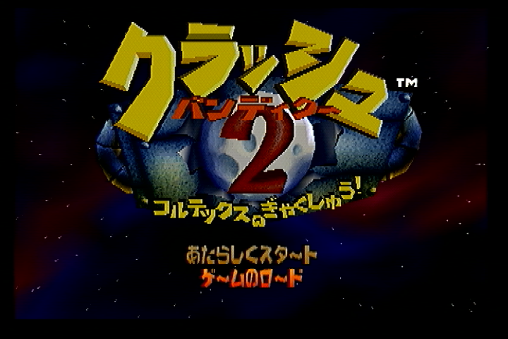

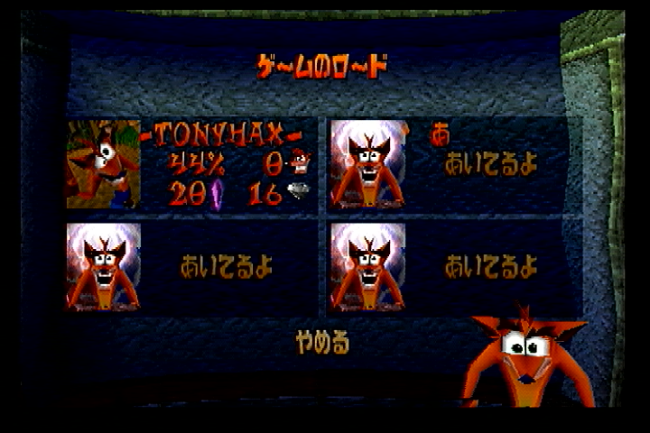

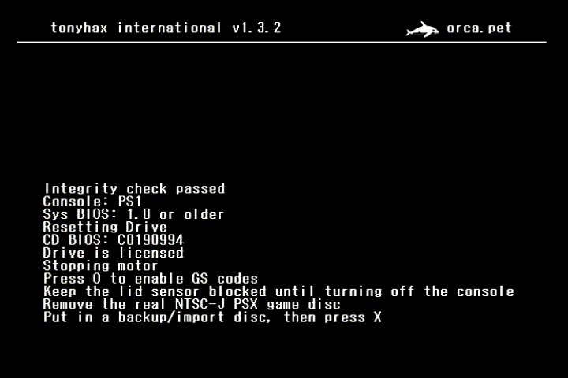

## Modded PS2 Method

You can use a PS2 console to copy the save game exploit files to a PS1 memory card from a USB flash drive.

You want to **use the RAW save game exploit file for your exploitable game (in the `entrypoints` directory) and the RAW loader file (in the `loader` directory)** when using this installation method. The RAW filenames are in the [list below](#save-game-exploit-supported-games-list).

Installation:

Copy the `Tonyhax International Loader RAW File` file and the `Save Game Exploit RAW` file to the FAT32 USB flash drive using a computer.

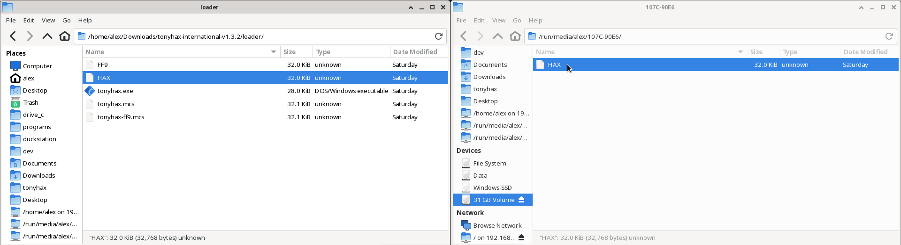

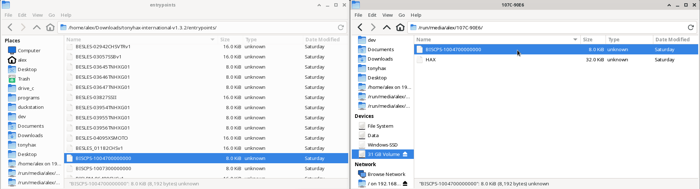

Eject the USB flash drive from your computer and insert it along with a PS1 memory card into your PS2. 

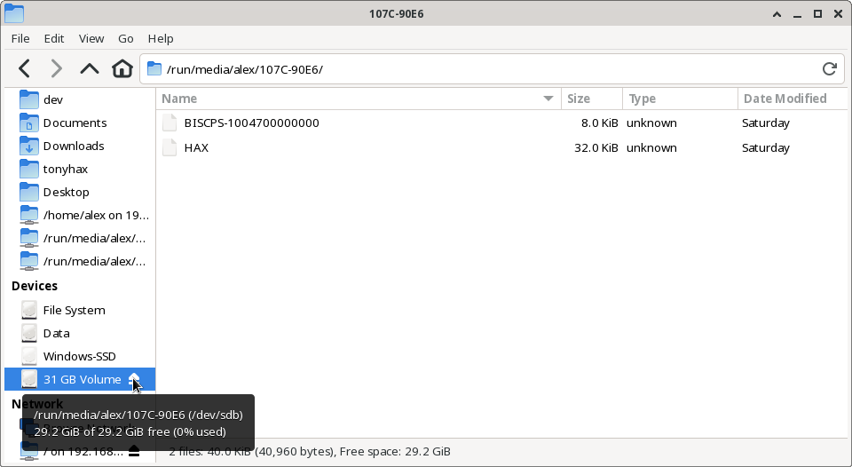

Start the [WLaunchELF](https://github.com/ps2homebrew/wLaunchELF) homebrew program on your PS2 console. Navigate to the `mass` device (this is your USB flash drive) with the `DPAD` on the controller, then select it with the `circle` button. 

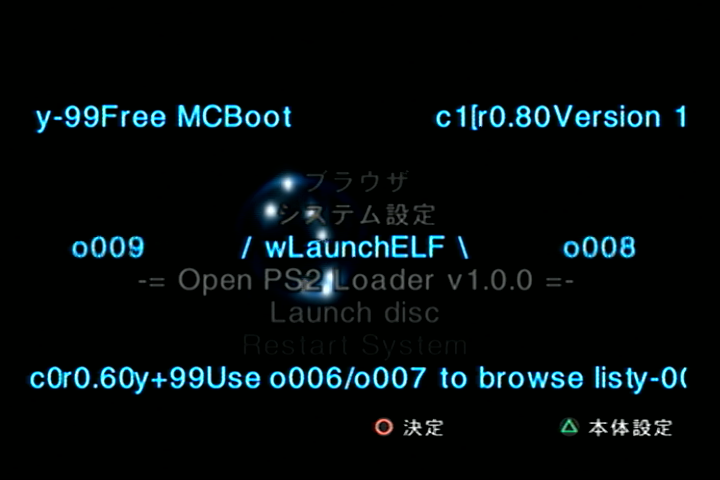

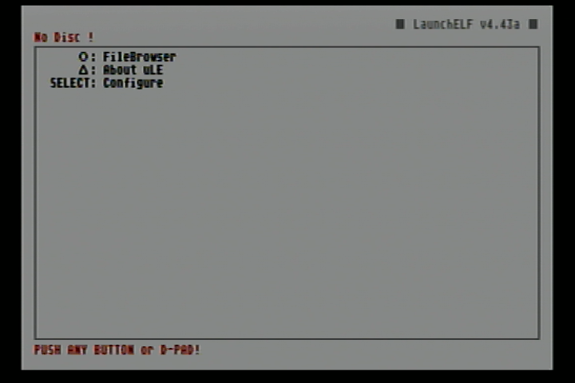

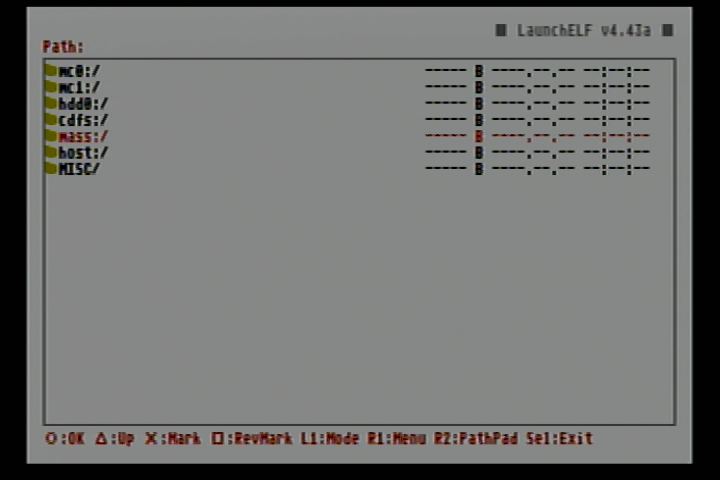

Using the `DPAD` to navigate, press the `cross` button on the controller to highlight both the `Tonyhax International Loader RAW` file and the `Save Game Exploit RAW` file that you previously copied to the USB flash drive. Press the `R1` button on the controller to make the file operations menu appear in [WLaunchELF](https://github.com/ps2homebrew/wLaunchELF). Use the `DPAD` to move to the copy function and then press the `circle` button to select it.

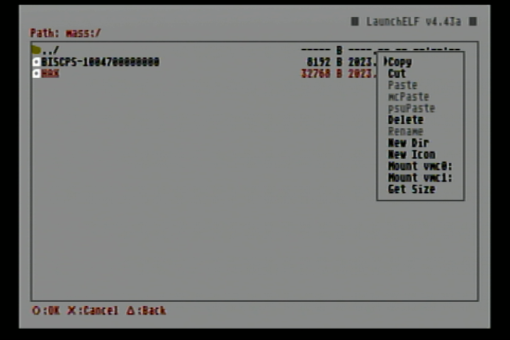

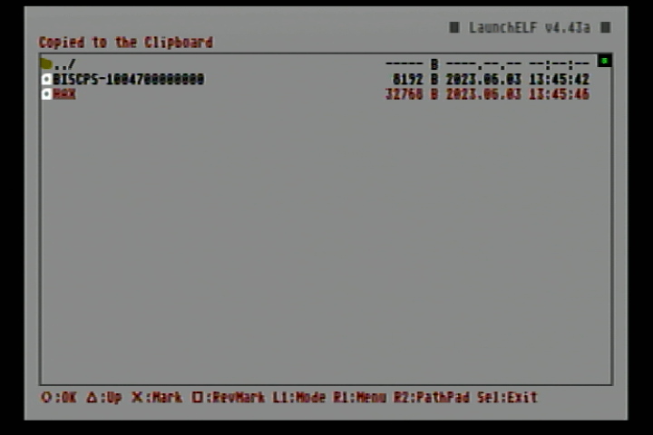

Press the `triangle` button to navigate out of the `mass` device. Use the `DPAD` and the circle button to navigate into either the `MC0` (if the PS1 memory card is in slot 1 of the PS2) or `MC1` (if the PS1 memory card is in slot 2 of the PS2) device. 

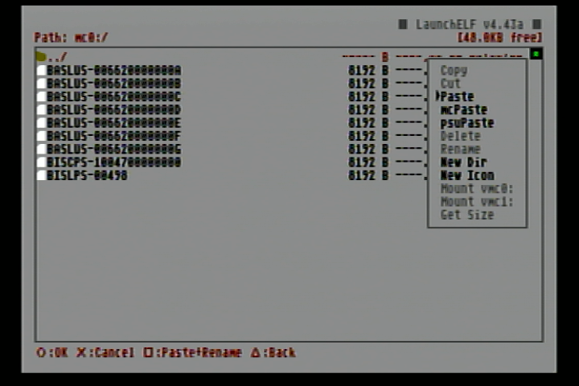

* Press the `R1` button to again make the file operations menu appear in [WLaunchELF](https://github.com/ps2homebrew/wLaunchELF). Use the `DPAD` to navigate to the paste option and press the `circle` button to finally paste both the Tonyhax International Loader RAW File` file and the `Save Game Exploit RAW` file. Now you can press the `triangle` button to navigate out of the PS1 memory card device, and remove the memory card from the PS2 console (if you want to use it in a different console).

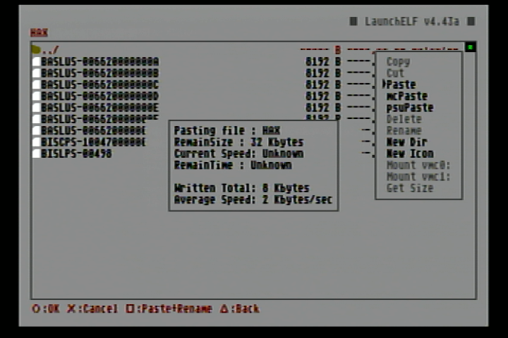

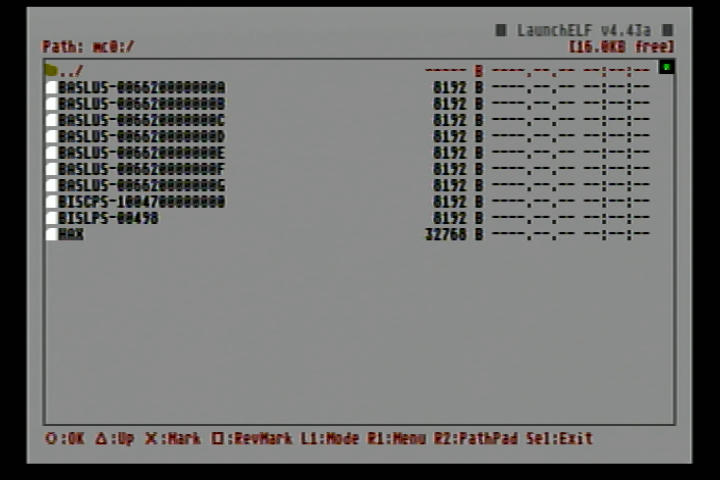

## PS3 Memory Card USB Adapter Method

You can use a PS3 Memory Card adapter in combination with the [MemcardRex](https://github.com/ShendoXT/memcardrex) and a Windows PC to copy the save game exploit files to a PS1 memory card.

Get the latest version of [MemcardRex](https://github.com/ShendoXT/memcardrex) and follow the instructions to install the driver for the PS3 Memory card adapter. Those instructions are found in the previous link, as well as copied verbatim below:

`PS3 Memory Card Adaptor
The PS3 Memory Card Adaptor is an official Sony USB adapter that allows reading and writing PS1 Memory Cards on a PlayStation 3.
To use it on a Windows PC, a custom USB driver needs to be installed.`

`This USB driver can be easily created and installed using [Zadig](https://zadig.akeo.ie/) by following these steps:`

`Plug the PS3 Memory Card Adaptor into a free USB port and start Zadig.
Zadig should display the PS3 MCA as an "Unknown Device". Verify that the USB ID matches: 054C 02EA`

`Click the Edit checkbox and name the device "PS3 Memory Card Adaptor"
Ensure that "WinUSB" is selected from the list of Driver options and click the Install Driver button.`

`After about 30 seconds Zadig should show a message that the driver was installed successfully.`

`With the USB driver installed and the PS3 Memory Card Adaptor plugged in, you should now be able to read, write and format PS1 Memory Cards.`

With everything ready, start up memcardrex and start copying/writing the save game exploit files, as displayed in the following images:

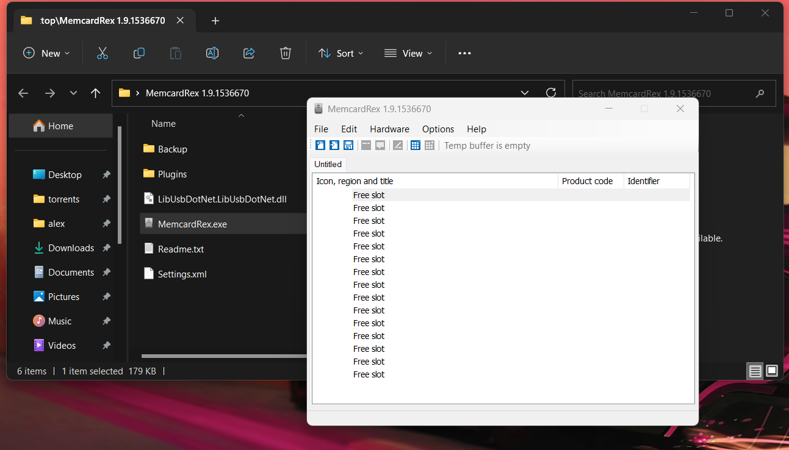

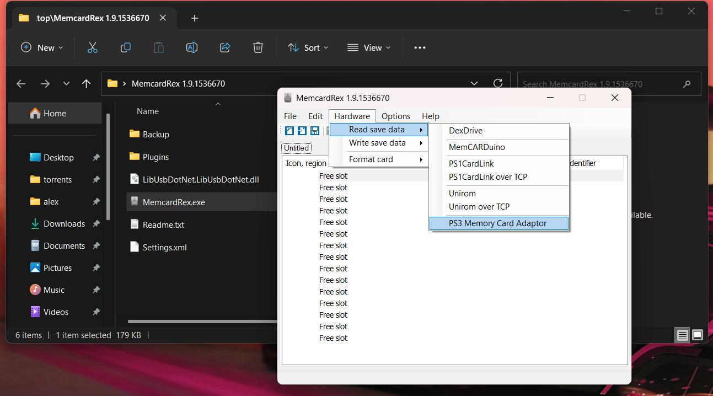

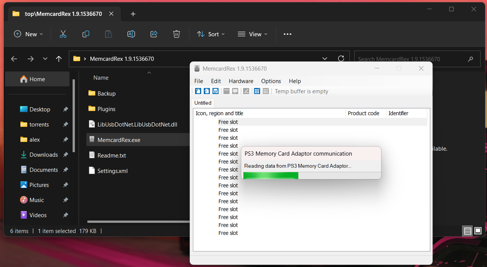

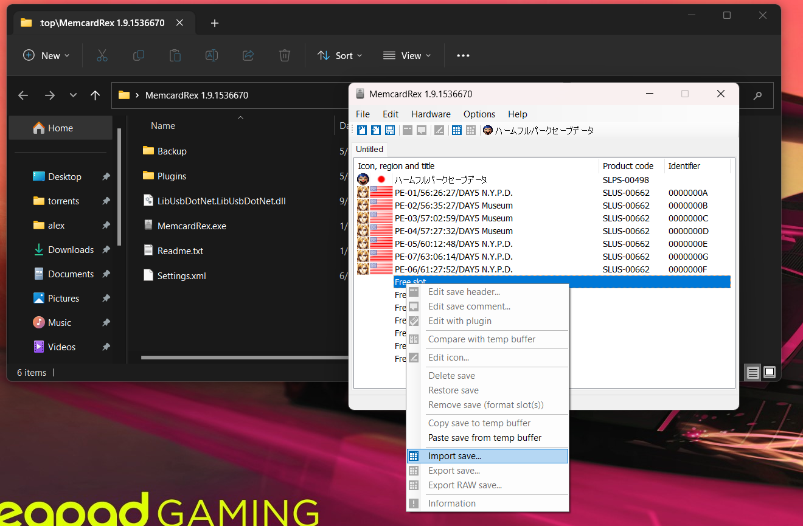

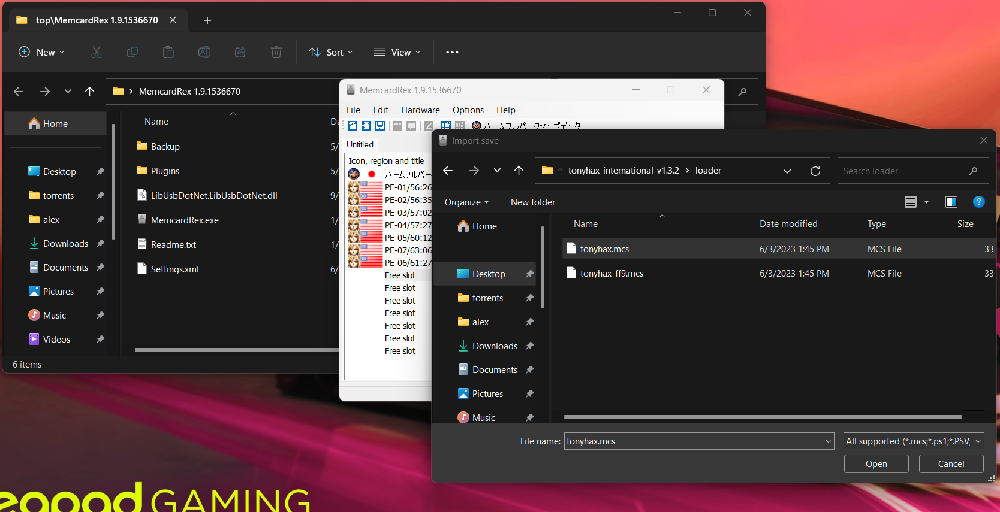

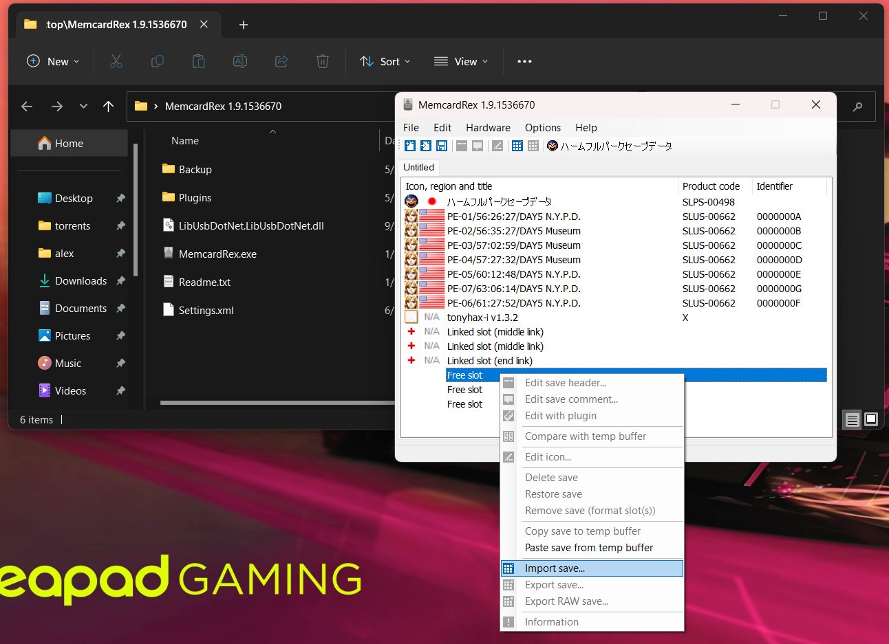

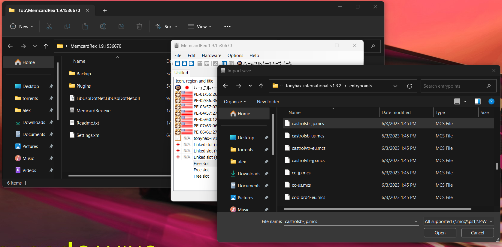

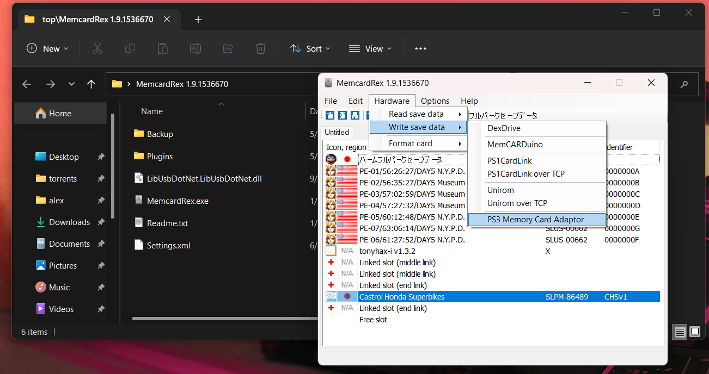

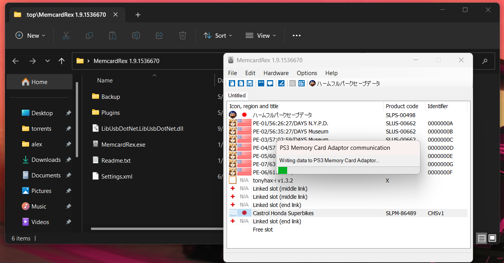

You want to **use the MCS save game exploit file for your exploitable game (in the `entrypoints` directory) and the MCS loader file  (in the `loader` directory)** when using this installation method. The MCS filenames are in the list below.

## Save Game Exploit Supported Games List

_Notes:_ 

* Demo versions of games do not contain load/save game functions and are hence not exploitable.

* Some games have multiple different versions of the same regional release (Rev 0, Rev 1, etc.). Sometimes, one save game exploit file won't work on both versions and multiple different save game exploit files are required. Some specific game/version combinations also do not have a save game exploit file available yet, this is a work in progress. Please see each listing below to see if this is the case for your specific PSX game disc that is a supported title.

* If you are using a Japanese PSX, it is **highly recommended** that you power off the console, put in the Japanese PSX game disc that has a save game exploit file available, block the lid sensor, and then turn on the console to boot the game disc. This makes it faster to swap out the disc once the Tonyhax International loader starts. 

* The _Exploit Instructions_ in each game listing below explain the game specific steps to trigger the exploit which starts the Tonyhax International loader.

* The _Save Game Exploit_ file can be on a memory card inserted in slot 1 or slot 2 of your console as long as the game supports loading a save game file from slot 2, it should work. Otherwise the _Save Game Exploit_ file **must be on the memory card in slot 1 of the console.**

* The _Tonyhax International Loader_ file **must be on a memory card inserted in slot 1** of your console.

### Brunswick Circuit Pro Bowling

* Versions Tested: [USA](http://redump.org/disc/13370/), [Europe](http://redump.org/disc/27347/).
* Versions With Save Game Exploit Support: USA, Europe.
* Save Game Exploit RAW file: `entrypoints/BASLUS-00571` (USA) or `entrypoints/BESLES-01376` (Europe).
* Save Game Exploit MCS file: `entrypoints/brunswick1-us.mcs` (USA) or `entrypoints/brunswick1-eu.mcs` (Europe).
* Tonyhax International Loader RAW file: `loader/HAX`
* Tonyhax International Loader MCS file: `loader/tonyhax.mcs`
* Exploit Instructions: At the main menu select `Load Game` and then the _Save Game Exploit_ file to trigger the exploit.

### Brunswick Circuit Pro Bowling 2

* Versions Tested: [USA](http://redump.org/disc/18447/), [Europe](http://redump.org/disc/11481/).
* Versions With Save Game Exploit Support: USA, Europe.
* Save Game Exploit RAW file: `entrypoints/BASLUS-00856` (USA) or `entrypoints/BESLES-02618` (Europe).
* Save Game Exploit MCS file: `entrypoints/brunswick2-us.mcs` (USA) or `entrypoints/brunswick2-eu.mcs` (Europe).
* Tonyhax International Loader RAW file: `loader/HAX`
* Tonyhax International Loader MCS file: `loader/tonyhax.mcs`
* Exploit Instructions: At the main menu select `Load Game` and then the _Save Game Exploit_ file to trigger the exploit.

### Castlevania Chronicles

* Versions Tested: Japan ([Rev 0](http://redump.org/disc/7481/), [Rev 1](http://redump.org/disc/11230/)), [USA](http://redump.org/disc/9474/), [Europe](http://redump.org/disc/1117/).
* Versions With Save Game Exploit Support: Japan Rev 0, USA. **Japan Rev 1 and Europe versions are not yet supported**.
* Save Game Exploit RAW file: `entrypoints/BISLPM-86754DRACULA` (Japan) or `entrypoints/BASLUS-01384DRACULA` (USA).
* Save Game Exploit MCS file: `entrypoints/cc-jp.mcs` (Japan Rev 0) or `entrypoints/cc-us.mcs` (USA).
* Tonyhax International Loader RAW file: `loader/HAX`
* Tonyhax International Loader MCS file: `loader/tonyhax.mcs`
* Exploit Instructions: At the title screen, select `ORIGINAL MODE`. Go through the intro text, and at the next title screen select `START GAME` to trigger the exploit.

### Castrol Honda Super Bike Racing

* Versions Tested: [Japan](http://redump.org/disc/33156/), [USA](http://redump.org/disc/78231/), [Europe](http://redump.org/disc/25546/).
* Versions With Save Game Exploit Support: Japan, USA, Europe.
* Save Game Exploit RAW file: `entrypoints/BISLPM-86489CHSv1` (Japan), `entrypoints/BASLUS-00882CHSv1` (USA), or `entrypoints/BESLES_01182CHSv1` (Europe).
* Save Game Exploit MCS file: `entrypoints/castrolsb-jp.mcs` (Japan), `entrypoints/castrolsb-us.mcs` (USA), or `entrypoints/castrolsb-eu.mcs` (Europe).
* Tonyhax International Loader RAW file: `loader/HAX`
* Tonyhax International Loader MCS file: `loader/tonyhax.mcs`
* Exploit instructions: If you are using the 'Europe' version select the English language in the language selection screen. On the main menu, choose Options. Select `Load Game` and load the _Save Game Exploit_ file. Back at the main menu, select either the `Single Race` or `Championship` option to trigger the exploit.

### Castrol Honda VTR

* Versions Tested: [Japan](http://redump.org/disc/37769/), [Europe](http://redump.org/disc/29332/).
* Versions With Save Game Exploit Support: Japan, Europe.
* Save Game Exploit RAW file: `entrypoints/BISLPM-86922CHSVTRv1` (Japan), `entrypoints/BESLES-02942CHSVTRv1` (Europe).
* Save Game Exploit MCS file: `entrypoints/castrolvtr-jp.mcs` (Japan), `entrypoints/castrolvtr-eu.mcs` (Europe).
* Tonyhax International Loader RAW file: `loader/HAX`
* Tonyhax International Loader MCS file: `loader/tonyhax.mcs`
* Exploit instructions: If you are using the 'Europe' version select the English language in the language selection screen. On the main menu, choose Options. Select `Load Game` and load the _Save Game Exploit_ file. Back at the main menu, select either the `Single Race` or `Championship` option to trigger the exploit.

### Cool Boarders 4

* Versions Tested: [Japan](http://redump.org/disc/4556/), [USA](http://redump.org/disc/5398/), [Europe](http://redump.org/disc/29332/).
* Versions With Save Game Exploit Support: USA, Europe. **Japan version is not yet supported.**
* Save Game Exploit RAW file: `entrypoints/BASCUS-9455916` (USA), `entrypoints/BESCES-0228316` (Europe).
* Save Game Exploit MCS file: `entrypoints/coolbrd4-us.mcs` (USA), `entrypoints/coolbrd4-eu.mcs` (Europe).
* Tonyhax International Loader RAW file: `loader/HAX`
* Tonyhax International Loader MCS file: `loader/tonyhax.mcs`
* Exploit Instructions: When you get to the title screen, it should say that the records and settings have been automatically loaded. Select the `ONE PLAYER` option to trigger the exploit.

### Crash Bandicoot 2: Cortex Strikes Back

* Versions Tested: [Japan](http://redump.org/disc/2688/), [USA](http://redump.org/disc/2688/), [Europe](http://redump.org/disc/1056/), [Europe EDC](http://redump.org/disc/14827/).
* Versions With Save Game Exploit Support: Japan, USA, Europe, Europe EDC.
* Save Game Exploit RAW file: `entrypoints/BISCPS-1004700000000` (Japan), `entrypoints/BASCUS-9415400047975` (USA), `entrypoints/BESCES-0096700765150` (Europe/Europe EDC).
* Save Game Exploit MCS file: `entrypoints/crash2-jp.mcs` (Japan), `entrypoints/crash2-us.mcs` (USA), `entrypoints/crash2-eu.mcs` (Europe Rev 0 **and** Europe Rev 1).
* Tonyhax International Loader RAW file: `loader/HAX`
* Tonyhax International Loader MCS file: `loader/tonyhax.mcs`
* Exploit Instructions: At the titlescreen select the `LOAD GAME` option. In the save game list, select the _Save Game Exploit_ file (named TONYHAX) to trigger the exploit.

### Crash Bandicoot 3: Warped

* Versions Tested: [Japan](http://redump.org/disc/3576/), [USA](http://redump.org/disc/5006/), [Europe](http://redump.org/disc/248/).
* Versions With Save Game Exploit Support: USA, Europe. **Japan version is not yet supported.**
* Save Game Exploit RAW file: `entrypoints/BASCUS-9424400000000` (USA), `entrypoints/BESCES-0142000000000` (Europe).
* Save Game Exploit MCS file: `entrypoints/crash3-us.mcs` (USA), `entrypoints/crash3-eu.mcs` (Europe).
* Tonyhax International Loader RAW file: `loader/HAX`
* Tonyhax International Loader MCS file: `loader/tonyhax.mcs`
* Exploit Instructions: At the titlescreen select the `LOAD GAME` option. In the save game list, select the _Save Game Exploit_ file (named TONYHAX) to trigger the exploit.

### Dokiou-ki

* Versions Tested: [Japan](http://redump.org/disc/3982/).
* Versions With Save Game Exploit Support: Japan.
* Save Game Exploit RAW file: `entrypoints/BISLPS-00130DOKIOH` (Japan).
* Save Game Exploit MCS file: `entrypoints/dokiou-ki-jp.mcs` (Japan).
* Tonyhax International Loader RAW file: `loader/HAX`
* Tonyhax International Loader MCS file: `loader/tonyhax.mcs`
* Exploit Instructions: At the title screen, load the _Save Game Exploit_ file. If you don't know Japanese, you can just keep spamming the confirm button (`O`) to navigate through the menu and load the _Save Game Exploit_ file.

### Downhill Snow

* Versions Tested: [Japan](http://redump.org/disc/34593/).
* Versions With Save Game Exploit Support: Japan.
* Save Game Exploit RAW file: `entrypoints/BISLPS-01391SKI00S` (Japan).
* Save Game Exploit MCS file: `entrypoints/downhill-snow-jp.mcs` (Japan).
* Tonyhax International Loader RAW file: `loader/HAX`
* Tonyhax International Loader MCS file: `loader/doki-oki-jp.mcs`.
* Exploit Instructions: At the title screen, select `SCENARIO`, then `CONTINUE`. In the memory card file display screen select the _Save Game Exploit_ file. After loading the save game exploit file, select `CONFIG`, then `RANKING`, then `Moguls`. **Immeditely after select Moguls press the right directional key until the blue screen appears, then let go of all buttons on the controller.**

### Final Fantasy IX (Disc 1)

_Note 1:_ Final Fantasy IX has 2 different types of exploits. Exploit type A works on consoles with BIOS versions 1.0-2.0. Exploit type B works on all newer BIOS versions (v2.1 to 5.0). 

_Note 2:_ If you have the Final Fantasy IX save exploit on a memory card and use the memory card manager of a SCPH-1000 console the entire console will lock up. This only happens when using the SCPH-1000's memory card manager, so please avoid doing that :) If you delete the Final Fantasy IX save exploit file this will stop the console from locking up with the default memory card manager of the SCPH-1000.

_Note 3:_ If you have the Final Fantasy IX save exploit on a memory card and use the memory card manager of a SCPH-3000 or newer the filenames of every save displayed will be bugged. This is visual only and doesn't affect any functionality.

Consoles with BIOS v1.0-v2.0:

* All SCPH-1000s.
* Very early SCPH-3000s, SCPH-1001s, and SCPH-1002s (the ones susceptible to the [CD Player Swap Trick](#cd-player-swap-trick)).

Consoles with BIOS v2.1-v5.0:

* Late SCPH-3000s, SCPH-1001s, SCPH-1002s, and **all newer models** (including PS2s) need to use the type B exploit for Final Fantasy IX.

* Versions Tested: [Japan](http://redump.org/disc/1968/), [USA](http://redump.org/disc/73/), [Spain](http://redump.org/disc/1113/), [Italy](http://redump.org/disc/2714/), [Germany](http://redump.org/disc/737/), [France](http://redump.org/disc/2455/), [Europe](http://redump.org/disc/2371/).
* Versions With Save Game Exploit Support: Japan, USA. **Spain, Italy, Germany, France, and Europe version are not yet supported**.
* Save Game Exploit RAW file (Type A Exploit for BIOS v1.0, v1.1, and v2.0 PS1 consoles): `entrypoints/FF9-A-JP/BISLPS-0200000000-00` (Japan) or `entrypoints/FF9-A-US/BASLUS-0125100000-00` (USA).
* Save Game Exploit RAW file (Type B Exploit for BIOS v2.1 and above, including all PS2s): `entrypoints/FF9-B-JP/BISLPS-0200000000-00` (Japan)  or `entrypoints/FF9-B-US/BASLUS-0125100000-00` (USA).
* Save Game Exploit MCS file (Type A Exploit for BIOS v1.0, v1.1, and v2.0 PS1 consoles): `entrypoints/FF9-A-JP/ff9-a-jp.mcs` (Japan) or `entrypoints/FF9-A-US/ff9-a-us.mcs` (USA).
* Save Game Exploit MCS file (Type B Exploit for BIOS v2.1 and above, including all PS2s): `entrypoints/FF9-B-JP/ff9-b-jp.mcs` (Japan) or `entrypoints/FF9-A-US/ff9-b-us.mcs` (USA).
* Tonyhax International Loader RAW file: `loader/FF9`.
* Tonyhax International Loader MCS file: `loader/tonyhax-ff9.mcs`.
* Exploit instructions: Select `Continue` at the title screen, and then the memory card with the _Save Game Exploit_ file. 

**Note: there are no colors displayed when using the Finaly Fantasy IX exploit, the screen will directly boot to the Tonyhax International loader in a few seconds after being triggered in-game.** Make sure you use the correct Type A or Type B exploit, or else the exploit won't trigger!

* Versions Tested: [Europe](http://redump.org/disc/7824/).
* Versions With Save Game Exploit Support: Europe.
* Save Game Exploit RAW file: `entrypoints/BESLES-03057SSBv1` (Europe).
* Save Game Exploit MCS file: `entrypoints/superbike1-eu.mcs` (Europe).
* Tonyhax International Loader RAW file: `loader/HAX`
* Tonyhax International Loader MCS file: `loader/tonyhax.mcs`
* Exploit instructions: Select the English language in the language selection screen. Enter the Memory Card menu. Load game from the Memory Card. Click accept after it's done loading. Back at the main menu, select `Race`, then `Single Race`.

### Sports Superbike 2

* Versions Tested: [USA](http://redump.org/disc/15326/), [Europe](http://redump.org/disc/19224/).
* Versions With Save Game Exploit Support: Europe. **USA version is not yet supported**.
* Save Game Exploit RAW file: `entrypoints/BESLES-03827SSII` (Europe).
* Save Game Exploit MCS file: `entrypoints/superbike2-eu.mcs` (Europe).
* Tonyhax International Loader RAW file: `loader/HAX`
* Tonyhax International Loader MCS file: `loader/tonyhax.mcs`
* Exploit instructions: If you are using the Europe version, select the English language in the language selection screen. On the main menu, choose Options. Select `Load Game` and load the _Save Game Exploit_ file. Back at the main menu, select either the `Single Race` or `Championship` option.       

### Tekken 2

* Versions Tested: [Japan Rev 0](http://redump.org/disc/38475/), [Japan Rev 1](http://redump.org/disc/1155/), [USA Rev 0](http://redump.org/disc/1836/), [USA Rev 1](http://redump.org/disc/14017/), [Germany](http://redump.org/disc/45460/), [France](http://redump.org/disc/47269/).
* Versions With Save Game Exploit Support: Japan Rev 1, USA Rev 1, Germany, France. **Japan Rev 0 and USA Rev 0 are not yet supported**.
* Save Game Exploit RAW file: `entrypoints/BISLPS-00300TEKKEN-2` (Japan Rev 1), `entrypoints/BASLUS-00213TEKKEN-2` (USA Rev 1), `entrypoints/BESCES-00255TEKKEN-2` (France **and** Germany).
* Save Game Exploit MCS file: `entrypoints/tekken2-jp.mcs` (Japan Rev 1), `entrypoints/tekken2-us.mcs` (USA Rev 1), `entrypoints/tekken2-eu.mcs` (France **and** Germany).
* Tonyhax International Loader RAW file: `loader/HAX`
* Tonyhax International Loader MCS file: `loader/tonyhax.mcs`
* Exploit Instructions: Start a round of `Survival Mode` at the title screen. Die at any point in surivival mode, and the game will go black and trigger the exploit in a few seconds. **Note: there are no colours displayed when using the Tekken exploits, the screen will directly boot to the Tonyhax International loader in a few seconds after being triggered in-game.**

### Tekken 3

* Versions Tested: [Japan Rev 0](http://redump.org/disc/588/), [Japan Rev 1](http://redump.org/disc/30736/), [USA](http://redump.org/disc/1464/), [Europe Rev 0](http://redump.org/disc/483/), [Europe Rev 1](http://redump.org/disc/449/).
* Versions With Save Game Exploit Support: Japan Rev 0, Japan Rev 1, USA, Europe Rev 0, Europe Rev 1.
* Save Game Exploit RAW file: `entrypoints/BISLPS-01300TEKKEN-3` (Japan Rev 0 **and** Japan Rev 1), `entrypoints/BASLUS-00402TEKKEN-3` (USA Rev 0 **and** USA Rev 1), `entrypoints/BESCES-01237TEKKEN-3` (Europe Rev 0 **and** Europe Rev 1).
* Save Game Exploit MCS file: `entrypoints/tekken3-jp.mcs` (Japan Rev 0 **and** Japan Rev 1), `entrypoints/tekken3-us.mcs` (USA Rev 0 **and** USA Rev 1), `entrypoints/tekken3-eu.mcs` (Europe Rev 0 **and** Europe Rev 1).
* Tonyhax International Loader RAW file: `loader/HAX`
* Tonyhax International Loader MCS file: `loader/tonyhax.mcs`
* Exploit Instructions: Start a round of `Survival Mode` at the title screen. Die at any point in surivival mode, and the game will go black and trigger the exploit in a few seconds. **Note: there are no colours displayed when using the Tekken exploits, the screen will directly boot to the Tonyhax International loader in a few seconds after being triggered in-game.**

### The Legend of Heroes I & II: Eiyuu Densetsu

* Versions Tested: [Japan](http://redump.org/disc/47491/).
* Versions With Save Game Exploit Support: Japan.
* Save Game Exploit RAW file: `entrypoints/BISLPS-01323010001` (Japan).
* Save Game Exploit MCS file: `entrypoints/the-legend-of-heroes-1-and-2-jp.mcs` (Japan).
* Tonyhax International Loader RAW file: `loader/HAX`
* Tonyhax International Loader MCS file: `loader/tonyhax.mcs`
* Exploit Instructions: At the main menu, **select `The Legend Of Heroes I` (the I button on the left)**, not `The Legend Of Heroes II` (the II button on the right). Once in `The Legend Of Heroes I` game, load the save game exploit file.

### Tony Hawk's Pro Skater 2

* Versions Tested: [Japan](http://redump.org/disc/35439/), [USA](http://redump.org/disc/1319/), [Germany](http://redump.org/disc/5899/), [France](http://redump.org/disc/27627/), [Europe/Australia](http://redump.org/disc/976/).
* Versions With Save Game Exploit Support: Japan, USA, Germany, France, Europe/Australia.
* Save Game Exploit RAW file: `entrypoints/BISLPM-86751CEEAG01` (Japan), `entrypoints/BASLUS-01066TNHXG01` (USA), `entrypoints/BESLES-02910TNHXG01` (Germany), `entrypoints/BESLES-02909TNHXG01` (France), `entrypoints/BESLES-02908TNHXG01` (Europe/Australia).
* Save Game Exploit MCS file: `entrypoints/thps2-jp.mcs` (Japan), `entrypoints/thps2-us.mcs` (USA), `entrypoints/thps2-de.mcs` (Germany), `entrypoints/thps2-fr.mcs` (France), `entrypoints/thps2-eu.mcs` (Europe/Australia).
* Tonyhax International Loader RAW file: `loader/HAX`
* Tonyhax International Loader MCS file: `loader/tonyhax.mcs`
At the main menu, wait until the save game exploit file is automatically loaded (it should say `Loading TONYHAX JP/US/EU/DE/FR`, depending on the game's region). Next, select `CREATE SKATER` and confirm the selection to start the exploit.

### Tony Hawk's Pro Skater 3

* Versions Tested: [USA](http://redump.org/disc/1320/), [Germany](http://redump.org/disc/3270/), [France](http://redump.org/disc/27628/), [Europe](http://redump.org/disc/1465/).
* Versions With Save Game Exploit Support: USA, Germany, France, Europe.
* Save Game Exploit RAW file: `entrypoints/BASLUS-01419TNHXG01` (USA), `entrypoints/BESLES-03647TNHXG01` (Germany), `entrypoints/BESLES-03646TNHXG01` (France), `entrypoints/BESLES-03645TNHXG01` (Europe).
* Save Game Exploit MCS file: `entrypoints/thps3-us.mcs` (USA), `entrypoints/thps3-de.mcs` (Germany), `entrypoints/thps3-fr.mcs` (France), `entrypoints/thps3-eu.mcs` (Europe).
* Tonyhax International Loader RAW file: `loader/HAX`
* Tonyhax International Loader MCS file: `loader/tonyhax.mcs`
At the main menu, wait until the save game exploit file is automatically loaded (it should say `Loading TONYHAX US/EU/DE/FR`, depending on the game's region). Next, select `CREATE SKATER` and confirm the selection to start the exploit.

### Tony Hawk's Pro Skater 4

* Versions Tested: [USA](http://redump.org/disc/1321/), [Germany](http://redump.org/disc/5130/), [France](http://redump.org/disc/27629/), [Europe](http://redump.org/disc/15090/).
* Versions With Save Game Exploit Support: USA, Germany, France, Europe.
* Save Game Exploit RAW file: `entrypoints/BASLUS-01485TNHXG01` (USA), `entrypoints/BESLES-03955TNHXG01` (Germany), `entrypoints/BESLES-03956TNHXG01` (France), `entrypoints/BESLES-03954TNHXG01` (Europe).
* Save Game Exploit MCS file: `entrypoints/thps4-us.mcs` (USA), `entrypoints/thps4-de.mcs` (Germany), `entrypoints/thps4-fr.mcs` (France), `entrypoints/thps4-eu.mcs` (Europe).
* Tonyhax International Loader RAW file: `loader/HAX`
* Tonyhax International Loader MCS file: `loader/tonyhax.mcs`
* Exploit Instructions: At the main menu, wait until the save game exploit file is automatically loaded (it should say `Loading TONYHAX US/EU/DE/FR`, depending on the game's region). Next, select `CREATE SKATER` and confirm the selection to start the exploit.

### XS Moto

* Versions Tested: [USA](http://redump.org/disc/6604/), [Europe](http://redump.org/disc/17764/).
* Versions With Save Game Exploit Support: USA, Europe.
* Save Game Exploit RAW file: `entrypoints/BASLUS-01506XSMOTOv1` (USA), `entrypoints/BESLES-04095XSMOTO` (Europe).
* Save Game Exploit MCS file: `entrypoints/xsmoto-us.mcs` (USA), `entrypoints/xsmoto-eu.mcs` (Europe).
* Tonyhax International Loader RAW file: `loader/HAX`
* Tonyhax International Loader MCS file: `loader/tonyhax.mcs`
* Exploit instructions: If you are using the 'Europe' version select the English language in the language selection screen. On the main menu, choose Options. Select `Load Game` and load the _Save Game Exploit_ file. Back at the main menu, select either the `Single Race` or `Championship` option to trigger the exploit.
